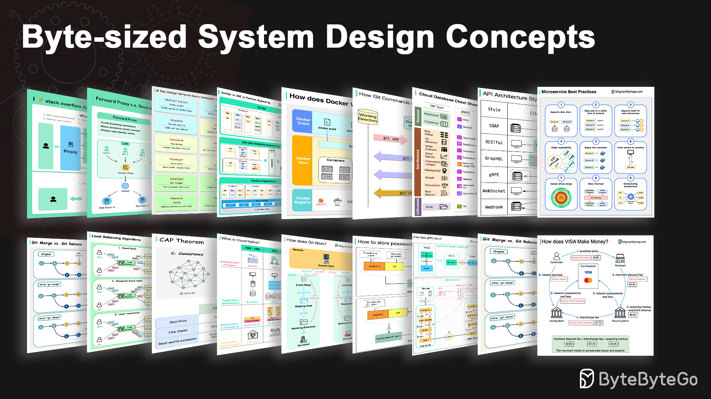

  

  【
  <a href="https://www.youtube.com/channel/UCZgt6AzoyjslHTC9dz0UoTw">
    👨🏻‍💻 YouTube
  </a> | 
  <a href="https://blog.bytebytego.com/?utm_source=site">
    📮 Newsletter
  </a> 】

# System Design 101

Explain complex systems using visuals and simple terms. 

Whether you're preparing for a System Design Interview or you simply want to understand how systems work beneath the surface, we hope this repository will help you achieve that.

# Table of Contents

<!-- TOC -->

* [API and Web Development](https://bytebytego.com/guides/api-web-development)
  * [Short/long polling, SSE, WebSocket](https://bytebytego.com/guides/shortlong-polling-sse-websocket)
  * [Load Balancer Realistic Use Cases](https://bytebytego.com/guides/load-balancer-realistic-use-cases-you-may-not-know)
  * [5 HTTP Status Codes That Should Never Have Been Created](https://bytebytego.com/guides/5-http-status-codes-that-should-never-have-been-created)
  * [How does gRPC work?](https://bytebytego.com/guides/how-does-grpc-work)
  * [How NAT Enabled the Internet](https://bytebytego.com/guides/how-nat-made-the-growth-of-the-internet-possible)
  * [Important Things About HTTP Headers](https://bytebytego.com/guides/important-things-about-http-headers-you-may-not-know)
  * [Internet Traffic Routing Policies](https://bytebytego.com/guides/internet-traffic-routing-policies)
  * [How Browsers Render Web Pages](https://bytebytego.com/guides/how-does-the-browser-render-a-web-page)
  * [What makes HTTP2 faster than HTTP1?](https://bytebytego.com/guides/what-makes-http2-faster-than-http1)
  * [What is CSS (Cascading Style Sheets)?](https://bytebytego.com/guides/what-is-css-cascading-style-sheets)
  * [Key Use Cases for Load Balancers](https://bytebytego.com/guides/key-use-cases-for-load-balancers)
  * [18 Common Ports Worth Knowing](https://bytebytego.com/guides/18-common-ports-worth-knowing)
  * [What are the differences between WAN, LAN, PAN and MAN?](https://bytebytego.com/guides/what-are-the-differences-between-wan-lan-pan-and-man)
  * [How does Javascript Work?](https://bytebytego.com/guides/how-does-javascript-work)
  * [8 Tips for Efficient API Design](https://bytebytego.com/guides/8-tips-for-efficient-api-design)
  * [Reverse Proxy vs. API Gateway vs. Load Balancer](https://bytebytego.com/guides/reverse-proxy-vs-api-gateway-vs-load-balancer)
  * [How does REST API work?](https://bytebytego.com/guides/how-does-rest-api-work)
  * [Load Balancer vs. API Gateway](https://bytebytego.com/guides/what-are-the-differences-between-a-load-balancer-and-an-api-gateway)
  * [How GraphQL Works at LinkedIn](https://bytebytego.com/guides/how-does-graphql-work-in-the-real-world)
  * [GraphQL Adoption Patterns](https://bytebytego.com/guides/graphql-adoption-patterns)
  * [A cheat sheet for API designs](https://bytebytego.com/guides/a-cheat-sheet-for-api-designs)
  * [API Gateway 101](https://bytebytego.com/guides/api-gateway-101)
  * [Top 3 API Gateway Use Cases](https://bytebytego.com/guides/top-3-api-gateway-use-cases)
  * [What do version numbers mean?](https://bytebytego.com/guides/what-do-version-numbers-mean)
  * [Do you know all the components of a URL?](https://bytebytego.com/guides/do-you-know-all-the-components-of-a-url)
  * [Unicast vs Broadcast vs Multicast vs Anycast](https://bytebytego.com/guides/unicast-vs-broadcast-vs-multicast-vs-anycast)
  * [10 Essential Components of a Production Web Application](https://bytebytego.com/guides/10-essential-components-of-a-production-web-application)
  * [URL, URI, URN - Differences Explained](https://bytebytego.com/guides/url-uri-urn-do-you-know-the-differences)
  * [API vs SDK](https://bytebytego.com/guides/api-vs-sdk)
  * [A Cheatsheet to Build Secure APIs](https://bytebytego.com/guides/a-cheatsheet-to-build-secure-apis)
  * [HTTP Status Codes You Should Know](https://bytebytego.com/guides/http-status-code-you-should-know)
  * [SOAP vs REST vs GraphQL vs RPC](https://bytebytego.com/guides/soap-vs-rest-vs-graphql-vs-rpc)
  * [A Cheatsheet on Comparing API Architectural Styles](https://bytebytego.com/guides/a-cheatsheet-on-comparing-api-architectural-styles)
  * [Top 9 HTTP Request Methods](https://bytebytego.com/guides/top-9-http-request-methods)
  * [What is a Load Balancer?](https://bytebytego.com/guides/what-is-a-load-balancer)
  * [Proxy vs Reverse Proxy](https://bytebytego.com/guides/proxy-vs-reverse-proxy)
  * [HTTP/1 -> HTTP/2 -> HTTP/3](https://bytebytego.com/guides/http1-http2-http3)
  * [Polling vs Webhooks](https://bytebytego.com/guides/polling-vs-webhooks)
  * [How do we Perform Pagination in API Design?](https://bytebytego.com/guides/how-do-we-perform-pagination-in-api-design)
  * [How to Design Effective and Safe APIs](https://bytebytego.com/guides/how-do-we-design-effective-and-safe-apis)
  * [How to Design Secure Web API Access](https://bytebytego.com/guides/how-to-design-secure-web-api-access-for-your-website)
  * [What Does an API Gateway Do?](https://bytebytego.com/guides/what-does-api-gateway-do)
  * [What is gRPC?](https://bytebytego.com/guides/what-is-grpc)
  * [Top 12 Tips for API Security](https://bytebytego.com/guides/top-12-tips-for-api-security)
  * [Explaining 9 Types of API Testing](https://bytebytego.com/guides/explaining-9-types-of-api-testing)
  * [REST API vs. GraphQL](https://bytebytego.com/guides/rest-api-vs-graphql)
  * [What is GraphQL?](https://bytebytego.com/guides/what-is-graphql)
  * [REST API Cheatsheet](https://bytebytego.com/guides/rest-api-cheatsheet)
  * [The Ultimate API Learning Roadmap](https://bytebytego.com/guides/the-ultimate-api-learning-roadmap)
  * [The Evolving Landscape of API Protocols in 2023](https://bytebytego.com/guides/the-evolving-landscape-of-api-protocols-in-2023)
* [Real World Case Studies](https://bytebytego.com/guides/real-world-case-studies)
  * [100X Postgres Scaling at Figma](https://bytebytego.com/guides/100x-postgres-scaling-at-figma)
  * [API of APIs - App Integrations](https://bytebytego.com/guides/api-of-apis-app-integrations)
  * [The one-line change that reduced clone times by 99% at Pinterest](https://bytebytego.com/guides/the-one-line-change-that-reduced-clone-times-by-a-whopping-99-says-pinterest)
  * [Is Telegram Secure?](https://bytebytego.com/guides/is-telegram-secure)
  * [Fixing Bugs Automatically at Meta Scale](https://bytebytego.com/guides/fixing-bugs-automatically-at-meta-scale)
  * [How Levelsfyi Scaled to Millions of Users with Google Sheets](https://bytebytego.com/guides/how-levelsfyi-scaled-to-millions-of-users-with-google-sheets)
  * [McDonald’s Event-Driven Architecture](https://bytebytego.com/guides/mcdonald's-event-driven-architecture)
  * [Uber Tech Stack - CI/CD](https://bytebytego.com/guides/uber-tech-stack-cicd)
  * [How to Design Stack Overflow](https://bytebytego.com/guides/how-will-you-design-the-stack-overflow-website)
  * [Twitter 1.0 Tech Stack](https://bytebytego.com/guides/twitter-10-tech-stack)
  * [How does Twitter recommend “For You” Timeline in 1.5 seconds?](https://bytebytego.com/guides/how-does-twitter-recommend-tweets)
  * [How YouTube Handles Massive Video Uploads](https://bytebytego.com/guides/how-does-youtube-handle-massive-video-content-upload)
  * [How Does a Typical Push Notification System Work?](https://bytebytego.com/guides/how-does-a-typical-push-notification-system-work)
  * [4 Ways Netflix Uses Caching](https://bytebytego.com/guides/4-ways-netflix-uses-caching-to-hold-user-attention)
  * [Netflix Tech Stack - Databases](https://bytebytego.com/guides/netflix-tech-stack-databases)
  * [0 to 1.5 Billion Guests: Airbnb's Architectural Evolution](https://bytebytego.com/guides/airbnb-artchitectural-evolution)
  * [How Netflix Scales Push Messaging](https://bytebytego.com/guides/how-does-netflix-scale-push-messaging-for-millions-of-devices)
  * [Netflix's Overall Architecture](https://bytebytego.com/guides/netflixs-overall-architecture)
  * [Netflix Tech Stack - CI/CD Pipeline](https://bytebytego.com/guides/netflix-tech-stack-cicd-pipeline)
  * [How TikTok Manages a 200K File Frontend MonoRepo](https://bytebytego.com/guides/how-tiktok-manages-a-200k-file-frontend-monorepo)
  * [How Netflix Really Uses Java](https://bytebytego.com/guides/how-netflix-really-uses-java)
  * [Evolution of Airbnb’s Microservice Architecture](https://bytebytego.com/guides/evolution-of-airbnb's-microservice)
  * [Reddit's Core Architecture](https://bytebytego.com/guides/reddit's-core-architecture)
  * [10 Principles for Building Resilient Payment Systems](https://bytebytego.com/guides/10-principles-for-building-resilient-payment-systems-by-shopify)
  * [What is the Journey of a Slack Message?](https://bytebytego.com/guides/what-is-the-journey-of-a-slack-message)
  * [Top 9 Engineering Blogs](https://bytebytego.com/guides/top-9-engineering-blog-favorites)
  * [Uber Tech Stack](https://bytebytego.com/guides/uber-tech-stack)
  * [Evolution of the Netflix API Architecture](https://bytebytego.com/guides/evolution-of-the-netflix-api-architecture)
  * [How Discord Stores Trillions of Messages](https://bytebytego.com/guides/how-discord-stores-trillions-of-messages)
  * [Twitter Architecture 2022 vs. 2012](https://bytebytego.com/guides/twitter-architecture-2022-vs-2012)
  * [Evolution of Uber's API Layer](https://bytebytego.com/guides/evolution-of-uber's-api-layer)
  * [Netflix's Tech Stack](https://bytebytego.com/guides/netflixs-tech-stack)
* [AI and Machine Learning](https://bytebytego.com/guides/ai-machine-learning)
  * [5 Functions to Merge Data with Pandas](https://bytebytego.com/guides/5-functions-to-merge-data-with-pandas)
  * [Key Data Terms](https://bytebytego.com/guides/key-data-terms)
  * [ChatGPT Timeline](https://bytebytego.com/guides/chatgpt-timeline)
  * [DeepSeek 1-Pager](https://bytebytego.com/guides/deepseek-1-pager)
  * [The Open Source AI Stack](https://bytebytego.com/guides/the-open-source-ai-stack)
  * [What is an AI Agent?](https://bytebytego.com/guides/what-is-an-ai-agent)
  * [Data Pipelines Overview](https://bytebytego.com/guides/data-pipelines-overview)
  * [How does ChatGPT work?](https://bytebytego.com/guides/how-does-chatgpt-work)
* [Database and Storage](https://bytebytego.com/guides/database-and-storage)
  * [Read Replica Pattern](https://bytebytego.com/guides/read-replica-pattern)
  * [Pessimistic vs Optimistic Locking](https://bytebytego.com/guides/pessimistic-vs-optimistic-locking)
  * [How to Upload a Large File to S3](https://bytebytego.com/guides/how-to-upload-a-large-file-to-s3)
  * [Types of Message Queues](https://bytebytego.com/guides/types-of-message-queue)
  * [Smooth Data Migration with Avro](https://bytebytego.com/guides/smooth-data-migration-with-avro)
  * [The Ultimate Kafka 101 You Cannot Miss](https://bytebytego.com/guides/the-ultimate-kafka-101-you-cannot-miss)
  * [Database Isolation Levels](https://bytebytego.com/guides/what-are-database-isolation-levels)
  * [Top 6 Data Management Patterns](https://bytebytego.com/guides/how-do-we-manage-data)
  * [Why is Kafka Fast?](https://bytebytego.com/guides/why-is-kafka-fast)
  * [Explaining the 4 Most Commonly Used Types of Queues](https://bytebytego.com/guides/explaining-the-4-most-commonly-used-types-of-queues-in-a-single-diagram)
  * [Time Series DB (TSDB) in 20 Lines](https://bytebytego.com/guides/time-series-db-tsdb-in-20-lines)
  * [Differences in Event Sourcing System Design](https://bytebytego.com/guides/differences-in-event-sourcing-system-design)
  * [Erasure Coding](https://bytebytego.com/guides/erasure-coding)
  * [Delivery Semantics](https://bytebytego.com/guides/delivery-semantics)
  * [Change Data Capture: Key to Leverage Real-time Data](https://bytebytego.com/guides/change-data-capture-key-to-leverage-real-time-data)
  * [Can Kafka Lose Messages?](https://bytebytego.com/guides/can-kafka-lose-messages)
  * [Storage Systems Overview](https://bytebytego.com/guides/storage-systems-overview)
  * [Explain the Top 6 Use Cases of Object Stores](https://bytebytego.com/guides/explain-the-top-6-use-cases-of-object-stores)
  * [Top Eventual Consistency Patterns You Must Know](https://bytebytego.com/guides/top-eventual-consistency-patterns-you-must-know)
  * [B-Tree vs. LSM-Tree](https://bytebytego.com/guides/b-tree-vs)
  * [How to Decide Which Type of Database to Use](https://bytebytego.com/guides/how-do-you-decide-which-type-of-database-to-use)
  * [Cloud Database Cheat Sheet](https://bytebytego.com/guides/cloud-database-cheat-sheet)
  * [Types of Memory](https://bytebytego.com/guides/types-of-memory)
  * [Understanding Database Types](https://bytebytego.com/guides/understanding-database-types)
  * [Top 4 Data Sharding Algorithms Explained](https://bytebytego.com/guides/top-4-data-sharding-algorithms-explained)
  * [Top 6 Database Models](https://bytebytego.com/guides/top-6-database-models)
  * [SQL Statement Execution in Database](https://bytebytego.com/guides/how-is-a-sql-statement-executed-in-the-database)
  * [What is Serverless DB?](https://bytebytego.com/guides/what-is-serverless-db)
  * [Why PostgreSQL is the Most Loved Database](https://bytebytego.com/guides/why-is-postgresql-voted-as-the-most-loved-database-by-stackoverflow-2022-developer-survey)
  * [Top 10 Most Popular Open-Source Databases](https://bytebytego.com/guides/top-10-most-popular-open-source-databases)
  * [Is PostgreSQL Eating the Database World?](https://bytebytego.com/guides/is-postgresql-eating-the-database-world)
  * [How to Choose the Right Database](https://bytebytego.com/guides/how-to-choose-the-right-database)
  * [iQIYI Database Selection Trees](https://bytebytego.com/guides/iqiyi-database-selection-trees)
  * [8 Data Structures That Power Your Databases](https://bytebytego.com/guides/8-data-structures-that-power-your-databases)
  * [How to Implement Read Replica Pattern](https://bytebytego.com/guides/how-to-implement-read-replica-pattern)
  * [A Crash Course on Database Sharding](https://bytebytego.com/guides/a-crash-course-in-database-sharding)
  * [IBM MQ -> RabbitMQ -> Kafka -> Pulsar: Message Queue Evolution](https://bytebytego.com/guides/how-do-message-queue-architectures-evolve)
  * [CAP Theorem: One of the Most Misunderstood Terms](https://bytebytego.com/guides/cap-theorem-one-of-the-most-misunderstood-terms)
  * [Consistent Hashing Explained](https://bytebytego.com/guides/consistent-hashing)
  * [Types of Databases](https://bytebytego.com/guides/types-of-databases)
  * [Key Concepts to Understand Database Sharding](https://bytebytego.com/guides/key-concepts-to-understand-database-sharding)
  * [Database Locks Explained](https://bytebytego.com/guides/what-are-the-differences-among-database-locks)
  * [A Cheatsheet on Database Performance](https://bytebytego.com/guides/a-cheatsheet-on-database-performance)
  * [What does ACID mean?](https://bytebytego.com/guides/what-does-acid-mean)
  * [Top 5 Kafka Use Cases](https://bytebytego.com/guides/top-5-kafka-use-cases)
  * [Types of Memory and Storage](https://bytebytego.com/guides/types-of-memory-and-storage)
  * [7 Must-Know Strategies to Scale Your Database](https://bytebytego.com/guides/7-must-know-strategies-to-scale-your-database)
* [Technical Interviews](https://bytebytego.com/guides/technical-interviews)
  * [How do SQL Joins Work?](https://bytebytego.com/guides/how-do-sql-joins-work)
  * [What Happens When You Type google.com Into a Browser?](https://bytebytego.com/guides/what-happens-when-you-type-google)
  * [What Happens When You Type a URL Into Your Browser?](https://bytebytego.com/guides/what-happens-when-you-type-a-url-into-your-browser)
  * [How to Ace System Design Interviews](https://bytebytego.com/guides/how-to-ace-system-design-interviews-like-a-boss)
  * [Recommended Materials for Technical Interviews](https://bytebytego.com/guides/my-recommended-materials-for-cracking-your-next-technical-interview)
* [Caching & Performance](https://bytebytego.com/guides/caching-performance)
  * [What is ELK Stack and Why is it Popular?](https://bytebytego.com/guides/what-is-elk-stack-and-why-is-it-so-popular-for-log-management)
  * [Why are Content Delivery Networks (CDN) so Popular?](https://bytebytego.com/guides/why-are-content-delivery-networks-cdn-so-popular)
  * [How Big Keys Impact Redis Persistence](https://bytebytego.com/guides/how-do-big-keys-impact-redis-persistence)
  * [A Beginner's Guide to CDN](https://bytebytego.com/guides/a-beginner's-guide-to-cdn-content-delivery-network)
  * [The Ultimate Redis 101](https://bytebytego.com/guides/the-ultimate-redis-101)
  * [Cache Systems Every Developer Should Know](https://bytebytego.com/guides/cache-systems-every-developer-should-know)
  * [Top 5 Strategies to Reduce Latency](https://bytebytego.com/guides/top-5-strategies-to-reduce-latency)
  * [Top 5 Caching Strategies](https://bytebytego.com/guides/top-5-caching-strategies)
  * [Things to Consider When Using Cache](https://bytebytego.com/guides/things-to-consider-when-using-cache)
  * [Cache Eviction Policies](https://bytebytego.com/guides/most-popular-cache-eviction)
  * [Memcached vs Redis](https://bytebytego.com/guides/memcached-vs-redis)
  * [Low Latency Stock Exchange](https://bytebytego.com/guides/low-latency-stock-exchange)
  * [Cache Miss Attack](https://bytebytego.com/guides/cache-miss-attack)
  * [Top 8 Cache Eviction Strategies](https://bytebytego.com/guides/top-8-cache-eviction-strategies)
  * [How Can Cache Systems Go Wrong?](https://bytebytego.com/guides/how-can-cache-systems-go-wrong)
  * [Top 6 Elasticsearch Use Cases](https://bytebytego.com/guides/top-6-elasticsearch-use-cases)
  * [How Does CDN Work?](https://bytebytego.com/guides/how-does-cnd-work)
  * [How Redis Architecture Evolved](https://bytebytego.com/guides/how-redis-architecture-evolve)
  * [How Does Redis Persist Data?](https://bytebytego.com/guides/how-does-redis-persist-data)
  * [How can Redis be used?](https://bytebytego.com/guides/how-can-redis-be-used)
  * [Why is Redis so Fast?](https://bytebytego.com/guides/why-is-redis-so-fast)
  * [How to Learn Elasticsearch](https://bytebytego.com/guides/how-do-we-learn-elasticsearch)
  * [What is CDN (Content Delivery Network)?](https://bytebytego.com/guides/what-is-cdn-content-delivery-network)
  * [Frontend Performance Optimization](https://bytebytego.com/guides/how-to-load-your-websites-at-lightning-speed)
  * [Which Latency Numbers Should You Know?](https://bytebytego.com/guides/which-latency-numbers-should-you-know)
  * [Top Caching Strategies](https://bytebytego.com/guides/what-are-the-top-caching-strategies)
  * [Top 9 Website Performance Metrics You Cannot Ignore](https://bytebytego.com/guides/top-9-website-performance-metrics-you-cannot-ignore)
  * [Top 5 Common Ways to Improve API Performance](https://bytebytego.com/guides/top-5-common-ways-to-improve-api-performance)
  * [Learn Cache](https://bytebytego.com/guides/learn-cache)
* [Payment and Fintech](https://bytebytego.com/guides/payment-and-fintech)
  * [E-commerce Workflow](https://bytebytego.com/guides/e-commerce-workflow)
  * [Digital Wallets: Banks vs. Blockchain](https://bytebytego.com/guides/digital-wallet-in-traditional-banks-vs-wallet-in-blockchain)
  * [What is a Stop-Loss Order and How Does it Work?](https://bytebytego.com/guides/what-is-a-stop-loss-order-and-how-does-it-work)
  * [What is Web 3.0? Why doesn't it have ads?](https://bytebytego.com/guides/what-is-web-3)
  * [SWIFT Payment Messaging System](https://bytebytego.com/guides/swift-payment-messaging-system)
  * [4 Ways of QR Code Payment](https://bytebytego.com/guides/4-ways-of-qr-code-payment)
  * [Handling Hotspot Accounts](https://bytebytego.com/guides/handling-hotspot-accounts)
  * [Reconciliation in Payment](https://bytebytego.com/guides/reconciliation-in-payment)
  * [Unified Payments Interface (UPI)](https://bytebytego.com/guides/unified-payments-interface-upi-in-india)
  * [How Scan to Pay Works](https://bytebytego.com/guides/how-does-scan-to-pay-work)
  * [Money Movement](https://bytebytego.com/guides/money-movement)
  * [Payment System](https://bytebytego.com/guides/payment-system)
  * [How to Learn Payments](https://bytebytego.com/guides/how-to-learn-payments)
  * [The Payments Ecosystem](https://bytebytego.com/guides/the-payments-ecosystem)
  * [Foreign Exchange Payments](https://bytebytego.com/guides/foreign-exchange-payments)
  * [How to Avoid Double Payment](https://bytebytego.com/guides/how-to-avoid-double-payment)
  * [How do Apple Pay and Google Pay work?](https://bytebytego.com/guides/how-applegoogle-pay-works)
  * [How VISA Works When Swiping a Credit Card](https://bytebytego.com/guides/how-does-visa-work-when-we-swipe-a-credit-card-at-a-merchant's-shop)
  * [How ACH Payment Works](https://bytebytego.com/guides/how-does-ach-payment-work)
  * [How does Visa make money?](https://bytebytego.com/guides/how-does-visa-make-money)
* [Software Architecture](https://bytebytego.com/guides/software-architecture)
  * [Inter-Process Communication on Linux](https://bytebytego.com/guides/how-do-processes-talk-to-each-other-on-linux)
  * [Orchestration vs. Choreography in Microservices](https://bytebytego.com/guides/orchestration-vs-choreography-microservices)
  * [UML Class Diagrams Cheatsheet](https://bytebytego.com/guides/a-cheatsheet-for-uml-class-diagrams)
  * [Amazon Prime Video Monitoring Service](https://bytebytego.com/guides/amazon-prime-video-monitoring-service)
  * [Is Microservice Architecture the Silver Bullet?](https://bytebytego.com/guides/is-microservice-architecture-the-silver-bullet)
  * [Database Middleware](https://bytebytego.com/guides/database-middleware)
  * [9 Best Practices for Developing Microservices](https://bytebytego.com/guides/9-best-practices-for-developing-microservices)
  * [Design Patterns Cheat Sheet](https://bytebytego.com/guides/design-patterns-cheat-sheet-part-1-and-part-2)
  * [Key Terms in Domain-Driven Design](https://bytebytego.com/guides/key-terms-in-domain-driven-design)
  * [8 Key OOP Concepts Every Developer Should Know](https://bytebytego.com/guides/8-key-oop-concepts-every-developer-should-know)
  * [18 Key Design Patterns Every Developer Should Know](https://bytebytego.com/guides/18-key-design-patterns-every-developer-should-know)
  * [10 System Design Tradeoffs You Cannot Ignore](https://bytebytego.com/guides/10-system-design-tradeoffs-you-cannot-ignore)
  * [9 Essential Components of a Production Microservice Application](https://bytebytego.com/guides/9-essential-components-of-a-production-microservice-application)
  * [9 Best Practices for Building Microservices](https://bytebytego.com/guides/9-best-practices-for-building-microservices)
  * [8 Key Concepts in Domain-Driven Design](https://bytebytego.com/guides/8-key-concepts-in-ddd)
  * [8 Common System Design Problems and Solutions](https://bytebytego.com/guides/8-common-system-design-problems-and-solutions)
  * [6 Software Architectural Patterns You Must Know](https://bytebytego.com/guides/6-software-architectural-patterns-you-must-know)
  * [How To Release A Mobile App](https://bytebytego.com/guides/how-to-release-a-mobile-app)
  * [How Do Computer Programs Run?](https://bytebytego.com/guides/how-do-computer-programs-run)
  * [Linux Boot Process Explained](https://bytebytego.com/guides/linux-boot-process-explained)
  * [MVC, MVP, MVVM, VIPER Patterns](https://bytebytego.com/guides/mvc-mvp-mvvm-viper-patterns)
  * [The Ultimate Software Architect Knowledge Map](https://bytebytego.com/guides/the-ultimate-software-architect-knowledge-map)
  * [Typical Microservice Architecture](https://bytebytego.com/guides/what-does-a-typical-microservice-architecture-look-like)
  * [Top 5 Software Architectural Patterns](https://bytebytego.com/guides/top-5-software-architectural-patterns)
* [DevTools & Productivity](https://bytebytego.com/guides/devtools-productivity)
  * [Git Commands Cheat Sheet](https://bytebytego.com/guides/git-commands-cheat-sheet)
  * [How does Git Work?](https://bytebytego.com/guides/git-workflow)
  * [JSON Crack: Visualize JSON Files](https://bytebytego.com/guides/json-files)
  * [Git vs GitHub](https://bytebytego.com/guides/git-vs-github)
  * [Git Merge vs. Git Rebase](https://bytebytego.com/guides/git-merge-vs-git-rebate)
  * [30 Useful AI Apps That Can Help You in 2025](https://bytebytego.com/guides/30-useful-ai-apps-that-can-help-you-in-2025)
  * [Diagram as Code](https://bytebytego.com/guides/diagram-as-code)
  * [Top 9 Causes of 100% CPU Usage](https://bytebytego.com/guides/top-9-cases-behind-100-cpu-usage)
  * [Top 6 Tools to Turn Code into Beautiful Diagrams](https://bytebytego.com/guides/top-6-tools-to-turn-code-into-beautiful-diagrams)
  * [Tools for Shipping Code to Production](https://bytebytego.com/guides/what-tools-does-your-team-use-to-ship-code-to-production-and-ensure-code-quality)
  * [Making Sense of Search Engine Optimization](https://bytebytego.com/guides/making-sense-of-search-engine-optimization)
  * [Most Used Linux Commands Map](https://bytebytego.com/guides/most-used-linux-commands-map)
  * [Linux File Permissions Illustrated](https://bytebytego.com/guides/linux-file-permission-illustrated)
  * [5 Important Components of Linux](https://bytebytego.com/guides/5-important-components-of-linux)
  * [15 Open-Source Projects That Changed the World](https://bytebytego.com/guides/15-open-source-projects-that-changed-the-world)
  * [20 Popular Open Source Projects Started by Big Companies](https://bytebytego.com/guides/20-popular-open-source-projects-started-or-supported-by-big-companies)
  * [Linux File System Explained](https://bytebytego.com/guides/linux-file-system-explained)
  * [Life is Short, Use Dev Tools](https://bytebytego.com/guides/life-is-short-use-dev-tools)
  * [How Git Works](https://bytebytego.com/guides/how-does-git-work)
  * [How do Companies Ship Code to Production?](https://bytebytego.com/guides/how-do-companies-ship-code-to-production)
* [Software Development](https://bytebytego.com/guides/software-development)
  * [Top 6 Most Commonly Used Server Types](https://bytebytego.com/guides/top-6-most-commonly-used-server-types)
  * [How does Garbage Collection work?](https://bytebytego.com/guides/how-does-garbage-collection-work)
  * [A Roadmap for Full-Stack Development](https://bytebytego.com/guides/a-roadmap-for-full-stack-development)
  * [What Are the Greenest Programming Languages?](https://bytebytego.com/guides/what-are-the-greenest-programming-languages)
  * [Java Collection Hierarchy](https://bytebytego.com/guides/java-collection-hierarchy)
  * [Running C, C++, or Rust in a Web Browser](https://bytebytego.com/guides/is-it-possible-to-run-c-c++-or-rust-on-a-web-browser)
  * [Top 8 C++ Use Cases](https://bytebytego.com/guides/top-8-c++-use-cases)
  * [Top 6 Multithreading Design Patterns You Must Know](https://bytebytego.com/guides/top-6-multithreading-design-patterns-you-must-know)
  * [Data Transmission Between Applications](https://bytebytego.com/guides/how-is-data-transmitted-between-applications)
  * [Blocking vs Non-Blocking Queue](https://bytebytego.com/guides/blocking-vs-non-blocking-queue)
  * [Big Endian vs Little Endian](https://bytebytego.com/guides/big-endian-vs-little-endian)
  * [How to Avoid Crawling Duplicate URLs at Google Scale?](https://bytebytego.com/guides/how-to-avoid-crawling-duplicate-urls-at-google-scale)
  * [10 Books for Software Developers](https://bytebytego.com/guides/10-books-for-software-developers)
  * [Top 8 Standards Every Developer Should Know](https://bytebytego.com/guides/top-8-standards-every-developer-should-know)
  * [How Do C++, Java, Python Work?](https://bytebytego.com/guides/how-do-c++-java-python-work)
  * [10 Key Data Structures We Use Every Day](https://bytebytego.com/guides/10-key-data-structures-we-use-every-day)
  * [A Brief History of Programming Languages](https://bytebytego.com/guides/a-brief-history-og-programming-languages)
  * [Top 6 Load Balancing Algorithms](https://bytebytego.com/guides/top-6-load-balancing-algorithms)
  * [The Fundamental Pillars of Object-Oriented Programming](https://bytebytego.com/guides/the-fundamental-pillars-of-object-oriented-programming)
  * [Top 8 Programming Paradigms](https://bytebytego.com/guides/top-8-programming-paradigms)
  * [Algorithms for System Design Interviews](https://bytebytego.com/guides/algorithms-you-should-know-before-taking-system-design-interviews)
  * [Imperative vs Functional vs Object-oriented Programming](https://bytebytego.com/guides/imperative-vs-functional-vs-object-oriented-programming)
  * [Explaining 9 Types of API Testing](https://bytebytego.com/guides/explaining-9-types-of-api-testing)
  * [The 9 Algorithms That Dominate Our World](https://bytebytego.com/guides/the-9-algorithms-that-dominate-our-world)
  * [Concurrency vs Parallelism](https://bytebytego.com/guides/concurrency-is-not-parallelism)
  * [Linux Boot Process Explained](https://bytebytego.com/guides/linux-boot-process-explained)
  * [11 Steps to Go From Junior to Senior Developer](https://bytebytego.com/guides/11-steps-to-go-from-junior-to-senior-developer)
  * [10 Good Coding Principles to Improve Code Quality](https://bytebytego.com/guides/10-good-coding-principles-to-improve-code-quality)
* [Cloud & Distributed Systems](https://bytebytego.com/guides/cloud-distributed-systems)
  * [How AWS Lambda Works Behind the Scenes](https://bytebytego.com/guides/how-does-aws-lambda-work-behind-the-scenes)
  * [8 Must-Know Scalability Strategies](https://bytebytego.com/guides/8-must-know-scalability-strategies)
  * [System Design Cheat Sheet](https://bytebytego.com/guides/system-design-cheat-sheet)
  * [Cloud Disaster Recovery Strategies](https://bytebytego.com/guides/cloud-disaster-recovery-strategies)
  * [Vertical vs Horizontal Partitioning](https://bytebytego.com/guides/vertical-partitioning-vs-horizontal-partitioning)
  * [Top 9 Architectural Patterns for Data and Communication Flow](https://bytebytego.com/guides/top-9-architectural-patterns-for-data-and-communication-flow)
  * [Top 6 Cases to Apply Idempotency](https://bytebytego.com/guides/top-6-cases-to-apply-idempotency)
  * [Top 5 Trade-offs in System Designs](https://bytebytego.com/guides/top-5-trade-offs-in-system-designs)
  * [How to Detect Node Failures in Distributed Systems](https://bytebytego.com/guides/how-do-we-detect-node-failures-in-distributed-systems)
  * [Why Meta, Google, and Amazon Stop Using Leap Seconds](https://bytebytego.com/guides/do-you-know-why-meta-google-and-amazon-all-stop-using-leap-seconds)
  * [The Fantastic Four of System Design](https://bytebytego.com/guides/who-are-the-fantastic-four-of-system-design)
  * [What makes AWS Lambda so fast?](https://bytebytego.com/guides/what-makes-aws-lambda-so-fast)
  * [Scaling Websites for Millions of Users](https://bytebytego.com/guides/how-to-scale-a-website-to-support-millions-of-users)
  * [Resiliency Patterns](https://bytebytego.com/guides/resiliency-patterns)
  * [25 Papers That Completely Transformed the Computer World](https://bytebytego.com/guides/25-papers-that-completely-transformed-the-computer-world)
  * [A Crash Course on Architectural Scalability](https://bytebytego.com/guides/a-crash-course-on-architectural-scalability)
  * [Must Know System Design Building Blocks](https://bytebytego.com/guides/must-know-system-design-building-blocks)
  * [Monorepo vs. Microrepo: Which is Best?](https://bytebytego.com/guides/monorepo-vs)
  * [How to Handle Web Request Errors](https://bytebytego.com/guides/how-to-handle-web-request-error)
  * [A Cheat Sheet for Designing Fault-Tolerant Systems](https://bytebytego.com/guides/a-cheat-sheet-for-designing-fault-tolerant-systems)
  * [Typical AWS Network Architecture](https://bytebytego.com/guides/typical-aws-network-architecture-in-one-diagram)
  * [Unique ID Generator](https://bytebytego.com/guides/unique-id-generator)
  * [Amazon's Build System: Brazil](https://bytebytego.com/guides/how-does-amazon-build-system-work)
  * [Infrastructure as Code Landscape Cheatsheet](https://bytebytego.com/guides/a-cheatsheet-on-infrastructure-as-code-landscape)
  * [How do we manage configurations in a system?](https://bytebytego.com/guides/how-do-we-manage-configurations-in-a-system)
  * [How do we incorporate Event Sourcing into systems?](https://bytebytego.com/guides/how-do-we-incorporate-event-sourcing-into-the-systems)
  * [The 12-Factor App](https://bytebytego.com/guides/the-12-factor-app)
  * [Explaining 5 Unique ID Generators](https://bytebytego.com/guides/explaining-5-unique-id-generators-in-distributed-systems)
  * [Retry Strategies for System Failures](https://bytebytego.com/guides/how-do-we-retry-on-failures)
  * [Cloud Monitoring Cheat Sheet](https://bytebytego.com/guides/cloud-monitoring-cheat-sheet)
  * [Why Use a Distributed Lock?](https://bytebytego.com/guides/why-do-we-need-to-use-a-distributed-lock)
  * [Top 6 Cloud Messaging Patterns](https://bytebytego.com/guides/top-6-cloud-messaging-patterns)
  * [Most Important AWS Services to Learn](https://bytebytego.com/guides/what-are-the-most-important-aws-services-to-learn)
  * [How to Transform a System to be Cloud Native](https://bytebytego.com/guides/how-do-we-transform-a-system-to-be-cloud-native)
  * [Hidden Costs of the Cloud](https://bytebytego.com/guides/hidden-costs-of-the-cloud)
  * [2 Decades of Cloud Evolution](https://bytebytego.com/guides/2-decades-of-cloud-evolution)
  * [Cloud Cost Reduction Techniques](https://bytebytego.com/guides/cloud-cost-reduction-techniques)
  * [Top 7 Most-Used Distributed System Patterns](https://bytebytego.com/guides/top-7-most-used-distributed-system-patterns)
  * [Cloud Load Balancer Cheat Sheet](https://bytebytego.com/guides/cloud-load-balancer-cheat-sheet)
  * [AWS Services Evolution](https://bytebytego.com/guides/aws-services-evolution)
  * [Azure Services Cheat Sheet](https://bytebytego.com/guides/azure-services-cheat-sheet)
  * [A cheat sheet for system designs](https://bytebytego.com/guides/a-cheat-sheet-for-system-designs)
  * [CAP, BASE, SOLID, KISS, What do these acronyms mean?](https://bytebytego.com/guides/cap-base-solid-kiss-what-do-these-acronyms-mean)
  * [System Design Blueprint: The Ultimate Guide](https://bytebytego.com/guides/system-design-blueprint-the-ultimate-guide)
  * [How to Design for High Availability](https://bytebytego.com/guides/how-do-we-design-for-high-availability)
  * [What is Cloud Native?](https://bytebytego.com/guides/what-is-cloud-native)
  * [Cloud Comparison Cheat Sheet](https://bytebytego.com/guides/cloud-comparison-cheat-sheet)
  * [Big Data Pipeline Cheatsheet for AWS, Azure, and Google Cloud](https://bytebytego.com/guides/big-data-pipeline-cheatsheet-for-aws-azure-and-google-cloud)
  * [AWS Services Cheat Sheet](https://bytebytego.com/guides/aws-services-cheat-sheet)
* [How it Works?](https://bytebytego.com/guides/how-it-works)
  * [How do AirTags work?](https://bytebytego.com/guides/how-do-airtags-work)
  * [How is Email Delivered?](https://bytebytego.com/guides/how-is-email-delivered)
  * [Design Gmail](https://bytebytego.com/guides/design-gmail)
  * [How Google/Apple Maps Blur License Plates and Faces](https://bytebytego.com/guides/how-do-googleapple-maps-blur-license-plates-and-human-faces-on-street-view)
  * [Quadtree](https://bytebytego.com/guides/quadtree)
  * [Build a Simple Chat Application with Redis](https://bytebytego.com/guides/build-a-simple-chat-application)
  * [Live Streaming Explained](https://bytebytego.com/guides/live-streaming-explained)
  * [How to Design a System for Internationalization](https://bytebytego.com/guides/how-do-we-design-a-system-for-internationalization)
  * [How to Design Google Docs](https://bytebytego.com/guides/how-to-design-google-docs)
  * [Payment System](https://bytebytego.com/guides/payment-system)
  * [Experiment Platform Architecture](https://bytebytego.com/guides/possible-experiment-platform-architecture)
  * [Design Google Maps](https://bytebytego.com/guides/design-google-maps)
  * [Designing a Chat Application](https://bytebytego.com/guides/how-do-we-design-a-chat-application-like-whatsapp-facebook-messenger-or-discord)
  * [Design Stock Exchange](https://bytebytego.com/guides/design-stock-exchange)
  * [How are Notifications Pushed to Our Phones or PCs?](https://bytebytego.com/guides/how-are-notifications-pushed-to-our-phones-or-pcs)
  * [What Happens When You Upload a File to Amazon S3?](https://bytebytego.com/guides/what-happens-when-you-upload-a-file-to-amazon-s3)
  * [Proximity Service](https://bytebytego.com/guides/proximity-service)
  * [How Do Search Engines Work?](https://bytebytego.com/guides/how-do-search-engines-work)
* [DevOps and CI/CD](https://bytebytego.com/guides/devops-cicd)
  * [Top 10 Kubernetes Design Patterns](https://bytebytego.com/guides/top-10-k8s-design-patterns)
  * [Some DevOps Books I Find Enlightening](https://bytebytego.com/guides/some-devops-books-i-find-enlightening)
  * [Paradigm Shift: Developer to Tester Ratio](https://bytebytego.com/guides/paradigm-shift-how-developer-to-tester-ratio-changed-from-11-to-1001)
  * [Push vs Pull in Metrics Collection Systems](https://bytebytego.com/guides/push-vs-pull-in-metrics-collecting-systems)
  * [Choose the Right Database for Metric Collection](https://bytebytego.com/guides/choose-the-right-database-for-metric-collecting-system)
  * [Top 4 Kubernetes Service Types](https://bytebytego.com/guides/top-4-kubernetes-service-types-in-one-diagram)
  * [Cloud Native Anti-Patterns](https://bytebytego.com/guides/cloud-native-anti-patterns)
  * [Kubernetes Tools Stack Wheel](https://bytebytego.com/guides/kubernetes-tools-stack-wheel)
  * [Kubernetes Tools Ecosystem](https://bytebytego.com/guides/kubernetes-tools-ecosystem)
  * [Kubernetes Periodic Table](https://bytebytego.com/guides/kubernetes-periodic-table)
  * [9 Docker Best Practices You Must Know](https://bytebytego.com/guides/9-docker-best-practices-you-must-know)
  * [Netflix Tech Stack - CI/CD Pipeline](https://bytebytego.com/guides/netflix-tech-stack-cicd-pipeline)
  * [Top 8 Must-Know Docker Concepts](https://bytebytego.com/guides/top-8-must-know-docker-concepts)
  * [CI/CD Simplified Visual Guide](https://bytebytego.com/guides/cicd-simplified-visual-guide)
  * [Top 5 Most-Used Deployment Strategies](https://bytebytego.com/guides/top-5-most-used-deployment-strategies)
  * [Kubernetes Command Cheatsheet](https://bytebytego.com/guides/the-ultimate-kubernetes-command-cheatsheet)
  * [Kubernetes Deployment Strategies](https://bytebytego.com/guides/kubernetes-deployment-strategies)
  * [How does Terraform turn Code into Cloud?](https://bytebytego.com/guides/how-does-terraform-turn-code-into-cloud)
  * [DevOps vs. SRE vs. Platform Engineering](https://bytebytego.com/guides/devops-vs-sre-vs-paltform-engg)
  * [Deployment Strategies](https://bytebytego.com/guides/how-to-deploy-services)
  * [Logging, Tracing, and Metrics](https://bytebytego.com/guides/logging-tracing-metrics)
  * [Log Parsing Cheat Sheet](https://bytebytego.com/guides/log-parsing-cheat-sheet)
  * [DevOps vs NoOps: What's the Difference?](https://bytebytego.com/guides/devops-vs-noops)
  * [Why is Nginx so Popular?](https://bytebytego.com/guides/why-is-nginx-so-popular)
  * [What is Kubernetes (k8s)?](https://bytebytego.com/guides/what-is-k8s-kubernetes)
  * [How does Docker work?](https://bytebytego.com/guides/how-does-docker-work)
  * [CI/CD Pipeline Explained in Simple Terms](https://bytebytego.com/guides/cicd-pipeline-explained-in-simple-terms)
* [Security](https://bytebytego.com/guides/security)
  * [What is DevSecOps?](https://bytebytego.com/guides/what-is-devsecops)
  * [Encoding vs Encryption vs Tokenization](https://bytebytego.com/guides/encoding-vs-encryption-vs-tokenization)
  * [Storing Passwords Safely: A Comprehensive Guide](https://bytebytego.com/guides/how-to-store-passwords-in-the-database)
  * [Designing a Permission System](https://bytebytego.com/guides/how-do-we-design-a-permission-system)
  * [How Password Managers Work](https://bytebytego.com/guides/how-does-a-password-manager-such-as-1password-or-lastpass-work)
  * [Is PassKey Shaping a Passwordless Future?](https://bytebytego.com/guides/is-passkey-shaping-a-passwordless-future)
  * [Firewall Explained to Kids and Adults](https://bytebytego.com/guides/firewall-explained-to-kids-and-adults)
  * [Cookies vs Sessions](https://bytebytego.com/guides/what-are-the-differences-between-cookies-and-sessions)
  * [HTTP Cookies Explained With a Simple Diagram](https://bytebytego.com/guides/http-cookies-explained-with-a-simple-diagram)
  * [Token, Cookie, Session](https://bytebytego.com/guides/token-cookie-session)
  * [Sessions, Tokens, JWT, SSO, and OAuth Explained](https://bytebytego.com/guides/explaining-sessions-tokens-jwt-sso-and-oauth-in-one-diagram)
  * [How to Design a Secure System](https://bytebytego.com/guides/how-do-we-design-a-secure-system)
  * [Top 6 Firewall Use Cases](https://bytebytego.com/guides/top-6-firewall-use-cases)
  * [Top 4 Authentication Mechanisms](https://bytebytego.com/guides/top-4-forms-of-authentication-mechanisms)
  * [How Digital Signatures Work](https://bytebytego.com/guides/how-digital-signatures-work)
  * [How do we manage sensitive data in a system?](https://bytebytego.com/guides/how-do-we-manage-sensitive-data-in-a-system)
  * [HTTPS, SSL Handshake, and Data Encryption Explained](https://bytebytego.com/guides/https-ssl-handshake-and-data-encryption-explained-to-kids)
  * [Symmetric vs Asymmetric Encryption](https://bytebytego.com/guides/symmetric-encryption-vs-asymmetric-encryption)
  * [Session-based Authentication vs. JWT](https://bytebytego.com/guides/what's-the-difference-between-session-based-authentication-and-jwts)
  * [JWT 101: Key to Stateless Authentication](https://bytebytego.com/guides/jwt-101-key-to-stateless-authentication)
  * [Is HTTPS Safe?](https://bytebytego.com/guides/is-https-safe)
  * [Cybersecurity 101](https://bytebytego.com/guides/cybersecurity-101-in-one-picture)
  * [Cookies vs Sessions vs JWT vs PASETO](https://bytebytego.com/guides/cookies-vs-sessions-vs-jwt-vs-paseto)
  * [How does SSH work?](https://bytebytego.com/guides/how-does-ssh-work)
  * [How Does a VPN Work?](https://bytebytego.com/guides/how-does-a-vpn-work)
  * [How Google Authenticator Works](https://bytebytego.com/guides/how-does-google-authenticator-or-other-types-of-2-factor-authenticators-work)
  * [Types of VPNs](https://bytebytego.com/guides/types-of-vpns)
  * [What is a Cookie?](https://bytebytego.com/guides/what-is-a-cookie)
  * [OAuth 2.0 Flows](https://bytebytego.com/guides/oauth-20-flows)
  * [Top Network Security Cheatsheet](https://bytebytego.com/guides/top-network-security-cheatsheet)
  * [What is SSO (Single Sign-On)?](https://bytebytego.com/guides/v1what-is-sso-single-sign-on)
  * [How does HTTPS work?](https://bytebytego.com/guides/how-does-https-work)
  * [Session, Cookie, JWT, Token, SSO, and OAuth 2.0 Explained](https://bytebytego.com/guides/session-cookie-jwt-token-sso-and-oauth-2)
  * [Explaining JSON Web Token (JWT) to a 10 Year Old Kid](https://bytebytego.com/guides/explaining-json-web-token-jwt-to-a-10-year-old-kid)
  * [OAuth 2.0 Explained With Simple Terms](https://bytebytego.com/guides/oauth-2-explained-with-siple-terms)
* [Computer Fundamentals](https://bytebytego.com/guides/computer-fundamentals)
  * [Paging vs Segmentation](https://bytebytego.com/guides/what-are-the-differences-between-paging-and-segmentation)
  * [IPv4 vs. IPv6: Differences](https://bytebytego.com/guides/ipv4-vs-ipv6)
  * [Top 4 Most Popular Use Cases for UDP](https://bytebytego.com/guides/top-4-most-popular-use-cases-for-udp)
  * [How Does the Domain Name System (DNS) Lookup Work?](https://bytebytego.com/guides/how-does-the-domain-name-system-dns-lookup-work)
  * [DNS Record Types You Should Know](https://bytebytego.com/guides/dns-record-types-you-should-know)
  * [TCP vs UDP for Online Gaming](https://bytebytego.com/guides/what-protocol-does-online-gaming-use-to-transmit-data)
  * [What is a Deadlock?](https://bytebytego.com/guides/what-is-a-deadlock)
  * [Process vs Thread: Key Differences](https://bytebytego.com/guides/what-is-the-difference-between-process-and-thread)
  * [OSI Model Explained](https://bytebytego.com/guides/what-is-osi-model)
  * [Visualizing a SQL Query](https://bytebytego.com/guides/visualizing-a-sql-query)
  * [Explaining 8 Popular Network Protocols in 1 Diagram](https://bytebytego.com/guides/explaining-8-popular-network-protocols-in-1-diagram)
  * [What is the Best Way to Learn SQL?](https://bytebytego.com/guides/what-is-the-best-way-to-learn-sql)

<!-- /TOC -->

## License

This work is licensed under <a href="http://creativecommons.org/licenses/by-nc-nd/4.0/?ref=chooser-v1" target="_blank" rel="license noopener noreferrer" style="display:inline-block;">CC BY-NC-ND 4.0</a>

