

  <a href="https://blog.bytebytego.com/?utm_source=site">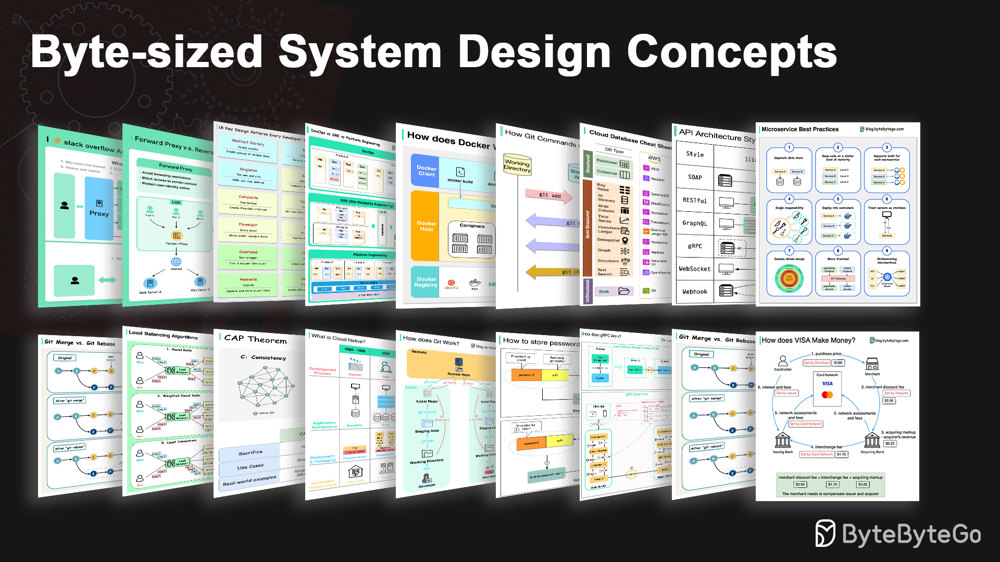 </a>

  【
  <a href="https://www.youtube.com/channel/UCZgt6AzoyjslHTC9dz0UoTw">
    👨🏻‍💻 YouTube
  </a> | 
  <a href="https://blog.bytebytego.com/?utm_source=site">
    📮 Newsletter
  </a> 】

# System Design 101

시각 자료와 간단한 용어를 사용하여 복잡한 시스템을 설명합니다. 

시스템 디자인 면접을 준비 중이거나 단순히 시스템이 표면 아래에서 어떻게 작동하는지 이해하고 싶으신 분이라면 이 리포지토리가 도움이 되길 바랍니다.

# 목차

<!-- TOC toc.levels=2 -->

- [Communication protocols](#communication-protocols)
  - [REST API vs GraphQL](#rest-api-vs-graphql)
  - [gRPC는 어떻게 작동하나요?](#grpc는-어떻게-작동하나요)
  - [webhook이란 무엇인가요?](#webhook이란-무엇인가요)
  - [API 성능을 개선하는 방법은 무엇인가요?](#api-성능을-개선하는-방법은-무엇인가요)
  - [HTTP 1.0 -\> HTTP 1.1 -\> HTTP 2.0 -\> HTTP 3.0 (QUIC)](#http-10---http-11---http-20---http-30-quic)
  - [SOAP vs REST vs GraphQL vs RPC](#soap-vs-rest-vs-graphql-vs-rpc)
  - [Code First vs API First](#code-first-vs-api-first)
  - [HTTP status codes](#http-status-codes)
  - [API gateway는 무엇을 하나요?](#api-gateway는-무엇을-하나요)
  - [효과적이고 안전한 API를 설계하려면 어떻게 해야 할까요?](#효과적이고-안전한-api를-설계하려면-어떻게-해야-할까요)
  - [TCP/IP encapsulation](#tcpip-encapsulation)
  - [왜 Nginx를 "reverse" 프록시라고 부르나요?](#왜-nginx를-reverse-프록시라고-부르나요)
  - [일반적인 로드 밸런싱 알고리즘은 무엇인가요?](#일반적인-로드-밸런싱-알고리즘은-무엇인가요)
  - [URL, URI, URN - 차이를 알고 있나요?](#url-uri-urn---차이를-알고-있나요)
- [CI/CD](#cicd)
  - [쉬운 용어로 설명하는 CI/CD 파이프라인](#쉬운-용어로-설명하는-cicd-파이프라인)
  - [넷플릭스 기술스택 (CI/CD Pipeline)](#넷플릭스-기술스택-cicd-pipeline)
- [아키텍처 패턴](#아키텍처-패턴)
  - [MVC, MVP, MVVM, MVVM-C, VIPER](#mvc-mvp-mvvm-mvvm-c-and-viper)
  - [모든 개발자가 알아야 할 18가지 핵심 디자인 패턴](#모든-개발자가-알아야-할-18가지-핵심-디자인-패턴)
- [데이터베이스](#데이터베이스)
  - [클라우드 서비스의 다양한 데이터베이스에 관한 치트시트](#클라우드-서비스의-다양한-데이터베이스에-관한-치트시트)
  - [데이터베이스를 강화하는 8가지 데이터 구조](#데이터베이스를-강화하는-8가지-데이터-구조)
  - [데이터베이스에서 SQL 문은 어떻게 실행되나요?](#데이터베이스에서-SQL-문은-어떻게-실행되나요)
  - [CAP 정리](#cap-정리)
  - [메모리 및 스토리지의 종류](#메모리-및-스토리지의-종류)
  - [SQL 쿼리 시각화](#SQL-쿼리-시각화)
  - [SQL 언어](#sql-언어)
- [캐시](#캐시)
  - [데이터는 어디에나 캐시됩니다](#데이터는-어디에나-캐시됩니다)
  - [Redis는 왜 빠른가요?](#redis는-왜-빠른가요)
  - [Redis는 어떻게 사용하나요?](#redis는-어떻게-사용하나요)
  - [주요 캐싱 전략](#주요-캐싱-전략)
- [마이크로서비스 아키텍처](#마이크로서비스-아키텍처)
  - [일반적인 마이크로서비스 아키텍처는 어떤 모습일까요?](#일반적인-마이크로서비스-아키텍처는-어떤-모습일까요)
  - [마이크로서비스 모범 사례](#마이크로서비스-모범사례)
  - [마이크로서비스에 일반적으로 사용하는 기술 스택은 무엇인가요?](#마이크로서비스에-일반적으로-사용하는-기술-스택은-무엇인가요)
  - [카프카가 빠른 이유](#카프카가-빠른-이유)
- [결제 시스템](#결제-시스템)
  - [결제 시스템은 어떻게 배우나요?](#결제-시스템은-어떻게-배우나요)
  - [신용카드를 "은행에서 가장 수익성이 높은 상품"이라고 부르는 이유는 무엇인가요? 비자/마스터카드는 어떻게 수익을 창출하나요?](#신용카드를-은행에서-가장-수익성이-높은-상품이라고-부르는-이유는-무엇인가요-비자마스터카드는-어떻게-수익을-창출하나요)
  - [상점에서 우리가 신용카드를 긁을 때, VISA는 어떻게 작동하나요?](#상점에서-우리가-신용카드를-긁을-때-visa는-어떻게-작동하나요)
  - [세계의 결제 시스템 시리즈(1부): 인도의 통합 결제 인터페이스(UPI)](#세계의-결제-시스템-시리즈1부-인도의-통합-결제-인터페이스upi)
- [DevOps](#devops)
  - [DevOps vs SRE vs Platform Engineering 무엇이 다른가요?](#devops-vs-sre-vs-platform-engineering-무엇이-다른가요)
  - [k8s(Kubernetes)란 무엇인가요?](#k8skubernetes란-무엇인가요)
  - [Docker vs Kubernetes. 어떤것을 사용해야 하나요?](#docker-vs-kubernetes-어떤것을-사용해야-하나요)
  - [Docker는 어떻게 작동하나요?](#docker는-어떻게-작동하나요)
- [GIT](#git)
  - [Git Commands 작동 방식](#git-commands-작동-방식)
  - [Git은 어떻게 작동하나요?](#git은-어떻게-작동하나요)
  - [Git merge vs Git rebase](#git-merge-vs-git-rebase)
- [클라우드 서비스](#클라우드-서비스)
  - [다양한 클라우드 서비스에 대한 유용한 치트시트(2023년판)](#다양한-클라우드-서비스에-대한-유용한-치트시트2023년판)
  - [cloud native란 무엇인가요?](#cloud-native란-무엇인가요)
- [개발자 생산성 도구](#개발자-생산성-도구)
  - [JSON 파일 시각화](#json-파일-시각화)
  - [코드를 아키텍처 다이어그램으로 자동 변환](#코드를-아키텍처-다이어그램으로-자동-변환)
- [리눅스](#리눅스)
  - [리눅스 파일 시스템 설명](#리눅스-파일-시스템-설명)
  - [가장 많이 사용되는 18가지 리눅스 커맨드 알아보기](#가장-많이-사용되는-18가지-리눅스-커맨드-알아보기)
- [보안](#보안)
  - [HTTPS는 어떻게 작동하나요?](#https는-어떻게-작동하나요)
  - [간단한 용어로 설명하는 Oauth 2.0](#간단한-용어로-설명하는-oauth-20)
  - [인증 메커니즘의 4가지 주요 형태](#인증-메커니즘의-4가지-주요-형태)
  - [Session, cookie, JWT, token, SSO, OAuth 2.0 - 그게 뭔가요?](#session-cookie-jwt-token-sso-oauth-20---그게-뭔가요)
  - [데이터베이스에 비밀번호를 안전하게 저장하는 방법과 비밀번호를 확인하는 방법은 무엇인가요?](#데이터베이스에-비밀번호를-안전하게-저장하는-방법과-비밀번호를-확인하는-방법은-무엇인가요)
  - [10세 어린이에게 JSON Web Token(JWT) 설명하기](#10세-어린이에게-json-web-tokenjwt-설명하기)
  - [Google authenticator(또는 다른 유형의 2 factor authenticator)는 어떻게 작동하나요?](#google-authenticator또는-다른-유형의-2-factor-authenticator는-어떻게-작동하나요)
- [실제 사례 연구](#실제-사례-연구)
  - [넷플릭스 기술 스택](#넷플릭스-기술-스택)
  - [트위터 아키텍처 2022](#트위터-아키텍처-2022)
  - [지난 15년간 에어비앤비 마이크로서비스 아키텍처의 진화 과정](#지난-15년간-에어비앤비-마이크로서비스-아키텍처의-진화-과정)
  - [모노레포 vs 마이크로레포](#모노레포-vs-마이크로레포)
  - [스택 오버플로 웹사이트를 어떻게 디자인할 건가요?](#스택-오버플로-웹사이트를-어떻게-디자인할-건가요)
  - [아마존 프라임 비디오 모니터링이 서버리스에서 모놀리식으로 전환된 이유는 무엇인가요? 어떻게 90%의 비용을 절감할 수 있을까요?](#아마존-프라임-비디오-모니터링이-서버리스에서-모놀리식으로-전환된-이유는-무엇인가요-어떻게-90의-비용을-절감할-수-있을까요)
  - [디즈니 핫스타는 어떻게 토너먼트 기간 동안 50억 개의 이모티콘을 획득할 수 있었나요?](#디즈니-핫스타는-어떻게-토너먼트-기간-동안-50억-개의-이모티콘을-획득할-수-있었나요)
  - [Discord가 수조 개의 메시지를 저장하는 방법](#discord가-수조-개의-메시지를-저장하는-방법)
  - [동영상 라이브 스트리밍은 YouTube, TikTok 라이브, Twitch에서 어떻게 작동하나요?](#동영상-라이브-스트리밍은-youtube-tiktok-라이브-twitch에서-어떻게-작동하나요)

<!-- /TOC -->

## Communication protocols

아키텍처 스타일은 애플리케이션 프로그래밍 인터페이스(API)의 여러 구성 요소가 서로 상호 작용하는 방식을 정의합니다. 결과적으로 API를 설계하고 구축하는 표준 접근 방식을 제공함으로써 효율성, 안정성, 다른 시스템과의 쉬운 통합을 보장합니다. 다음은 가장 많이 사용되는 스타일입니다.

  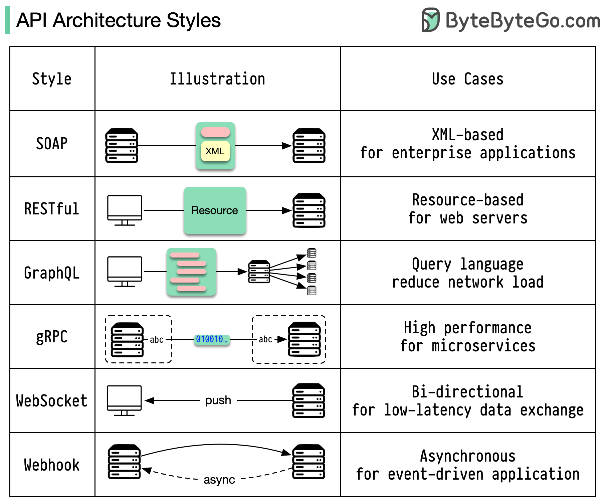

- SOAP: 

  성숙하고, 포괄적이고, XML 기반 
  
  엔터프라이즈 애플리케이션에 가장 적합 

- RESTful: 

  인기있고, 구현하기 쉽고, HTTP methods 

  웹 서비스에 이상적 

- GraphQL: 

  쿼리 언어, 특정 데이터 요청 

  네트워크 오버헤드 감소, 빠른 응답 

- gRPC: 

  Modern, high-performance, Protocol Buffers 

  마이크로서비스 아키텍처에 적합 

- WebSocket: 

  실시간, 양방향, 지속적인 연결 

  지연 시간이 짧은 데이터에 적합 

- Webhook: 

  이벤트 기반, HTTP 콜백, 비동기식 

  이벤트가 발생하면 시스템에 알림 

### REST API vs GraphQL

API 설계에 있어서 REST와 GraphQL은 고유의 장단점이 있습니다.

아래 다이어그램은 REST와 GraphQL을 간략하게 비교한 것입니다.

  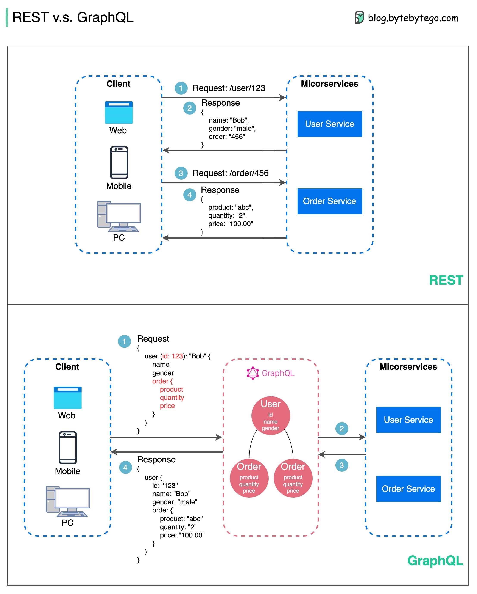

REST

- CRUD 작업에 GET, POST, PUT, DELETE와 같은 표준 HTTP 메서드를 사용합니다.
- 서로 다른 서비스/애플리케이션 간에 간단하고 균일한 인터페이스가 필요할 때 효과적입니다.
- 캐싱 전략은 구현이 간단합니다.
- 단점으로 별도의 엔드포인트에서 관련 데이터를 수집하기 위해 여러 번의 왕복이 필요할 수 있습니다.

GraphQL

- 클라이언트가 필요한 데이터를 정확하게 쿼리할 수 있는 단일 엔드포인트를 제공합니다.
- 클라이언트가 중첩 쿼리에 필요한 정확한 필드를 지정하면 서버는 해당 필드만 포함한 최적화된 페이로드를 반환합니다.
- 데이터 수정을 위한 뮤테이션과 실시간 알림을 위한 구독을 지원합니다.
- 여러 소스의 데이터를 응집하는데 적합하며 빠르게 진화하는 프론트엔드 요구사항에 잘 맞습니다.
- 하지만 복잡성을 클라이언트 측으로 전가하며, 제대로 보호하지 않으면 악의적인 쿼리를 허용할 수 있습니다.
- 캐싱 전략은 REST보다 더 복잡할 수 있습니다.

애플리케이션과 개발팀의 구체적인 요구사항에 따라 REST와 GraphQL 중 적합한 것을 선택해야 합니다. GraphQL은 복잡하거나 자주 변경되는 프론트엔드 요구사항에 적합하며, REST는 단순하고 일관된 계약이 선호되는 애플리케이션에 적합합니다.

두 API 방식 모두 은총알은 아닙니다. 올바른 스타일을 선택하려면 요구 사항과 장단점을 신중하게 검토하는 것이 중요합니다. REST와 GraphQL은 모두 데이터를 노출하고 최신 애플리케이션을 구동하는 데 유효한 옵션입니다.

### gRPC는 어떻게 작동하나요?

RPC(Remote Procedure Call)는 마이크로서비스 아키텍처에서 서비스가 서로 다른 서버에 배포될 때 원격 서비스 간의 통신을 가능하게 하기 때문에 "**remote**"라고 불립니다. 사용자 입장에서는 로컬 함수 호출처럼 작동합니다.

아래 다이어그램은 **gRPC**의 전체 데이터 플로우를 보여줍니다.

  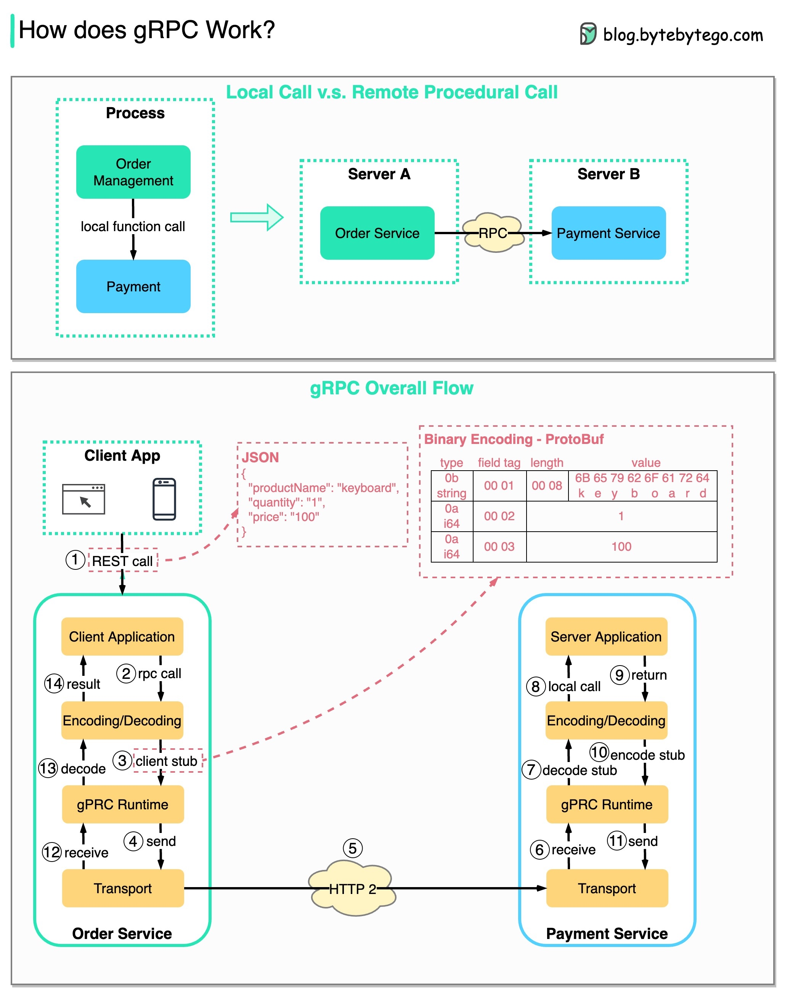

1단계: 클라이언트에서 REST 호출을 수행합니다. request body는 일반적으로 JSON 포맷입니다.

2-4단계: 주문 서비스(gRPC 클라이언트)가 REST 호출을 수신하여 변환한 후 결제 서비스에 RPC 호출을 합니다. gRPC는 **client stub**을 바이너리로 인코딩하여 로우레벨 전송 계층으로 보냅니다.

5단계: gRPC가 HTTP2를 통해 패킷을 전송합니다. 바이너리 인코딩과 네트워크 최적화로 인해 gRPC는 JSON보다 5배 빠르다고 합니다.

6-8단계: 결제 서비스(gRPC 서버)가 네트워크에서 패킷을 수신하고, 이를 디코딩한 후 서버 애플리케이션을 호출합니다.

9-11단계: 서버 애플리케이션에서 결과를 반환하고 인코딩하여 전송 계층으로 전송합니다.

12-14단계: 주문 서비스가 패킷을 수신하여 디코딩한 후 결과를 클라이언트 애플리케이션에 보냅니다.

### webhook이란 무엇인가요?

아래 다이어그램은 폴링과 웹훅을 비교한 것입니다. 

  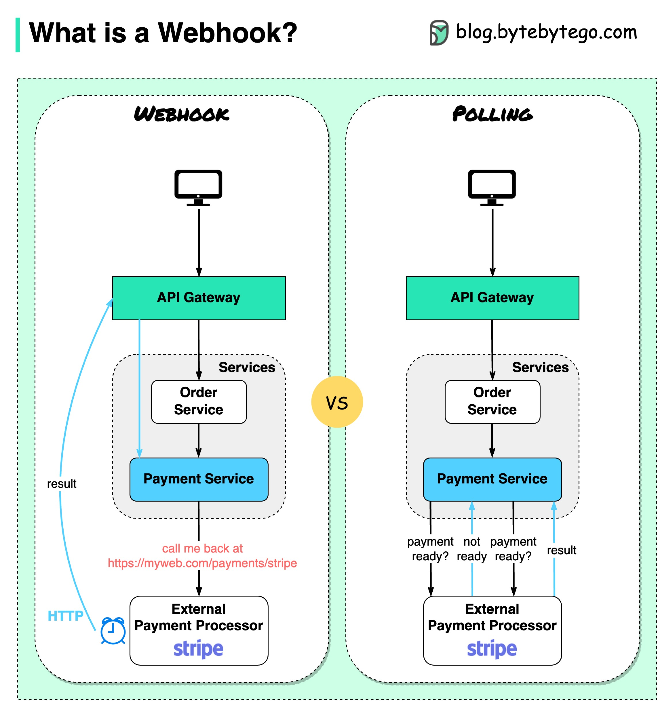

전자상거래 웹사이트를 운영한다고 가정해 보겠습니다. 클라이언트가 API 게이트웨이를 통해 주문 서비스로 주문을 보내면, 주문 서비스는 결제 트랜잭션을 위해 결제 서비스로 이동합니다. 그러면 결제 서비스는 외부 결제 서비스 공급업체(PSP)와 통신하여 트랜잭션을 완료합니다. 

외부 PSP와의 통신을 처리하는 방법에는 두 가지가 있습니다.

**1. 숏 폴링 Short polling** 

결제 요청을 PSP에 전송한 후 결제 서비스에서 PSP에 결제 상태를 계속 묻습니다. 몇 번의 라운드가 끝나면 PSP는 마침내 상태를 반환합니다. 

숏 폴링에는 두 가지 단점이 있습니다.
- 상태를 지속적으로 폴링하려면 결제 서비스의 리소스가 필요합니다. 
- 외부 서비스가 결제 서비스와 직접 통신하므로 보안 취약점이 발생할 수 있습니다.

**2. 웹훅 Webhook** 

외부 서비스에 웹훅을 등록할 수 있습니다. 즉, 요청에 대한 업데이트가 있을 때 특정 URL로 다시 호출하라는 의미입니다. PSP가 처리를 완료하면 HTTP 요청을 호출하여 결제 상태를 업데이트합니다.

이러한 방식으로 프로그래밍 패러다임이 바뀌고 결제 서비스는 더 이상 결제 상태를 폴링하기 위해 리소스를 낭비할 필요가 없습니다.

PSP가 다시 응답하지 않으면 어떻게 하나요? 매 시간 결제 상태를 확인하도록 하우스키핑 작업을 설정할 수 있습니다.

웹훅은 서버가 클라이언트에 HTTP 요청을 보내기 때문에 리버스 API 또는 푸시 API라고도 불립니다. 웹훅을 사용할 때는 다음 세 가지 사항에 주의해야 합니다.

1. 외부 서비스가 호출할 수 있는 적절한 API를 설계해야 합니다.
2. 보안을 위해 API 게이트웨이에 적절한 규칙을 설정해야 합니다.
3. 외부 서비스에 올바른 URL을 등록해야 합니다.

### API 성능을 개선하는 방법은 무엇인가요?

아래 다이어그램은 API 성능을 개선하는 5가지 일반적인 방법을 보여줍니다.

  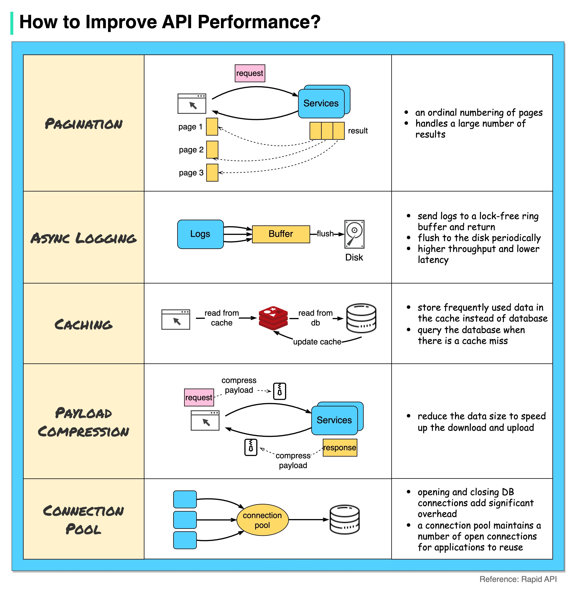

Pagination

이는 결과의 크기가 클 때 일반적으로 사용하는 최적화 방법입니다. 서비스 응답성을 개선하기 위해 결과를 클라이언트로 다시 스트리밍합니다.

Asynchronous Logging

동기식 로깅은 모든 호출에 대해 디스크를 처리하므로 시스템 속도가 느려질 수 있습니다. 비동기 로깅은 로그를 잠금 없는 버퍼로 먼저 전송한 후 즉시 반환합니다. 로그는 주기적으로 디스크에 플러시됩니다. 따라서 I/O 오버헤드가 크게 줄어듭니다.

Caching

자주 액세스하는 데이터를 캐시에 저장할 수 있습니다. 클라이언트는 데이터베이스를 직접 방문하는 대신 캐시를 먼저 쿼리할 수 있습니다. 캐시에 미스가 있는 경우 클라이언트는 데이터베이스에서 쿼리할 수 있습니다. Redis와 같은 캐시는 데이터를 메모리에 저장하므로 데이터 액세스가 데이터베이스보다 훨씬 빠릅니다.

Payload Compression

요청과 응답은 gzip 등을 사용하여 압축할 수 있으므로 전송되는 데이터 크기가 훨씬 작아집니다. 이렇게 하면 업로드와 다운로드 속도가 빨라집니다.

Connection Pool

리소스에 액세스할 때 데이터베이스에서 데이터를 로드해야 하는 경우가 종종 있습니다. 닫혀 있는 데이터베이스 커넥션을 열면 상당한 오버헤드가 추가됩니다. 따라서 오픈 커넥션 풀을 통해 데이터베이스에 연결해야 합니다. 커넥션 풀은 커넥션 라이프사이클을 관리하는 역할을 합니다.

### HTTP 1.0 -> HTTP 1.1 -> HTTP 2.0 -> HTTP 3.0 (QUIC)

각 세대의 HTTP는 어떤 문제를 해결하나요?

아래 다이어그램은 주요 특징을 보여줍니다.

  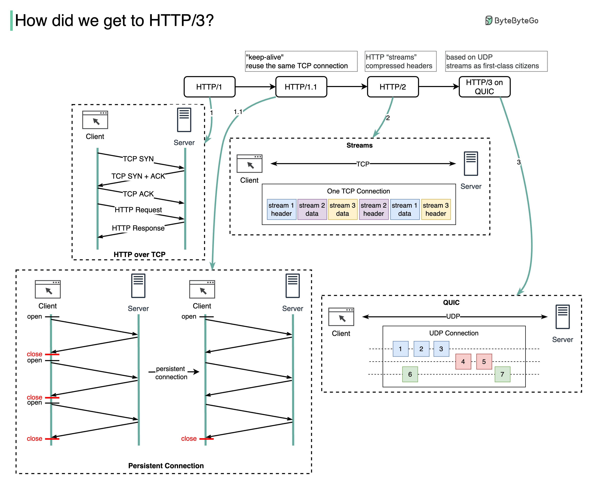

- HTTP 1.0은 1996년에 완성되어 완전히 문서화되었습니다. 동일한 서버에 대한 모든 요청에는 별도의 TCP 연결이 필요합니다.

- HTTP 1.1은 1997년에 발표되었습니다. TCP 커넥션은 재사용(persistent connection)을 위해 열어둘 수 있지만, HOL(head-of-line) 차단 문제를 해결하지는 못합니다.

  HOL 차단 - 브라우저에서 허용하는 병렬 요청의 수를 모두 사용하면 후속 요청은 이전 요청이 완료될 때까지 기다려야 합니다.

- HTTP 2.0은 2015년에 발표되었습니다. 이는 요청 다중화를 통해 HOL 문제를 해결하여 응용 계층에서 HOL 차단을 제거하지만, 전송(TCP) 계층에는 여전히 HOL이 존재합니다.

  다이어그램에서 볼 수 있듯이 HTTP 2.0은 동일한 TCP 커넥션에 서로 다른 HTTP 교환을 다중화할 수 있는 추상화 개념인 HTTP "stream"을 도입했습니다. 각 스트림을 순서대로 전송할 필요는 없습니다.

- HTTP 3.0 초안은 2020년에 발표되었습니다. HTTP 2.0의 후속 버전으로 제안되었습니다. 기본 트랜스포트 프로토콜로 TCP 대신 QUIC을 사용하므로 전송 계층에서 HOL 차단이 제거됩니다. 

QUIC은 UDP를 기반으로 합니다. 이는 전송 계층에서 스트림을 퍼스트 클래스 시티즌으로 소개합니다. QUIC 스트림은 동일한 QUIC 커넥션을 공유하므로 새 스트림을 생성하기 위해 추가적인 핸드셰이크나 슬로우 스타트가 필요하지 않으며, 대부분의 경우 한 스트림에 영향을 미치는 패킷 손실이 다른 스트림에 영향을 미치지 않도록 독립적으로 전달됩니다.

### SOAP vs REST vs GraphQL vs RPC

아래 다이어그램은 API 타임라인과 API 스타일을 비교한 것입니다.

시간이 지남에 따라 다양한 API 아키텍처 스타일이 출시됩니다. 각 스타일에는 데이터 교환을 표준화하는 고유한 패턴이 있습니다. 

다이어그램에서 각 스타일의 사용 사례를 확인할 수 있습니다.

  

### Code First vs API First 

아래 다이어그램은 코드 퍼스트 개발과 API 퍼스트 개발의 차이점을 보여줍니다. API 퍼스트 설계를 고려해야 하는 이유는 무엇인가요?

  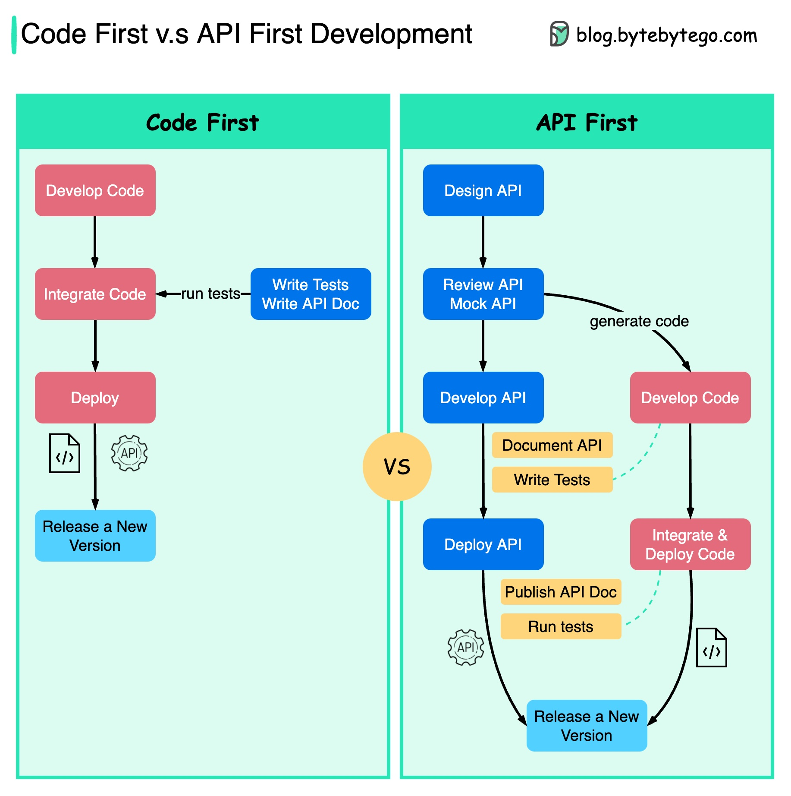

- 마이크로서비스는 시스템 복잡성을 증가시키며, 시스템의 다양한 기능을 담당하는 별도의 서비스를 제공합니다. 이러한 아키텍처는 업무의 디커플링과 분리를 용이하게 하지만 서비스 간의 다양한 커뮤니케이션을 처리해야 합니다.

코드를 작성하기 전에 시스템의 복잡성을 고려하고 서비스의 범위를 신중하게 정의하는 것이 좋습니다.

- 기능조직은 동일한 언어로 의사소통해야 하며, 목적조직은 자체 컴포넌트와 서비스에만 책임이 있습니다. API 설계를 통해 조직이 동일한 언어로 의사소통하는 것이 좋습니다.

코드를 작성하기 전에 요청과 응답을 모의로 작성하여 API 설계를 검증할 수 있습니다.

- 소프트웨어 품질과 개발자 생산성이 향상됩니다. 프로젝트가 시작될 때 대부분의 불확실성을 제거했기 때문에 전반적인 개발 프로세스가 더 원활해지고 소프트웨어 품질이 크게 향상됩니다.

개발자는 갑작스러운 변경 사항을 논의하는 대신 기능 개발에 집중할 수 있기 때문에 이 프로세스에 만족합니다.

프로젝트 라이프사이클이 끝날 무렵에 서프라이즈가 발생할 가능성이 줄어듭니다.

API를 먼저 설계했기 때문에 코드가 개발되는 동안 테스트를 설계할 수 있습니다. 어떤 면에서는 API 퍼스트 개발 방식을 사용할 때 TDD(Test Driven Design)를 적용한다고 볼 수 있습니다.

### HTTP status codes

  

HTTP의 응답 코드는 5가지 카테고리로 나누어집니다.

Informational (100-199)  
Success (200-299)  
Redirection (300-399)  
Client Error (400-499)  
Server Error (500-599)  

### API gateway는 무엇을 하나요? 

아래 다이어그램은 자세한 내용을 보여줍니다.

  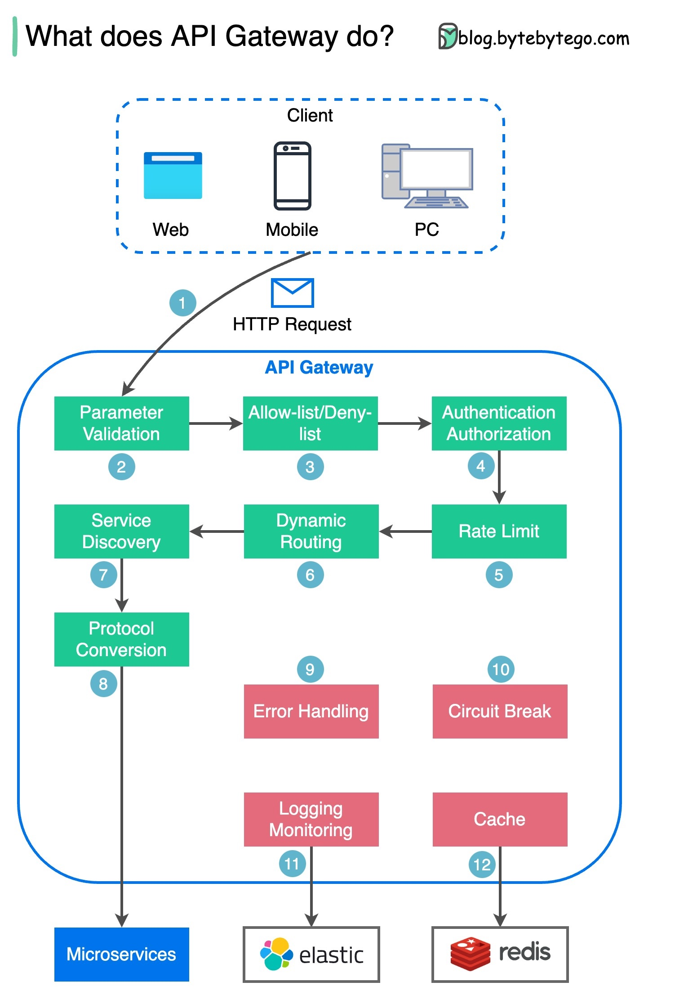

1단계 - 클라이언트가 API 게이트웨이에 HTTP 요청을 보냅니다.

2단계 - API 게이트웨이가 HTTP 요청의 어트리뷰트를 파싱하고 유효성을 검사합니다.

3단계 - API 게이트웨이가 allow-list/deny-list 검사를 수행합니다.

4단계 - API 게이트웨이가 인증과 인가를 위해 ID 공급자와 통신합니다.

5단계 - 요청에 레이트 리미트 규칙을 적용합니다. 한도를 초과하면 요청을 거부합니다.

6,7단계 - 요청이 기본 검사를 통과했으므로 이제 API 게이트웨이가 path 매칭을 통해 라우팅할 관련 서비스를 찾습니다.

8단계 - API 게이트웨이가 요청을 적절한 프로토콜로 변환하여 백엔드 마이크로서비스로 전송합니다.

9-12단계: API 게이트웨이는 오류를 적절하게 처리하고, 복구하는데 시간이 오래 걸리는 오류가 발생하는 경우 장애를 처리합니다.(circuit break) 또한 로깅과 모니터링을 위해 ELK(Elastic-Logstash-Kibana) 스택을 활용할 수 있습니다. 때때로 API 게이트웨이에 데이터를 캐시하기도 합니다.

### 효과적이고 안전한 API를 설계하려면 어떻게 해야 할까요?

아래 다이어그램은 쇼핑 카트 예시와 함께 일반적인 API 설계를 보여줍니다. 

  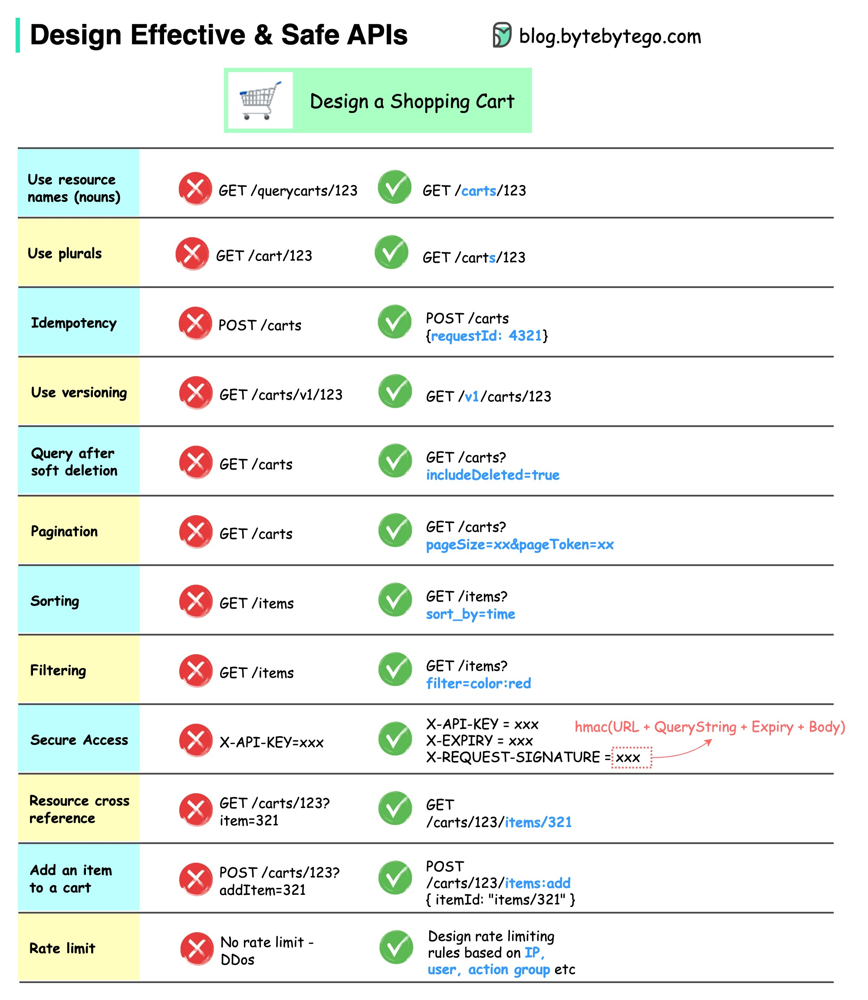

API 설계는 단순한 URL path 설계가 아니라는 점에 유의하세요. 대부분의 경우 적절한 리소스 이름, 식별자, path 패턴을 선택해야 합니다. 적절한 HTTP 헤더 필드를 설계하거나 API 게이트웨이 내에서 효과적인 레이트 리미트 규칙을 설계하는 것도 마찬가지로 중요합니다.

### TCP/IP encapsulation 

데이터는 네트워크를 통해 어떻게 전송되나요? OSI 모델에 많은 계층이 필요한 이유는 무엇인가요?

아래 다이어그램은 네트워크를 통해 데이터를 전송할 때 어떻게 캡슐화되고 캡슐화가 해제되는지 보여줍니다.

  

1단계: 디바이스 A가 네트워크상의 HTTP 프로토콜을 통해 장치 B로 데이터를 전송할 때, 먼저 응용 계층에서 HTTP 헤더가 추가됩니다.

2단계: 그런 다음 TCP 혹은 UDP 헤더가 데이터에 추가됩니다. 이 헤더는 전송 계층에서 TCP 세그먼트로 캡슐화됩니다. 헤더에는 출발지 포트, 도착지 포트, 시퀀스 넘버가 포함됩니다.

3단계: 그런 다음 세그먼트는 네트워크 계층에서 IP 헤더로 캡슐화됩니다. IP 헤더에는 출발지/도착지 IP 주소가 포함됩니다.

4단계: 데이터 링크 계층에서 IP 데이터그램에 출발지/도착지 MAC 주소와 함께 MAC 헤더가 추가됩니다.

5단계: 캡슐화된 프레임이 물리 계층으로 전송되고 네트워크를 통해 2진수 비트로 전송됩니다.

6-10단계: 디바이스 B가 네트워크에서 비트를 수신하면 캡슐화 프로세스의 역처리인 캡슐화 해제 프로세스를 수행합니다. 헤더가 한 층씩 제거되고 결국 디바이스 B가 데이터를 읽을 수 있게 됩니다.

네트워크 모델에 계층이 필요한 이유는 각 계층이 고유한 책임에 집중하기 때문입니다. 각 계층은 처리 지침을 헤더에 의존할 수 있으며 마지막 계층의 데이터의 의미를 알 필요가 없습니다.

### 왜 Nginx를 "reverse" 프록시라고 부르나요?

아래 다이어그램은 𝐟𝐨𝐫𝐰𝐚𝐫𝐝 𝐩𝐫𝐨𝐱𝐲 와 𝐫𝐞𝐯𝐞𝐫𝐬𝐞 𝐩𝐫𝐨𝐱𝐲 의 차이점을 보여줍니다.

  

포워드 프록시는 사용자 디바이스와 인터넷 사이에 있는 서버입니다.

포워드 프록시는 일반적으로 다음 용도로 사용됩니다.

1. 클라이언트 보호
2. 브라우징 제약 우회하기
3. 특정 콘텐츠에 대한 액세스 차단

리버스 프록시는 클라이언트의 요청을 수락하여 웹 서버로 요청을 전달한 후 프록시 서버가 요청을 처리한 것처럼 결과를 클라이언트에 반환하는 서버입니다.

리버스 프록시는 다음과 같은 경우에 유용합니다.

1. 서버 보호
2. 로드 밸런싱
3. 정적 콘텐츠 캐싱
4. SSL 통신 암호화 및 복호화

### 일반적인 로드 밸런싱 알고리즘은 무엇인가요?

아래 다이어그램은 6가지 일반적인 알고리즘을 보여줍니다.

  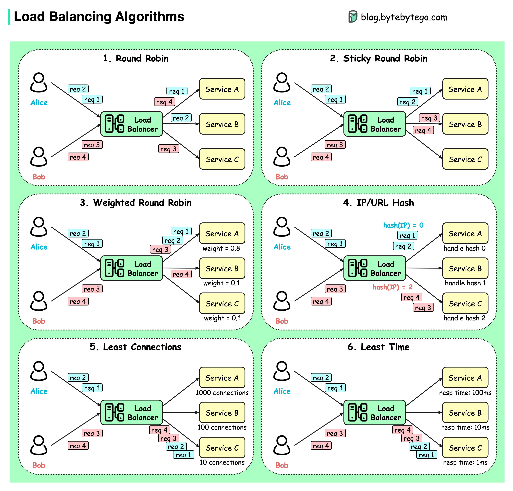

- 정적 알고리즘

1. Round robin

    클라이언트 요청은 순차적으로 다른 서비스 인스턴스로 전송됩니다. 서비스는 일반적으로 스테이트리스(과거 처리 내용을 기억하지 않는 서비스)여야 합니다. 

3. Sticky round-robin

    이는 라운드 로빈 알고리즘을 개선한 것입니다. 앨리스의 첫 번째 요청이 서비스 A로 전달되면 다음 요청도 서비스 A로 전달됩니다. 

4. Weighted round-robin

    관리자는 각 서비스에 대한 가중치를 지정할 수 있습니다. 가중치가 높은 서비스는 다른 서비스보다 더 많은 요청을 처리합니다.

6. Hash

    이 알고리즘은 들어오는 요청의 IP 또는 URL에 해시 함수를 적용합니다. 요청은 해시 함수 결과에 따라 관련 인스턴스로 라우팅됩니다.

- 동적 알고리즘

5. Least connections

    동시 연결이 가장 적은 서비스 인스턴스로 새 요청이 전송됩니다. 

7. Least response time

    새 요청은 응답 시간이 가장 빠른 서비스 인스턴스로 전송됩니다.

### URL, URI, URN - 차이를-알고-있나요? 

아래 다이어그램은 URL, URI, URN의 비교를 보여줍니다.

  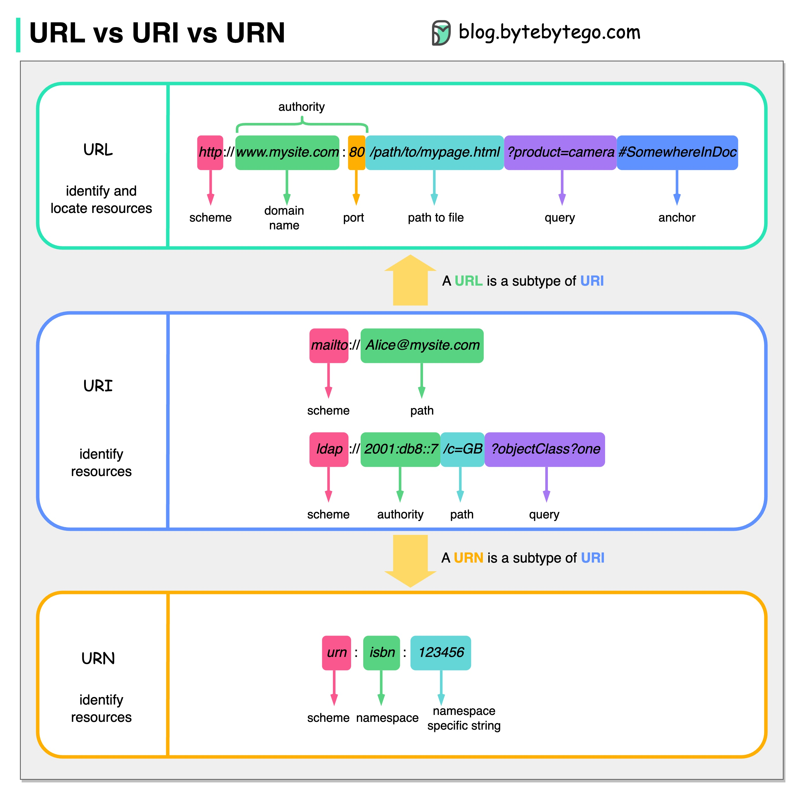

- URI 

URI은 Uniform Resource Identifier의 약자입니다. 웹에서 논리적 또는 물리적 리소스를 식별합니다. URL과 URN은 URI의 하위 유형입니다. URL은 리소스를 찾고 URN은 리소스의 이름을 지정합니다.

URI는 다음과 같은 부분으로 구성되어 있습니다. 
scheme:[//authority]path[?query][#fragment] 

- URL 

URL은 Uniform Resource Locator의 약자로, HTTP의 핵심 개념입니다. 웹에서 고유한 리소스의 주소입니다. FTP와 JDBC와 같은 다른 프로토콜과 함께 사용할 수 있습니다. 

- URN 

URN은 Uniform Resource Name의 약자로, urn 스키마를 사용합니다. URN은 리소스를 찾는 데 사용할 수 없습니다. 다이어그램에 제시된 간단한 예는 네임스페이스와 네임스페이스 특정 문자열로 구성되어 있습니다.

이 주제에 대해 더 자세히 알아보려면 [W3C’s clarification](https://www.w3.org/TR/uri-clarification/)을 추천합니다.

## CI/CD

### 쉬운 용어로 설명하는 CI/CD 파이프라인

  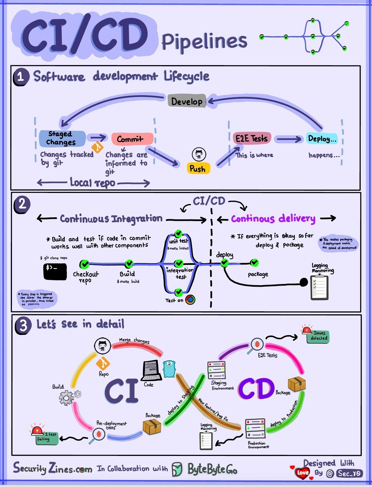

섹션 1 - CI/CD가 포함된 소프트웨어 개발 수명 주기

소프트웨어 개발 수명 주기(SDLC)는 개발, 테스트, 배포, 유지보수 등 몇 가지 주요 단계로 구성됩니다. CI/CD는 이러한 단계를 자동화하고 통합하여 더 빠르고 안정적인 릴리스를 가능하게 합니다.

코드가 git 리포지토리에 푸시되면 자동화된 빌드, 테스트 프로세스가 시작됩니다. 코드의 유효성을 검사하기 위해 엔드투엔드(e2e) 테스트 케이스가 실행됩니다. 테스트를 통과하면 코드를 스테이징/프로덕션 환경에 자동으로 배포할 수 있습니다. 이슈가 발견되면 코드는 버그 수정을 위해 개발 단계로 다시 보내집니다. 이러한 자동화는 개발자에게 신속한 피드백을 제공하고 프로덕션 환경에서 발생하는 버그 위험을 줄여줍니다.

섹션 2 - CI와 CD의 차이점

Continuous Integration(CI)은 빌드, 테스트, 병합 프로세스를 자동화합니다. 코드가 커밋될 때마다 테스트를 실행하여 통합 이슈를 조기에 발견합니다. 이를 통해 코드 커밋을 자주 하고 피드백을 빠르게 받을 수 있습니다.

Continuous Delivery(CD)는 인프라 변경, 배포와 같은 릴리스 프로세스를 자동화합니다. 자동화된 워크플로를 통해 언제든지 소프트웨어를 안정적으로 릴리스할 수 있습니다. 또한 CD는 프로덕션 배포 전에 필요한 메뉴얼 테스트와 승인 단계를 자동화할 수도 있습니다.

섹션 3 - CI/CD 파이프라인

일반적인 CI/CD 파이프라인은 다음과 같이 연결된 여러 단계로 구성됩니다.
- 개발자가 코드 변경 사항을 소스 컨트롤에 커밋합니다.
- CI 서버가 변경 사항을 감지하고 빌드를 트리거합니다.
- 코드가 컴파일되고 테스트됩니다(단위 테스트, 통합 테스트).
- 테스트 결과를 개발자에게 보고합니다.
- 성공하면 아티팩트가 스테이징 환경에 배포됩니다.
- 릴리스 전에 스테이징 환경에서 추가 테스트를 수행할 수 있습니다.
- CD 시스템이 승인된 변경 사항을 프로덕션에 배포합니다.

### 넷플릭스 기술스택 (CI/CD Pipeline)

  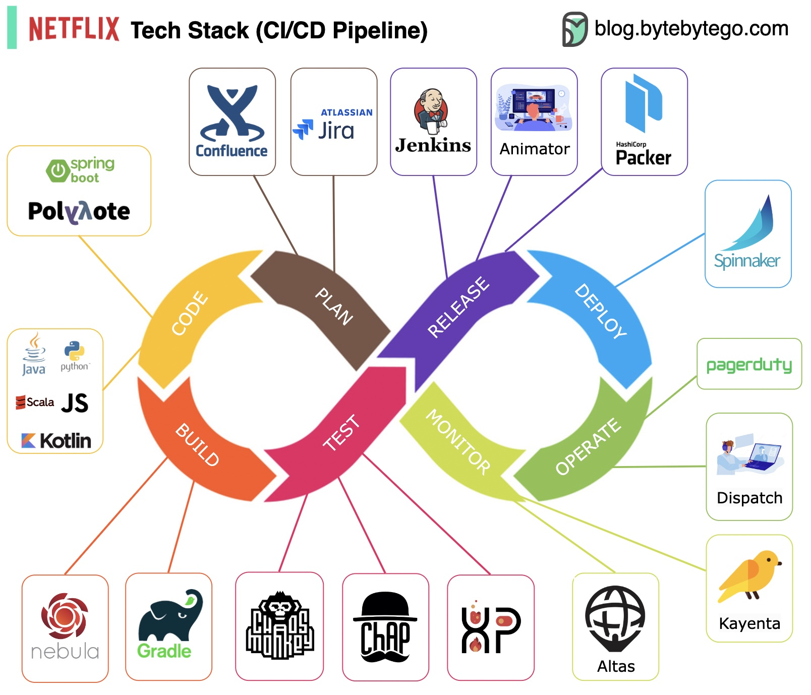

플래닝: 넷플릭스 엔지니어링은 플래닝에는 JIRA를, 문서화에는 Confluence를 사용합니다.

코딩: Java는 백엔드 서비스를 위한 기본 프로그래밍 언어이며, 다른 언어는 유즈케이스에 따라 사용됩니다.  

빌드: Gradle은 주로 빌드에 사용되며, Gradle 플러그인은 다양한 유스케이스를 지원하기 위해 만들어졌습니다.

패키징: 패키지 및 의존성은 릴리스를 위해 아마존 머신 이미지(AMI)에 패키징됩니다. 

테스팅: 테스트는 카오스 툴(시스템에 예상치 못한 장애나 트래픽을 발생시켜 시스템의 안정성을 테스트하는 도구)을 구축하는 데 중점을 두는 프로덕션 문화를 강조합니다.  

배포: 넷플릭스는 카나리 롤아웃 배포에 자체 구축한 Spinnaker를 사용합니다.

모니터링: 모니터링 지표는 Atlas에서 중앙 집중식으로 관리되며, 이상 징후를 감지하는 데 Kayenta가 사용됩니다. 

인시던트 리포트: 우선순위에 따라 인시던트가 발송되며, 사고 처리를 위해 PagerDuty가 사용됩니다. 

## 아키텍처 패턴

### MVC, MVP, MVVM, MVVM-C, VIPER
이러한 아키텍처 패턴은 iOS, Android 플랫폼에서 앱 개발 시 가장 일반적으로 사용하는 패턴입니다. 개발자들은 이전 패턴의 한계를 극복하기 위해 이러한 패턴을 도입했습니다. 그렇다면 어떻게 다를까요?

  

- 가장 오래된 패턴인 MVC는 거의 50년 전으로 거슬러 올라갑니다.
- 모든 패턴에는 콘텐츠를 표시하고 사용자 입력을 수신하는 view(V)가 있습니다. 
- 대부분의 패턴에는 비즈니스 데이터를 관리하기 위한 model(M)이 포함됩니다.
- Controller, presenter, view-model은 뷰와 모델(VIPER 패턴의 entity) 사이를 매개하는 변환기입니다.

### 모든 개발자가 알아야 할 18가지 핵심 디자인 패턴

패턴은 일반적인 설계 문제에 대한 재사용 가능한 솔루션으로, 보다 원활하고 효율적인 개발 프로세스를 가능하게 합니다. 패턴은 더 나은 소프트웨어 구조를 구축하기 위한 설계도(blueprint) 역할을 합니다. 다음은 가장 많이 사용되는 패턴 중 일부입니다.

  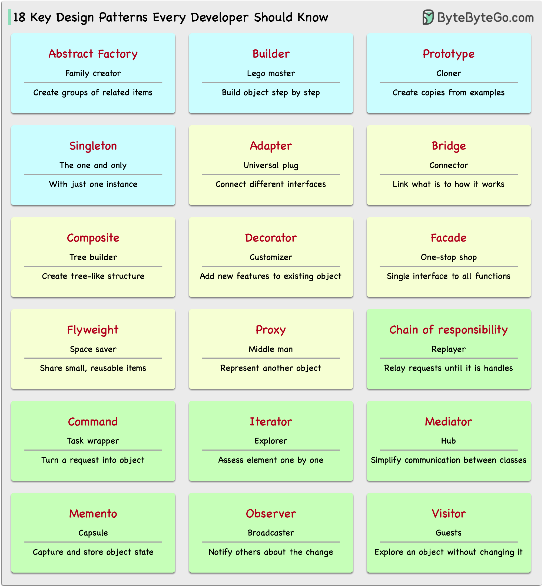

- Abstract Factory: Family Creator - 관련 항목 그룹을 만듭니다.
- Builder: Lego Master - 생성 및 모양을 분리하여 객체를 단계별로 빌드합니다.
- Prototype: Clone Maker - 완전히 준비된 예제의 복사본을 생성합니다.
- Singleton: One and Only - 인스턴스가 하나뿐인 특별한 클래스입니다.
- Adapter: Universal Plug - 서로 다른 인터페이스를 가진 것들을 연결합니다.
- Bridge: Function Connector - 객체의 구현과 행동을 연결합니다.
- Composite: Tree Builder -  단순한 부분과 복잡한 부분으로 이루어진 트리 구조를 형성합니다.
- Decorator: Customizer - 객체의 핵심을 손상하지 않고 기능을 추가합니다.
- Facade: One-Stop-Shop - 전체 시스템을 단일하고 간단한 인터페이스로 나타냅니다.
- Flyweight: Space Saver - 작고 재사용 가능한 항목을 효율적으로 공유합니다.
- Proxy: Stand-In Actor - 다른 객체를 대표하여 액세스 또는 작업을 제어합니다.
- Chain of Responsibility: Request Relay - 요청을 처리할 때까지 객체 체인을 통해 전달합니다.
- Command: Task Wrapper - 요청을 객체로 변환하여 작업 준비를 갖추게 합니다.
- Iterator: Collection Explorer - 컬렉션 요소에 하나씩 액세스합니다.
- Mediator: Communication Hub - 서로 다른 클래스 간의 인터랙션을 간소화합니다.
- Memento: Time Capsule - 객체의 상태를 캡처하고 복원합니다.
- Observer: News Broadcaster - 다른 객체의 변경에 대해 클래스에게 알립니다.
- Visitor: Skillful Guest - 객체를 변경하지 않고 새로운 작업을 추가합니다.

## 데이터베이스

### 클라우드 서비스의 다양한 데이터베이스에 관한 치트시트

  

프로젝트에 적합한 데이터베이스를 선택하는 것은 복잡한 작업입니다. 각기 다른 유즈케이스에 적합한 데이터베이스 옵션이 많으면 의사 결정에 대한 피로도가 빠르게 높아질 수 있습니다.

이 치트시트가 프로젝트의 요구사항에 맞는 올바른 서비스를 찾아내고 잠재적인 함정을 피하는 데 도움이 되기를 바랍니다.

참고: 구글은 데이터베이스 유즈케이스에 대한 문서가 제한되어 있습니다. 사용 가능한 자료를 최대한 검토하고 최선의 옵션을 제시했지만, 일부 항목은 더 정확한 정보가 필요할 수 있습니다.

### 데이터베이스를 강화하는 8가지 데이터 구조

정답은 유즈케이스에 따라 달라집니다. 데이터는 메모리나 디스크에 인덱스 될 수 있습니다. 마찬가지로 데이터 포맷도 넘버, 스트링, 지리적 좌표 등 다양합니다. 시스템이 쓰기 중심일 수도, 읽기 중심일 수도 있습니다. 이러한 모든 요소는 데이터베이스 인덱스 포맷 선택에 영향을 미칩니다. 

  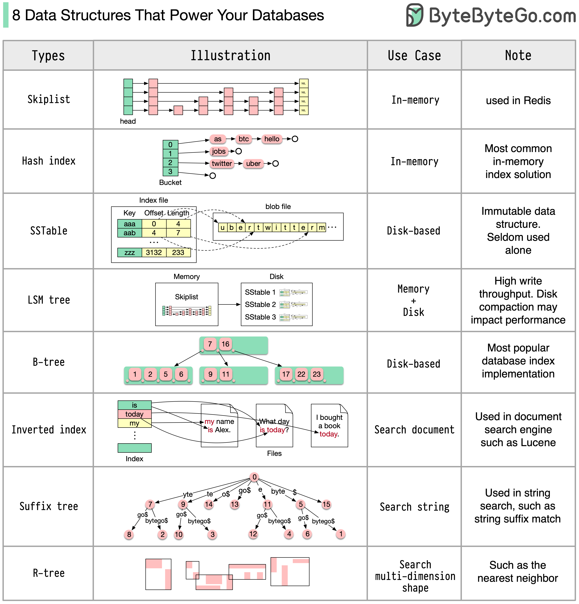

다음은 데이터 인덱싱에 가장 많이 사용되는 몇 가지 데이터 구조입니다.

- Skiplist: 일반적인 인메모리 인덱스 타입으로, Redis에서 사용.
- Hash index: Map 데이터 구조(또는 Collection)의 매우 일반적인 구현.
- SSTable: 디스크에 이뮤터블 Map 구현
- LSM tree: Skiplist + SSTable. 높은 쓰기 처리량. 
- B-tree: 디스크 기반 솔루션. 일관된 읽기/쓰기 성능.
- Inverted index: 도큐먼트 인덱싱에 사용. 루씬에서 사용.
- Suffix tree: 스트링 패턴 검색. 
- R-tree: 가장 가까운 이웃 찾기와 같은 다차원 검색. 

### 데이터베이스에서 SQL 문은 어떻게 실행되나요?

아래 다이어그램은 그 과정을 보여줍니다. 데이터베이스마다 아키텍처가 다르지만 이 다이어그램은 몇 가지 일반적인 설계를 보여줍니다.

  

1단계 - SQL 문은 전송 계층 프로토콜(예: TCP)을 통해 데이터베이스로 전송됩니다.

2단계 - SQL 문은 command parser로 전송되어 구문 및 의미 분석을 거친 후 쿼리 트리가 생성됩니다.

3단계 - 쿼리 트리가 optimizer로 전송됩니다. optimizer가 실행 계획을 생성합니다.

4단계 - 실행 계획이 executor에게 전송됩니다. executor는 익스큐션에서 데이터를 검색합니다.

5단계 - Access methods는 실행에 필요한 데이터 페칭 로직을 제공하여 스토리지 엔진에서 데이터를 검색합니다. 

6단계 - Access methods는 SQL 문의 읽기 전용 여부를 결정합니다. 쿼리가 읽기 전용인 경우(SELECT 문), 쿼리는 추가 처리를 위해 buffer manager에게 전달됩니다. buffer manager는 캐시 또는 데이터 파일에서 데이터를 찾습니다.

7단계 - UPDATE 혹은 INSERT 문인 경우, 추가 처리를 위해 transaction manager에게 전달합니다.

8단계 - 트랜잭션이 진행되는 동안 데이터는 잠겨 있습니다. 이는 lock manager에 의해 보장됩니다. 또한 트랜잭션의 ACID 프로퍼티도 보장합니다. 

###  CAP 정리

CAP 정리는 컴퓨터 과학에서 가장 유명한 용어 중 하나이지만 개발자마다 이해하는 바가 다를 수 있습니다. 이 용어가 무엇이며 왜 혼란스러울 수 있는지 살펴보겠습니다. 

  

CAP 정리에 따르면 분산 시스템은 이 세 가지 보장 중 두 가지 이상을 동시에 제공할 수 없습니다.

**Consistency**: 일관성이란 모든 클라이언트가 어느 노드에 연결하든 동일한 데이터를 동시에 볼 수 있다는 의미입니다.

**Availability**: 가용성이란 일부 노드가 다운되더라도 데이터를 요청하는 모든 클라이언트가 응답을 받는다는 의미입니다.

**Partition Tolerance**: 파티션은 두 노드 간의 통신 단절을 나타냅니다. 파티션 똘레랑스는 시스템이 네트워크 파티션에도 불구하고 계속 작동할 수 있는 능력을 의미합니다.

"셋 중 둘" 공식은 유용할 수 있지만 **이러한 단순화는 오해의 소지가 있습니다**.

1. 데이터베이스를 선택하는 것은 쉽지 않습니다. CAP 정리만으로 선택을 정당화하는 것은 충분하지 않습니다. 예를 들어, 회사에서 단순히 AP 시스템이라는 이유만으로 채팅 애플리케이션을 위해 Cassandra를 선택하지는 않습니다. 채팅 메시지를 저장하는 데 있어 Cassandra를 바람직한 옵션으로 만드는 좋은 특성 목록이 있습니다. 더 깊이 파고들 필요가 있습니다.

2. "CAP는 디자인 공간의 극히 일부분, 즉 파티션이 있을 때 완벽한 가용성과 일관성을 보장하는 경우는 드뭅니다." 논문에서 인용: CAP Twelve Years Later: How the "Rules" Have Changed.

3. 이 정리는 약 100%의 가용성과 일관성을 의미합니다. 보다 현실적인 논의는 네트워크 파티션이 없을 때 지연 시간과 일관성 간의 절충안입니다. 자세한 내용은 PACELC 정리를 참조하세요.

**CAP정리가 실제로 유용한가요?**

절충안을 논의할 수 있다는 점에서 여전히 유용하다고 생각하지만, 이는 일부분일 뿐입니다. 올바른 데이터베이스를 선택하려면 더 깊이 파고들어야 합니다.

### 메모리 및 스토리지의 종류

  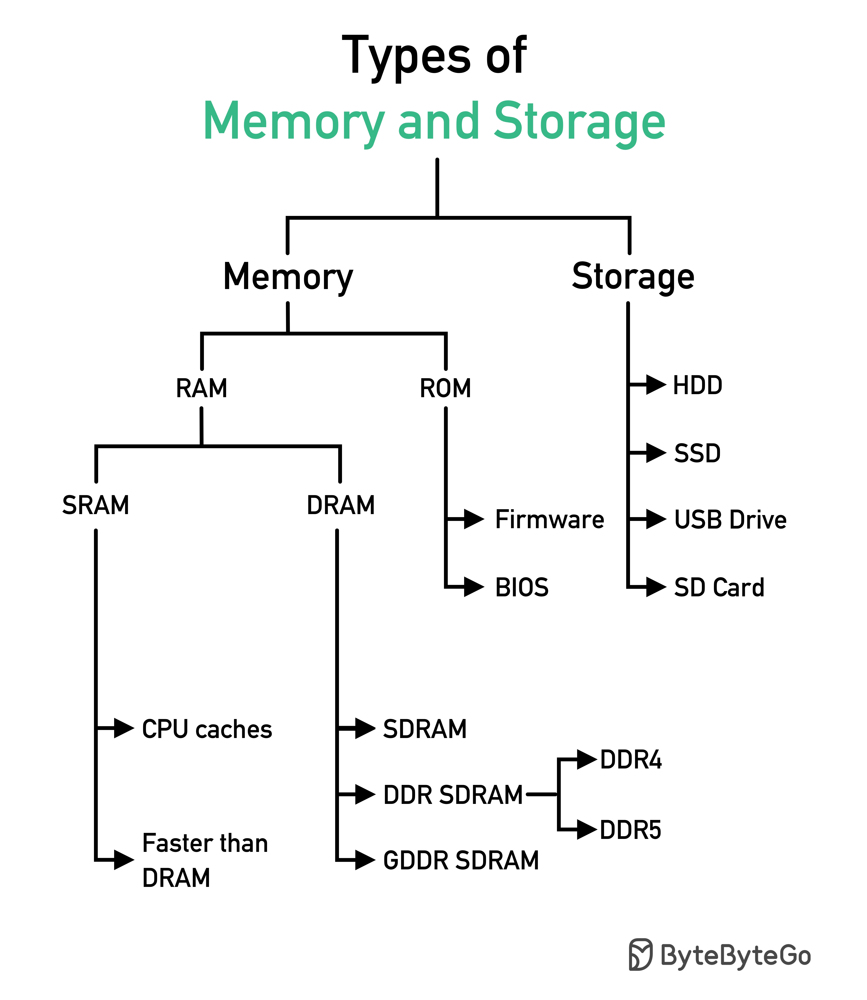

### SQL 쿼리 시각화

  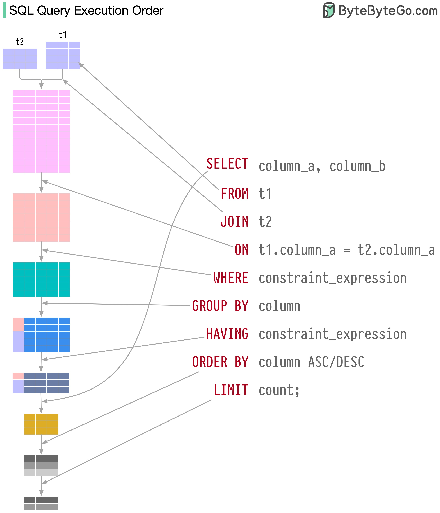

SQL 문은 데이터베이스 시스템에서 다음과 같은 여러 단계로 실행됩니다. 

- SQL문 파싱과 유효성 검사 
- SQL을 관계대수(relational algebra) 같은 내부 표현으로 변환 
- 내부 표현을 최적화하고 인덱스 정보를 활용하는 실행 계획 생성 
- 계획 실행 및 결과 반환

SQL 실행은 매우 복잡하며 다음과 같은 많은 고려 사항을 포함합니다. 

- 인덱스 및 캐시 사용 
- 테이블 조인 순서 
- 동시성 제어 
- 트랜잭션 관리

### SQL 언어 

1986년, SQL(Structured Query Language)이 표준이 되었습니다. 그 후 40년 동안 관계형 데이터베이스 관리 시스템에서 가장 많이 사용되는 언어가 되었습니다. 최신 표준(ANSI SQL 2016)을 읽는 데는 많은 시간이 소요될 수 있습니다. 어떻게 배울 수 있을까요? 

  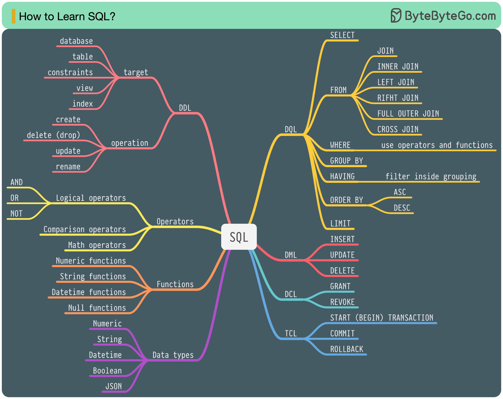

SQL 언어에는 5가지 구성 요소가 있습니다. 

- DDL: 데이터 정의 언어. 예: CREATE, ALTER, DROP 
- DQL: 데이터 쿼리 언어. 예: SELECT 
- DML: 데이터 조작 언어. 예: INSERT, UPDATE, DELETE 
- DCL: 데이터 제어 언어. 예: GRANT, REVOKE 
- TCL: 트랜잭션 제어 언어. 예: COMMIT, ROLLBACK 

백엔드 엔지니어의 경우 대부분을 알아야 할 수도 있습니다. 데이터 분석가라면 DQL을 잘 이해해야 할 수도 있습니다. 자신에게 가장 관련성이 높은 주제를 선택하세요. 

## 캐시

### 데이터는 어디에나 캐시됩니다

이 다이어그램은 일반적인 아키텍처에서 데이터를 캐시하는 위치를 보여줍니다.

  

플로우를 따라 **여러 레이어** 가 있습니다.

1. Client apps: HTTP 응답은 브라우저에 의해 캐시될 수 있습니다. HTTP를 통해 처음으로 데이터를 요청하면 HTTP 헤더에 만료 정책과 함께 반환되며, 데이터를 다시 요청하면 클라이언트 앱이 먼저 브라우저 캐시에서 데이터를 검색하려고 시도합니다.
2. CDN: CDN은 정적 웹 리소스를 캐시합니다. 클라이언트는 근처의 CDN 노드에서 데이터를 검색할 수 있습니다.
3. Load Balancer: 로드 밸런서는 리소스도 캐시할 수 있습니다.
4. Messaging infra: 메시지 브로커가 먼저 디스크에 메시지를 저장한 다음, 컨슈머는 자신의 속도에 맞춰 메시지를 검색합니다. 리텐션 정책에 따라 데이터는 일정 기간 동안 카프카 클러스터에 캐시됩니다.
5. Services: 서비스에는 여러개의 캐시 계층이 있습니다. CPU 캐시에 데이터가 없으면 메모리 캐시에서 검색을 시도합니다. 때로는 서비스가 디스크에 데이터를 저장하는 세컨드 레벨 캐시가 있을 수 있습니다.
6. Distributed Cache: Redis와 같은 분산 캐시는 여러 서비스에 대한 key-value 쌍을 메모리에 보관합니다. 데이터베이스보다 훨씬 뛰어난 읽기/쓰기 성능을 제공합니다.
7. Full-text Search: 도큐먼트 검색이나 로그 검색을 위해 Elastic Search와 같은 풀텍스트 검색을 사용해야 할 때가 있습니다. 데이터 사본도 검색 엔진에서 인덱스됩니다.
8. Database: 데이터베이스 내에서도 다양한 레벨의 캐시가 있습니다.
- WAL(Write-ahead Log): 데이터는 B 트리 인덱스를 구축하기 전에 먼저 WAL에 기록됩니다.
- Bufferpool: 쿼리 결과를 캐시하기 위해 할당된 메모리 영역입니다.
- Materialized View: 쿼리 결과를 미리 계산하고 데이터베이스 테이블에 저장하여 쿼리 성능을 향상시킵니다.
- Transaction log: 모든 트랜잭션과 데이터베이스 업데이트를 기록합니다.
- Replication Log: 데이터베이스 클러스터의 복제 상태를 기록하는데 사용됩니다.

### Redis는 왜 빠른가요? 

아래 다이어그램과 같이 3가지 주요 이유가 있습니다.

  

1. Redis는 RAM 기반 데이터 스토리지입니다. RAM 액세스는 임의의 디스크 액세스보다 최소 1000배 이상 빠릅니다.
2. Redis는 실행 효율성을 위해 IO 멀티플렉싱과 싱글 스레드 익스큐션 루프를 활용합니다.
3. Redis는 몇 가지 효율적인 로우 레벨 데이터 구조를 활용합니다.

질문: 또 다른 인기 있는 인메모리 스토리지는 Memcached입니다. Redis와 Memcached의 차이점을 알고 있나요?

이 다이어그램의 스타일이 이전 게시물과 다르다는 것을 눈치채셨을 것입니다. 어느 쪽을 선호하시는지 알려주세요.

### Redis는 어떻게 사용하나요?

  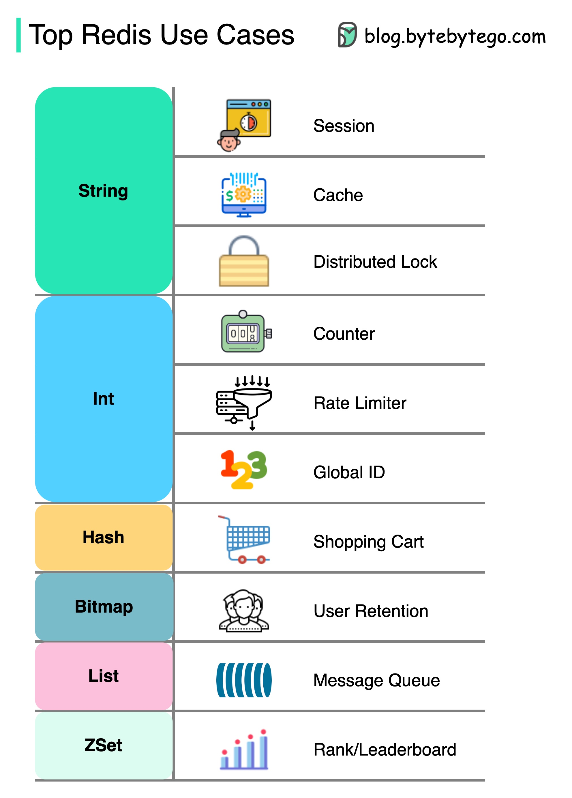

Redis에는 단순한 캐싱 이상의 기능이 있습니다.

Redis는 다이어그램에 표시된 것처럼 다양한 시나리오에서 사용할 수 있습니다. 

- Session 

  Redis를 사용하여 여러 서비스 간에 사용자 세션 데이터를 공유할 수 있습니다. 

- Cache 

  특히 핫스팟 데이터의 경우 Redis를 사용하여 객체나 페이지를 캐시할 수 있습니다.

- Distributed lock 

  Redis 스트링을 사용하여 분산 서비스 간에 lock을 획득할 수 있습니다. 

- Counter 

  좋아요 수, 조회수를 계산할 수 있습니다. 

- Rate limiter 

  특정 사용자 IP에 대해 rate limiter를 적용할 수 있습니다. 

- Global ID generator 

  글로벌 ID에 Redis Int를 사용할 수 있습니다. 

- Shopping cart 

  Redis 해시를 사용하여 장바구니의 key-value 쌍을 나타낼 수 있습니다. 

- Calculate user retention 

  비트맵을 사용하여 매일 로그인하는 사용자를 표시하고 사용자 리텐션을 계산할 수 있습니다. 

- Message queue 

  메시지 큐에 리스트를 사용할 수 있습니다. 

- Ranking 

  ZSet을 사용하여 아티클을 정렬할 수 있습니다. 

### 주요 캐싱 전략

대규모 시스템을 설계할 때는 일반적으로 캐싱을 신중하게 고려해야 합니다. 
다음은 자주 활용되는 5가지 캐싱 전략입니다.

  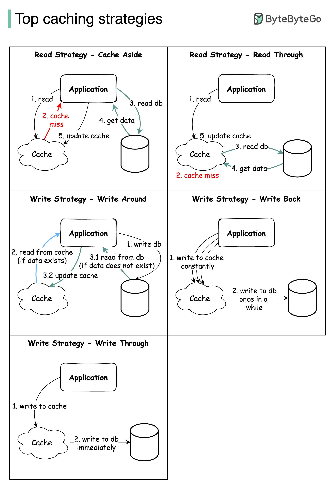

## 마이크로서비스 아키텍처

### 일반적인 마이크로서비스 아키텍처는 어떤 모습일까요? 

  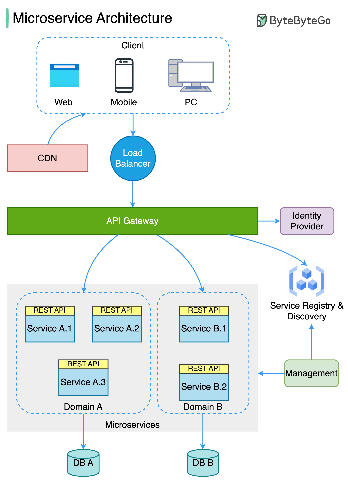

아래 다이어그램은 일반적인 마이크로서비스 아키텍처를 보여줍니다. 

- Load Balancer: 이렇게 하면 들어오는 트래픽이 여러 백엔드 서비스에 분산됩니다. 
- CDN (Content Delivery Network): CDN은 더 빠른 전송을 위해 정적 콘텐츠를 보관하는 지리적으로 분산된 서버 그룹입니다. 클라이언트는 먼저 CDN에서 콘텐츠를 찾은 다음 백엔드 서비스로 이동합니다.
- API Gateway: 수신 요청을 처리하고 관련 서비스로 라우팅합니다. ID 공급자와 통신하고 서비스를 검색합니다.
- Identity Provider: 사용자에 대한 인증과 인가를 처리합니다. 
- Service Registry & Discovery: 이 컴포넌트에서 마이크로서비스 등록 및 검색이 이루어지고, API 게이트웨이는 이 컴포넌트에서 통신할 관련 서비스를 찾습니다.
- Management: 이 컴포넌트는 서비스 모니터링을 담당합니다.
- Microservices: 마이크로서비스는 서로 다른 도메인에서 설계 및 배포됩니다. 각 도메인에는 자체 데이터베이스가 있습니다. API 게이트웨이는 REST API 또는 기타 프로토콜을 통해 마이크로서비스와 통신하고, 동일한 도메인 내의 마이크로서비스는 RPC(Remote Procedure Call)를 사용하여 서로 통신합니다.

마이크로서비스의 이점

- 빠르게 설계, 배포하고 수평적으로 확장할 수 있습니다.
- 각 도메인은 전담 팀에서 독립적으로 관리할 수 있습니다.
- 결과적으로 각 도메인에서 비즈니스 요구 사항을 커스터마이즈하고 더 나은 지원을 제공할 수 있습니다.

### 마이크로서비스 모범사례

사진 한 장이 천 마디 말보다 낫습니다. 다음은 마이크로서비스 개발을 위한 9가지 모범 사례입니다.

  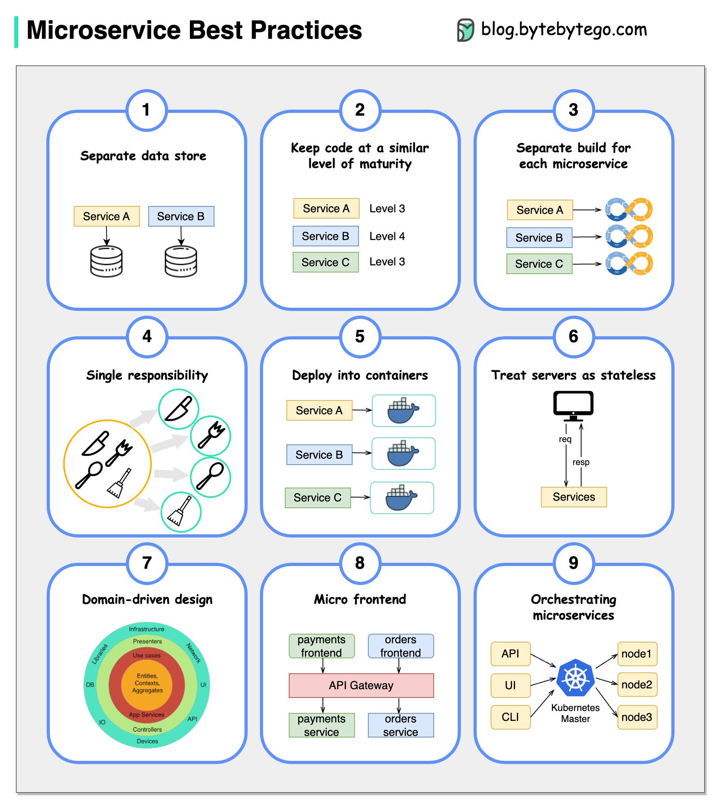

 
마이크로서비스를 개발할 때는 다음과 같은 모범 사례를 따라야 합니다.

1. 각 마이크로서비스마다 별도의 데이터 스토리지 사용 
2. 코드의 완성도를 비슷한 수준으로 유지
3. 각 마이크로서비스마다 별도로 빌드 
4. 각 마이크로서비스에 단일 책임 할당
5. 컨테이너에 배포
6. 스테이트리스 서비스 설계 
7. 도메인 드리븐 설계 도입
8. 마이크로 프론트엔드 설계 
9. 마이크로서비스 오케스트레이션 

### 마이크로서비스에 일반적으로 사용하는 기술 스택은 무엇인가요

아래에서 개발 단계와 프로덕션 단계의 마이크로서비스 기술 스택을 보여주는 다이어그램을 확인할 수 있습니다.

  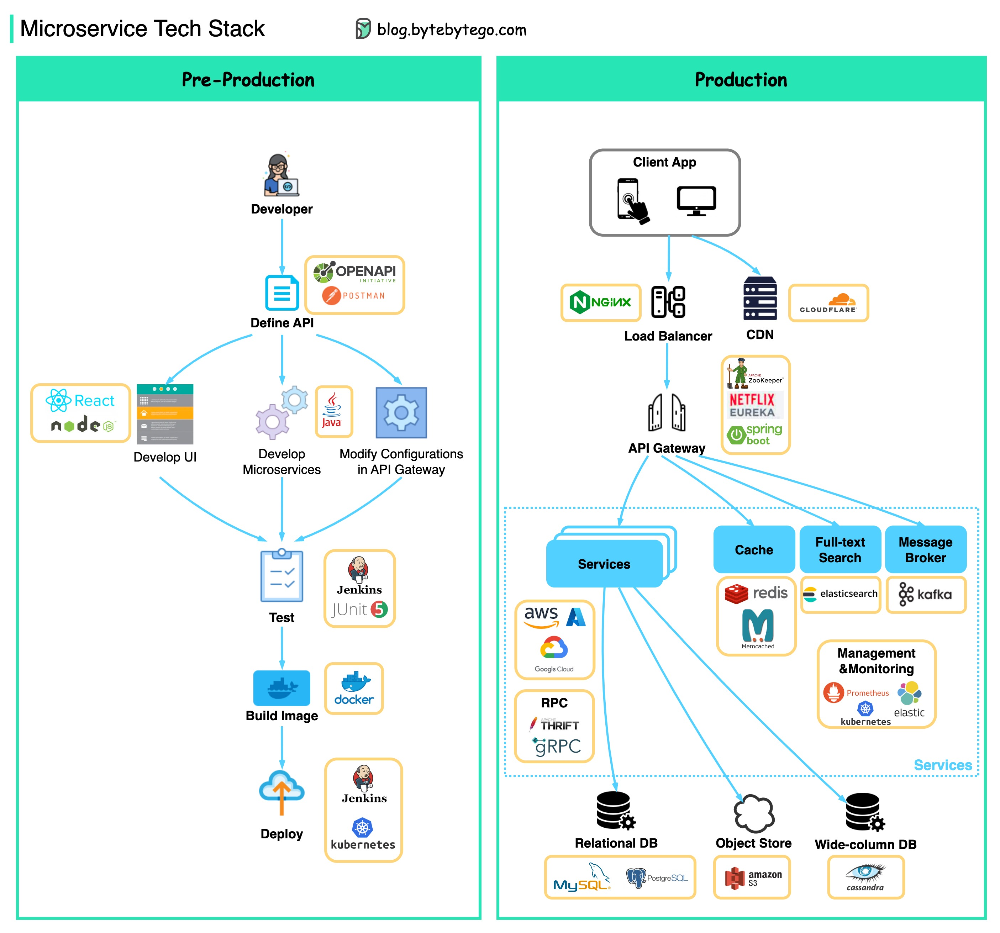

▶️ 𝐏𝐫𝐞-𝐏𝐫𝐨𝐝𝐮𝐜𝐭𝐢𝐨𝐧

- Define API - 이렇게 하면 프론트엔드와 백엔드 간에 계약이 성립됩니다. 이를 위해 Postman,  OpenAPI를 사용할 수 있습니다.
- Development - 프론트엔드 개발에는 Node.js나 react가, 백엔드 개발에는 자바/파이썬/go가 많이 사용됩니다. 또한 API 정의에 따라 API 게이트웨이의 구성을 변경해야 합니다.
- Continuous Integration - 자동화된 테스트를 위해 JUnit과 Jenkins를 사용합니다. 코드는 도커 이미지로 패키징되어 마이크로서비스로 배포됩니다.

▶️ 𝐏𝐫𝐨𝐝𝐮𝐜𝐭𝐢𝐨𝐧

- 로드 밸런서에는 NGinx가 일반적으로 선택됩니다. Cloudflare는 CDN(Content Delivery Network)을 제공합니다.
- API Gateway - 게이트웨이에는 스프링 부트를 사용하고, 서비스 검색에는 유레카/주키퍼를 사용할 수 있습니다.
- 마이크로서비스는 클라우드에 배포됩니다. AWS, Microsoft Azure, Google GCP 중에서 선택할 수 있습니다.
Cache and Full-text Search - Redis는 key-value 쌍을 캐싱하기 위한 일반적인 선택입니다. 풀텍스트 검색에는 Elasticsearch가 사용됩니다.
- Communications - 서비스가 서로 통신하기 위해서는 메시징 인프라로 카프카 혹은 RPC를 사용할 수 있습니다.
- Persistence - 관계형 데이터베이스에는 MySQL 또는 PostgreSQL을 사용할 수 있으며, 객체 스토리지에는 Amazon S3을 사용할 수 있습니다. 필요한 경우 wide-column 스토리지로 Cassandra를 사용할 수도 있습니다.
- Management & Monitoring - 수많은 마이크로서비스를 관리하기 위한 일반적인 운영 도구로 Prometheus, Elastic Stack, Kubernetes가 있습니다.

### 카프카가 빠른 이유

카프카 성능에 기여한 많은 디자인 결정이 있습니다. 이 글에서는 두 가지에 초점을 맞추겠습니다. 이 두 가지가 가장 큰 비중을 차지했다고 생각합니다.

  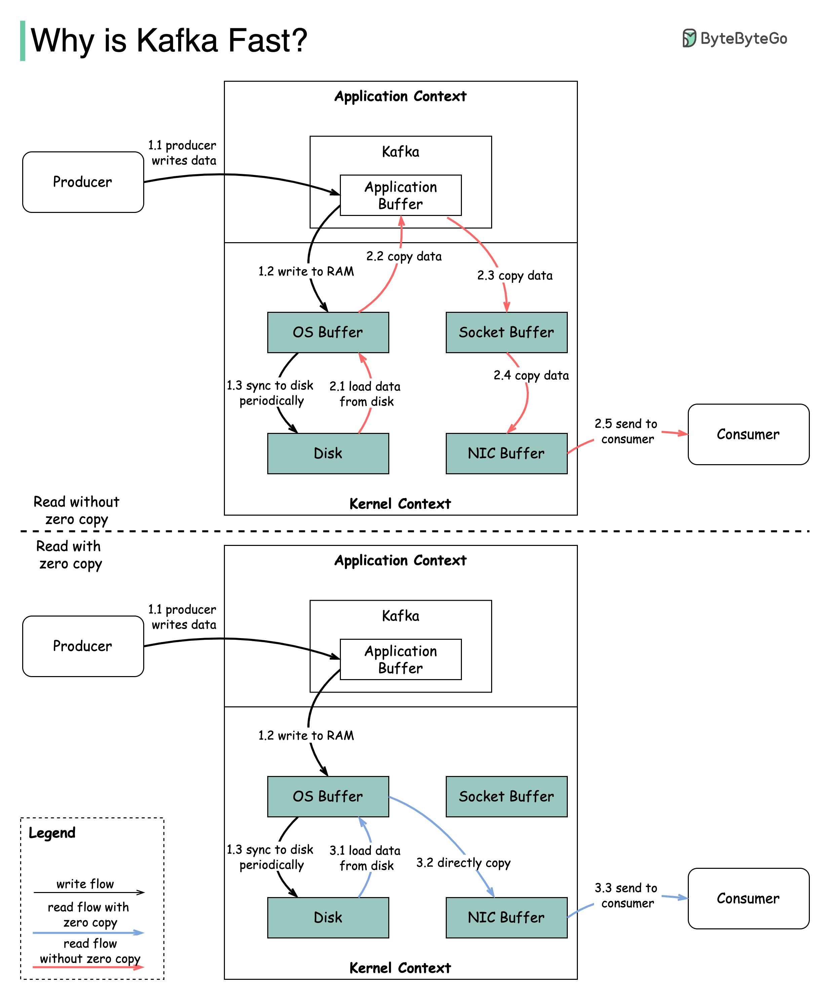

1. 첫 번째는 카프카가 순차적 I/O에 의존한다는 점입니다.
2. 카프카의 성능 이점을 제공하는 두 번째 설계 선택은 효율성에 초점을 맞춘 제로 카피 원칙입니다.
 
이 다이어그램은 프로듀서와 컨슈머 간에 데이터가 전송되는 방식과 제로 카피의 의미를 설명합니다.
 
- 1.1 - 1.3단계: 프로듀서가 디스크에 데이터 쓰기 
- 2단계: 컨슈머가 제로 카피 없이 데이터 읽기

2.1 데이터가 디스크에서 OS 캐시로 로드됩니다.

2.2 데이터가 OS 캐시에서 카프카 애플리케이션으로 복사됩니다.

2.3 카프카 애플리케이션이 데이터를 소켓 버퍼에 복사합니다. 

2.4 데이터가 소켓 버퍼에서 네트워크 카드로 복사됩니다.

2.5 네트워크 카드가 컨슈머에게 데이터를 전송합니다.

 
- 3단계: 컨슈머는 제로 카피로 데이터를 읽습니다.

3.1: 데이터가 디스크에서 OS 캐시로 로드됩니다.
3.2 OS 캐시는 sendfile() 커맨드를 통해 데이터를 네트워크 카드에 직접 복사합니다.
3.3 네트워크 카드가 컨슈머에게 데이터를 전송합니다.
 
제로 카피는 애플리케이션 컨텍스트와 커널 컨텍스트 사이에 여러 데이터 복사본을 저장하는 숏컷입니다.

## 결제 시스템

### 결제 시스템은 어떻게 배우나요?

  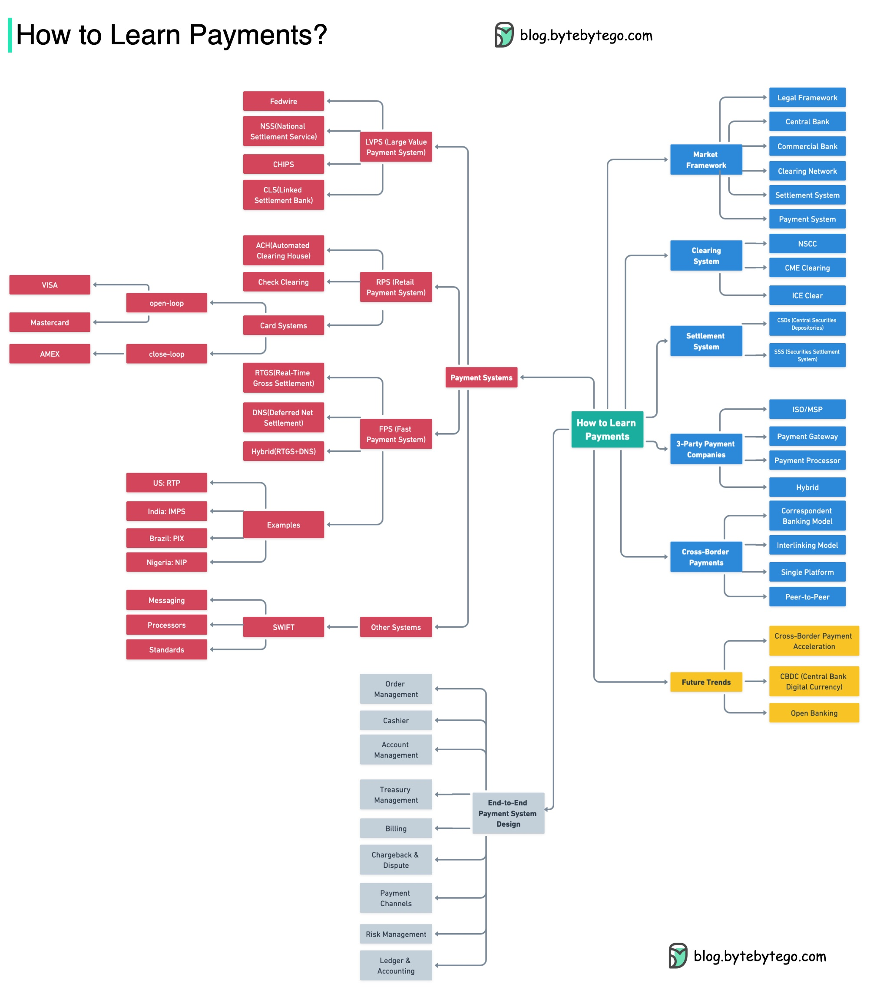

### 신용카드를 "은행에서 가장 수익성이 높은 상품"이라고 부르는 이유는 무엇인가요? 비자/마스터카드는 어떻게 수익을 창출하나요? 

아래 다이어그램은 신용카드 결제 플로우의 이코노믹스를 보여줍니다.

  

1.카드 소유자가 제품을 구매하기 위해 판매자에게 100달러를 지불합니다.

2.판매자는 판매량이 많은 신용카드를 사용하여 이익을 얻고 결제 서비스 제공에 대해 발급사와 카드 네트워크에 보상을 해야 합니다. 매입 은행은 판매자와 "merchant discount fee"라고 하는 수수료를 설정합니다.

3 - 4. 매입 은행은 교환 수수료로 $0.25를 소유하고, $1.75는 환전 수수료로 발급 은행에 지불합니다. merchant discount fee로 환전 수수료를 충당해야 합니다. 

  각 발급 은행이 각 가맹점과 수수료를 협상하는 것이 효율적이지 않기 때문에 교환 수수료는 카드 네트워크에서 설정합니다.

5.카드 네트워크는 각 은행과 network assessments and fees를 설정하고, 은행은 매달 카드 네트워크에 서비스 비용을 지불합니다. 예를 들어, VISA는 스와이프할 때마다 0.11%의 평가 수수료와 $0.0195의 사용 수수료를 부과합니다.

6.카드 소유자는 발급 은행에 서비스 비용을 지불합니다.

왜 발급 은행이 보상을 받아야 하나요?

- 카드 소유주가 발급사에 대금을 지불하지 않더라도 발급사는 판매자에게 대금을 지불합니다. 
- 카드 소지자가 발급사에 대금을 지불하기 전에 발급사가 판매자에게 대금을 먼저 지불합니다.
- 발급사는 고객 계좌 관리, 명세서 제공, 사기 탐지, 위험 관리, 청산 및 결제 등 기타 운영 비용이 발생합니다. 

### 상점에서 우리가 신용카드를 긁을 때, VISA는 어떻게 작동하나요?

  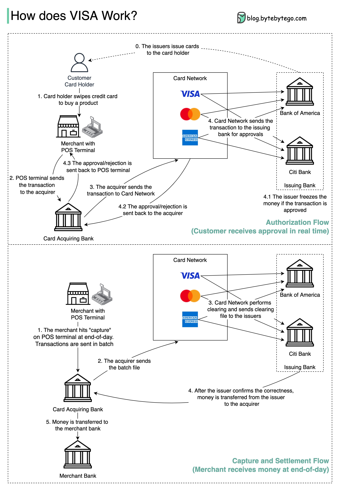

비자, 마스터카드, 아메리칸 익스프레스는 자금 청산 및 정산을 위한 카드 네트워크 역할을 합니다. 카드 매입 은행과 카드 발급 은행은 서로 다를 수 있으며, 실제로도 종종 다릅니다. 은행이 중개자 없이 하나씩 거래를 정산한다면, 각 은행은 다른 모든 은행과 거래를 정산해야 합니다. 이는 매우 비효율적입니다.   
 
위 다이어그램은 신용 카드 결제 프로세스에서 VISA의 역할을 보여줍니다. 두 가지 플로우가 관련되어 있습니다. 승인 흐름은 고객이 신용카드를 스와이프할 때 발생합니다. 캡처와 정산 플로우는 상점이 하루가 끝날 때 발생합니다.
 
- 거래 승인 플로우Authorization Flow

0단계: 카드 발급 은행이 고객에게 신용카드를 발급합니다. 
 
1단계: 카드 소유자가 제품을 구매하기 위해 상점의 POS(Point of Sale) 단말기에서 신용카드를 스와이프합니다.
 
2단계: POS 단말기는 POS 단말기를 제공한 매입 은행으로 거래를 전송합니다.
 
3, 4단계: 매입 은행은 거래를 카드 네트워크로 전송하며, 이를 카드 스킴이라고도 합니다. 카드 네트워크는 승인을 위해 발급 은행으로 거래를 전송합니다.
 
4.1, 4.2, 4.3단계: 트랜잭션이 승인되면 발급 은행은 자금을 동결합니다. 승인 또는 거부가 매입 은행에 다시 전송되고 POS 단말기로도 전송됩니다. 
 
- 캡처와 정산 플로우Capture and Settlement Flow

1, 2단계: 판매자는 하루가 끝날 때 돈을 받으려고 POS 단말기에서 '매입'을 누릅니다. 트랜잭션은 매입 은행에게 일괄적으로 전송됩니다. 매입 은행은 트랜잭션이 포함된 배치 파일을 카드 네트워크로 전송합니다.
 
3단계: 카드 네트워크는 여러 매입 은행으로부터 수집한 거래에 대해 정산을 수행하고 정산 파일을 여러 발급 은행으로 전송합니다.
 
4단계: 발급 은행은 정산 파일의 정확성을 확인하고 관련 매입 은행으로 자금을 이체합니다.
 
5단계: 그러면 매입 은행이 판매자의 은행으로 송금합니다. 
 
4단계: 카드 네트워크는 서로 다른 카드 발급 은행의 거래를 정산합니다. 정산은 상호 상쇄 거래를 결산하는 과정으로, 총 거래 수를 줄입니다.
 
이 과정에서 카드 네트워크는 각 은행과 대화해야 하는 부담을 떠안고 그 대가로 서비스 수수료를 받습니다.

### 세계의 결제 시스템 시리즈(1부): 인도의 통합 결제 인터페이스(UPI)

UPI란 무엇인가요? UPI는 인도 국립결제공사에서 개발한 실시간 즉시 결제 시스템입니다.

현재 인도에서 디지털 소매 거래의 60%를 차지하고 있습니다.

UPI = 결제 마크업 언어 + 상호 운용 가능한 결제 표준

  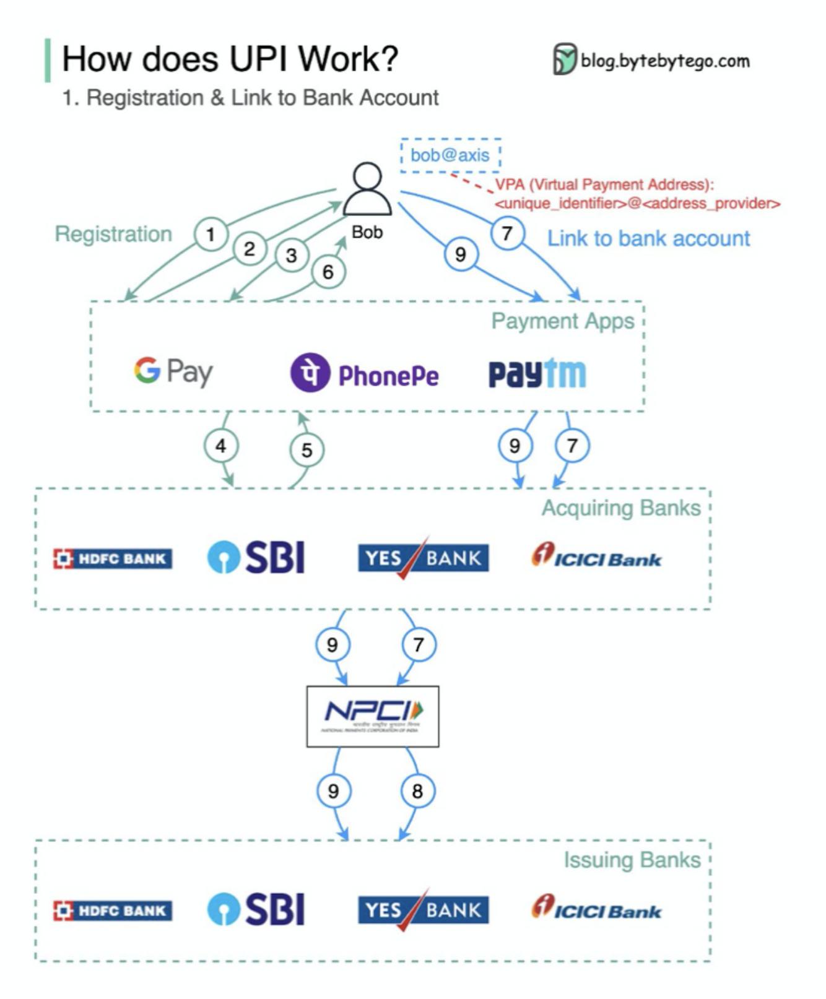

## DevOps

###  DevOps vs SRE vs Platform Engineering 무엇이 다른가요?

데브옵스, SRE, 플랫폼 엔지니어링의 개념은 서로 다른 시기에 등장하여 다양한 개인과 조직에 의해 발전해 왔습니다.

  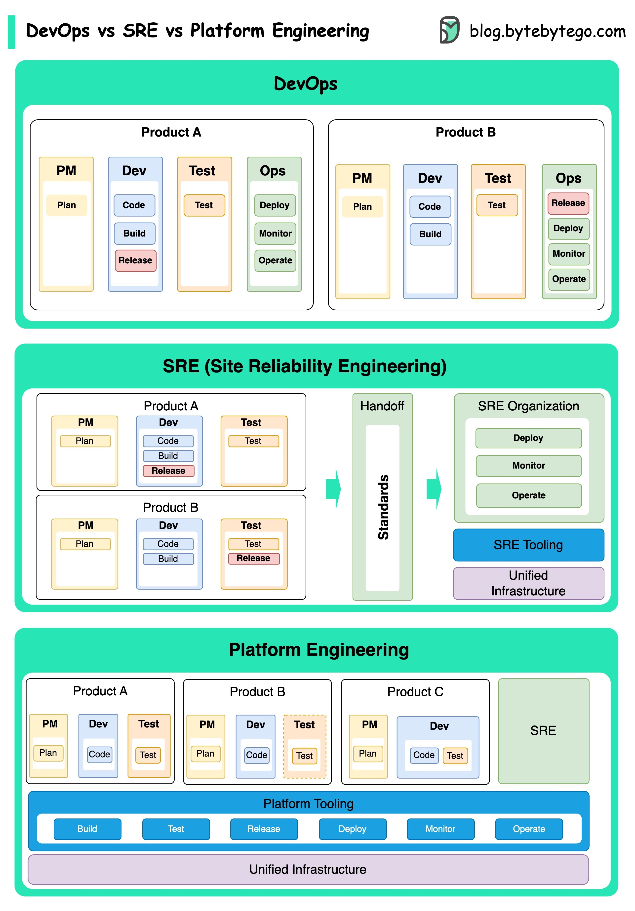

데브옵스라는 개념은 2009년 애자일 컨퍼런스에서 Patrick Debois와 Andrew Shafer에 의해 소개되었습니다. 이들은 전체 소프트웨어 개발 라이프사이클에 대한 공동 책임과 협업 문화를 장려함으로써 소프트웨어 개발과 운영 간의 간극을 좁히고자 했습니다.

SRE(Site Reliability Engineering)는 2000년대 초반 구글에서 대규모 복잡한 시스템 관리의 운영상 문제를 해결하기 위해 개척되었습니다. 구글은 서비스의 안정성과 효율성을 높이기 위해 Borg 클러스터 관리 시스템, Monarch 모니터링 시스템과 같은 SRE 실습 및 도구를 개발했습니다.

플랫폼 엔지니어링은 SRE 엔지니어링의 기반으로 한 최근 개념입니다. 플랫폼 엔지니어링의 정확한 기원은 명확하지 않지만, 일반적으로 제품 개발을 위한 포괄적인 플랫폼을 제공하고 전체 사업 관점을 지원하는 데 초점을 둔 DevOps와 SRE 관행의 확장으로 이해됩니다.

이러한 개념이 서로 다른 시기에 등장했다는 점에 주목할 필요가 있습니다. 이 개념들은 모두 소프트웨어 개발 및 운영 전반에 걸쳐 지속적인 협업, 자동화, 효율성 개선이라는 공통 목표를 바탕으로 합니다.

### k8s(Kubernetes)란 무엇인가요?

K8s는 컨테이너 오케스트레이션 시스템입니다. 컨테이너 배포 및 관리에 사용됩니다. 이 시스템의 설계는 구글의 내부 시스템인 Borg의 영향을 많이 받았습니다.

  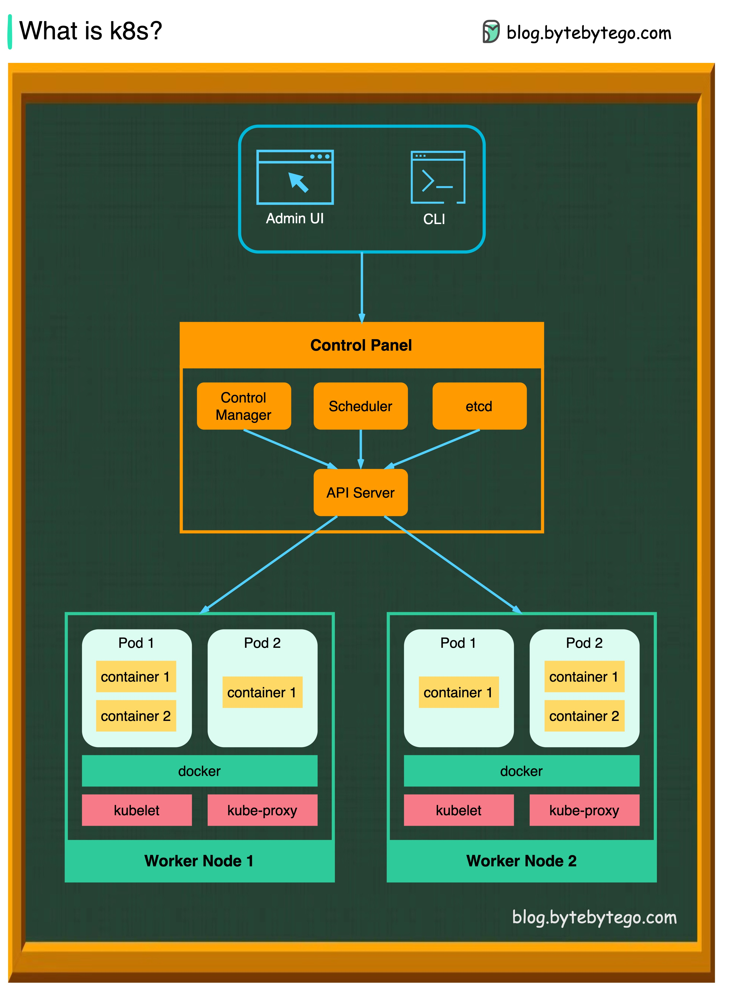

k8s 클러스터는 컨테이너화된 애플리케이션을 실행하는 노드라고 하는 일련의 워커 머신으로 구성됩니다. 모든 클러스터에는 하나 이상의 워커 노드가 있습니다.

워커 노드는 애플리케이션 워크로드의 컴포넌트인 파드를 호스팅합니다. 컨트롤 플레인은 클러스터의 워커 노드와 파드를 관리합니다. 프로덕션 환경에서 컨트롤 플레인은 일반적으로 여러 대의 컴퓨터에서 실행되며, 클러스터는 일반적으로 여러 노드를 실행하여 내결함성(tolerance)과 고가용성을 제공합니다.

- Control Plane 컴포넌트

1. API Server

    API 서버는 k8s 클러스터의 모든 컴포넌트와 통신합니다. 파드에 대한 모든 작업은 API 서버와 통신하여 실행됩니다.

2. Scheduler

    스케줄러는 파드 워크로드를 감시하고 새로 생성된 파드에 로드를 할당합니다.

3. Controller Manager

    컨트롤러 매니저는 노드 컨트롤러, 잡 컨트롤러, 엔드포인트슬라이스 컨트롤러, 서비스 어카운트 컨트롤러를 포함한 컨트롤러를 실행합니다.

4. Etcd
    
    etcd는 모든 클러스터 데이터에 대한 쿠버네티스의 백업 스토리지로 사용되는 key-value 스토리지입니다.

- Nodes

1. Pod

    파드는 컨테이너 그룹으로, k8s가 관리하는 가장 작은 단위입니다. 파드에는 파드 내의 모든 컨테이너에 단일 IP 주소가 적용됩니다.

2. Kubelet

    클러스터의 각 노드에서 실행되는 에이전트입니다. 컨테이너가 파드에서 실행되도록 보장합니다.

3. Kube Proxy

    Kube-proxy는 클러스터의 각 노드에서 실행되는 네트워크 프록시입니다. 서비스에서 노드로 들어오는 트래픽을 라우팅합니다. 작업 요청을 올바른 컨테이너로 전달합니다.

### Docker vs Kubernetes 어떤것을 사용해야 하나요?

  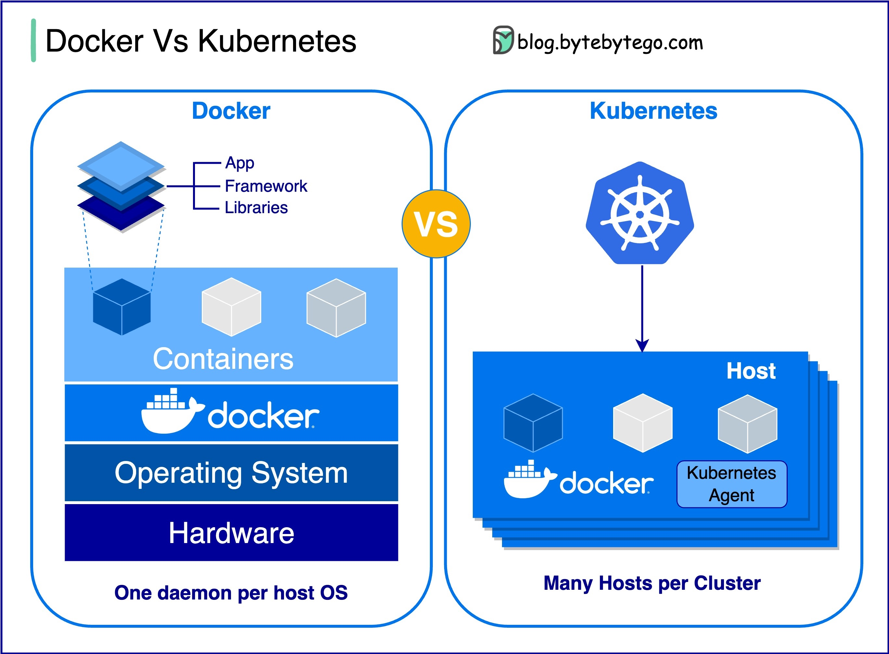

도커Docker란 무엇인가요?

도커는 격리된 컨테이너에서 애플리케이션을 패키징, 배포 및 실행할 수 있는 오픈 소스 플랫폼입니다. 컨테이너화에 중점을 두어 애플리케이션과 그 종속성을 캡슐화하는 경량 환경을 제공합니다.

Kubernetes란 무엇인가요?

K8s라고도 불리는 Kubernetes는 오픈 소스 컨테이너 오케스트레이션 플랫폼입니다. 노드 클러스터 전반에서 컨테이너화된 애플리케이션의 배포, 스케일링, 관리를 자동화하기 위한 프레임워크를 제공합니다.

두 가지가 서로 어떻게 다른가요?

Docker: 도커는 단일 운영 체제 호스트의 개별 컨테이너 수준에서 작동합니다.

각 호스트를 수동으로 관리해야 하며 여러 관련 컨테이너에 대한 네트워크, 보안 정책, 스토리지를 설정하는 것은 복잡할 수 있습니다.

Kubernetes: 쿠버네티스는 클러스터 레벨에서 작동합니다. 여러 호스트에 걸쳐 여러 컨테이너화된 애플리케이션을 관리하며, 로드 밸런싱, 스케일링, 애플리케이션의 원하는 상태 보장과 같은 작업에 대한 자동화를 제공합니다.

간단히 말해, 도커는 컨테이너화 및 개별 호스트에서 컨테이너를 실행하는 데 중점을 두는 반면, 쿠버네티스는 호스트 클러스터 전체에서 컨테이너를 대규모로 관리하고 조정하는 데 특화되어 있습니다.

### Docker는 어떻게 작동하나요?

아래 다이어그램은 도커의 아키텍처와 "docker build", "docker pull", "docker run" 을 실행할 때 어떻게 작동하는지 보여줍니다.

  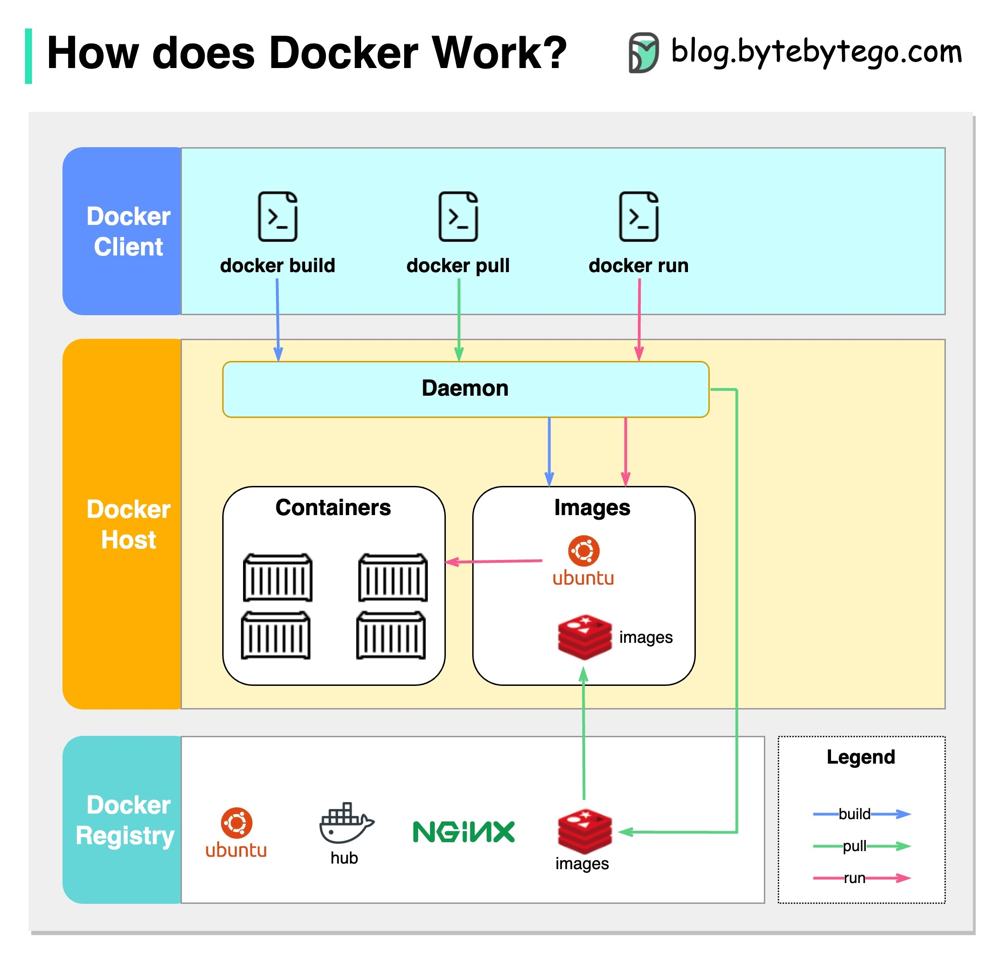

도커 아키텍처에는 3가지 컴포넌트가 있습니다.

- Docker client 
    
    도커 클라이언트가 도커 데몬과 통신합니다.

- Docker host 

    도커 데몬은 도커 API 요청을 수신하고 이미지, 컨테이너, 네트워크, 볼륨 같은 도커 객체를 관리합니다.

- Docker registry 

    도커 레지스트리는 도커 이미지를 저장합니다. 도커 Hub는 누구나 사용할 수 있는 공용 레지스트리입니다.

"docker run" 커맨드를 예로 들어 보겠습니다.

  1. 도커는 레지스트리에서 이미지를 가져옵니다.
  1. 도커가 새 컨테이너를 생성합니다.
  1. 도커는 컨테이너에 읽기-쓰기 파일시스템을 할당합니다.
  1. 도커는 컨테이너를 디폴트 네트워크에 연결하기 위해 네트워크 인터페이스를 생성합니다.
  1. 도커가 컨테이너를 시작합니다.

## GIT

### Git Commands 작동 방식

우선 코드가 어디에 저장되어 있는지 파악하는 것이 중요합니다. 일반적으로 코드가 저장되는 위치는 Github과 같은 리모트 서버와 로컬 컴퓨터 두 곳 뿐이라고 가정합니다. 하지만 이는 정확하지 않습니다. Git은 컴퓨터에 3개의 로컬 저장소를 유지하므로 코드가 네 곳에서 발견될 수 있습니다.

  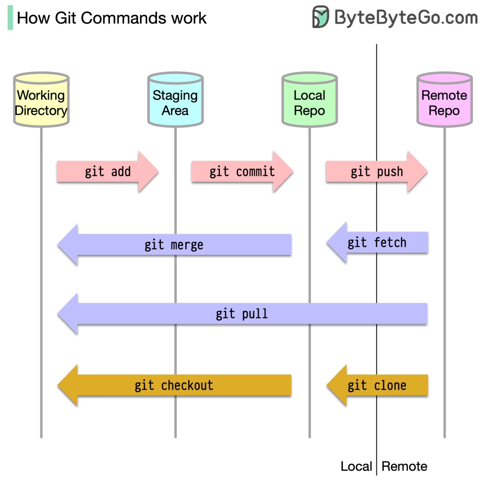

- Working directory: 파일을 편집하는 위치
- Staging area: 다음 커밋을 위해 파일이 저장되는 임시 위치
- Local repository: 커밋된 코드가 포함되는 로컬 저장소
- Remote repository: 코드를 저장하는 리모트 서버

대부분의 Git 명령은 주로 이 네 위치 사이에서 파일을 이동합니다.

### Git은 어떻게 작동하나요?

아래 다이어그램은 Git 워크플로우를 보여줍니다.

  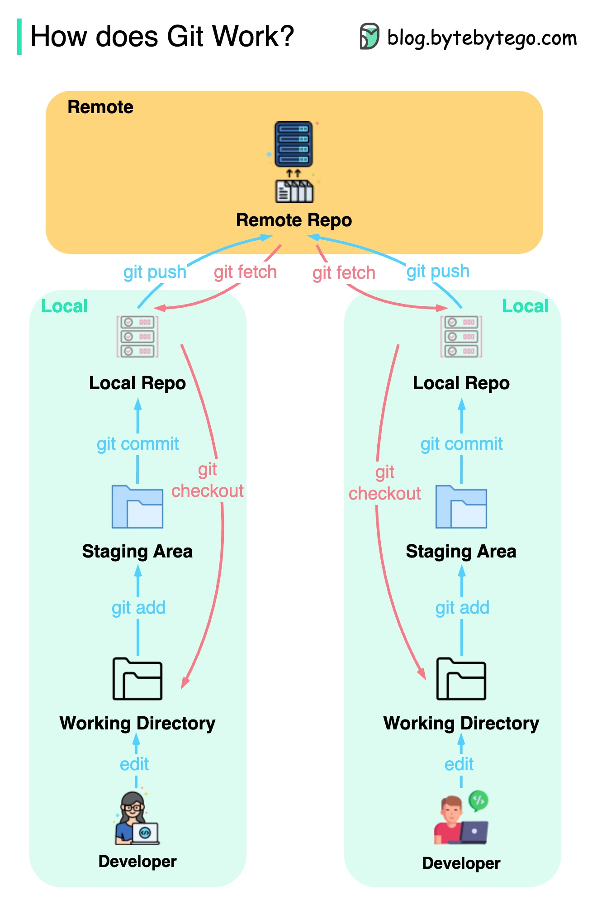

Git은 분산 버전 관리 시스템입니다.

모든 개발자는 메인 리포지토리의 로컬 복사본을 유지 관리하고 로컬 복사본에서 편집 및 커밋합니다.

작업이 리모트 리포지토리와 상호작용하지 않기 때문에 커밋이 매우 빠릅니다.

리모트 리포지토리에 충돌이 발생하면 로컬 리포지토리에서 파일을 복구할 수 있습니다.

### Git merge vs Git rebase

어떤 점이 다른가요?

  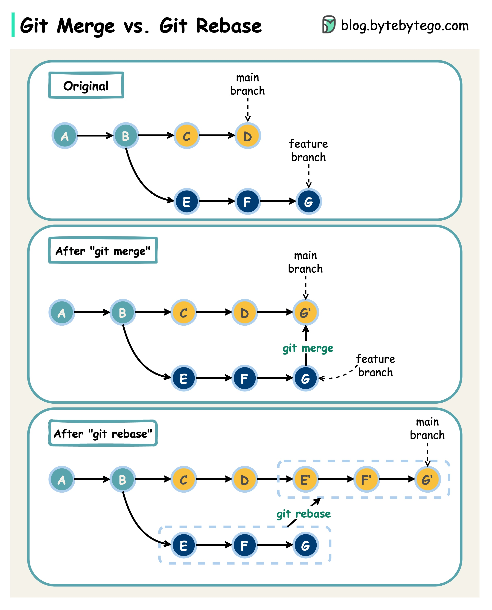

한 Git 브랜치에서 다른 브랜치로 **merge changes** 할 때 git merge 또는 git rebase를 사용할 수 있습니다. 아래 다이어그램은 두 커맨드의 작동 방식을 보여줍니다.

**Git merge**

이 작업은 메인 브랜치에 새 커밋 G'를 생성합니다. G'는 메인 브랜치와 피처 브랜치의 히스토리를 모두 연결합니다.

Git 병합은 **non-destructive**입니다. 메인 브랜치나 피처 브랜치 모두 변경되지 않습니다.

**Git rebase**

Git 리베이스는 피처 브랜치 히스토리를 메인 브랜치의 헤드로 가져옵니다. 그러면 피처 브랜치의 각 커밋에 대해 새 커밋 E', F', G' 가 생성됩니다.

리베이스의 장점은 선형적인 **commit history**가 있다는 것입니다.

"git 리베이스 황금률"을 따르지 않으면 리베이스가 위험할 수 있습니다.

**git 리베이스 황금률**

퍼블랙 브랜치에서는 절대 사용하지 마세요!

## 클라우드 서비스

### 다양한 클라우드 서비스에 대한 유용한 치트시트(2023년판)

  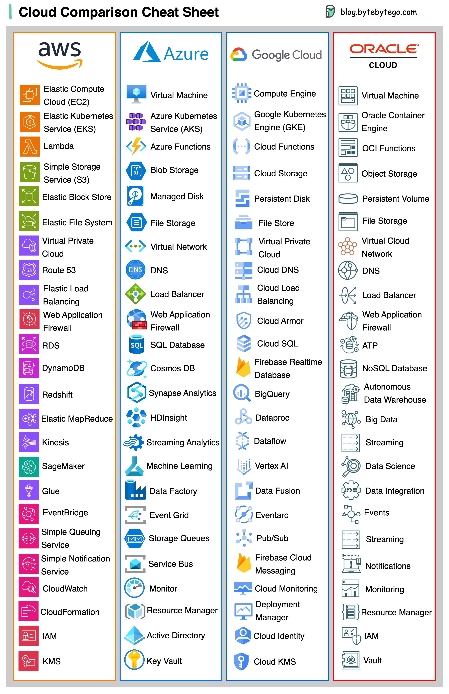

### cloud native란 무엇인가요?

아래 다이어그램은 1980년대 이후 아키텍처와 프로세스의 진화를 보여줍니다.

  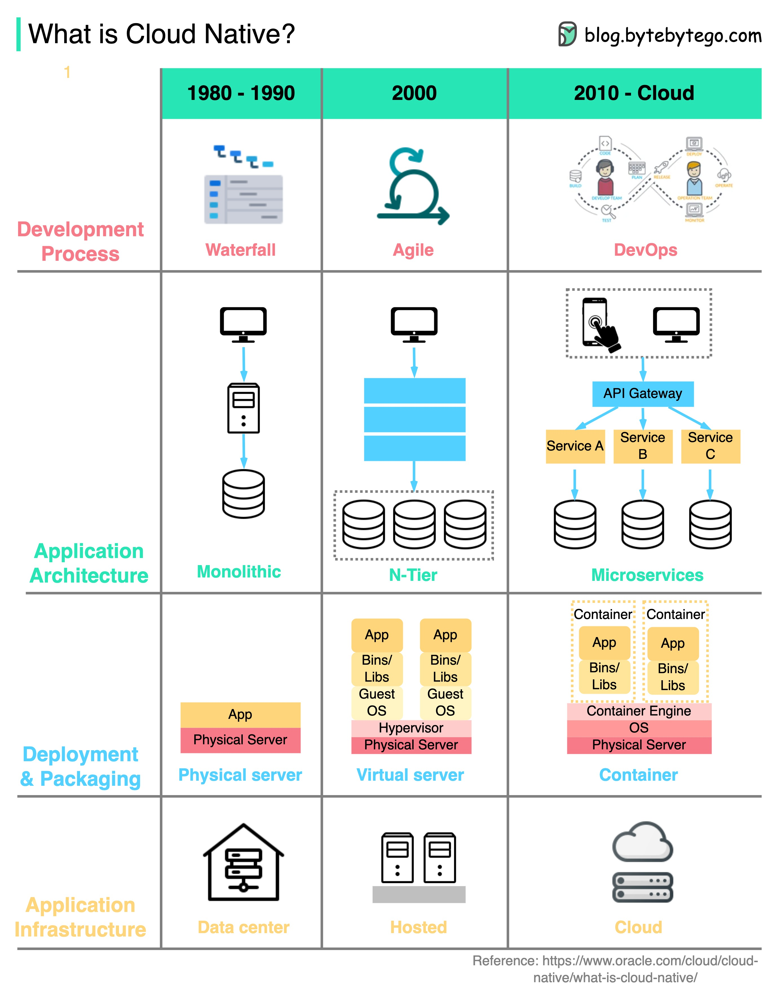

조직은 클라우드 네이티브 기술을 사용하여 퍼블릭, 프라이빗, 하이브리드 클라우드에서 확장 가능한 애플리케이션을 빌드하고 실행할 수 있습니다.

이러한 애플리케이션은 클라우드 기능을 활용하도록 설계되어 있어, 로딩이 탄력적이고 쉽게 확장할 수 있습니다.

클라우드 네이티브에는 4가지 측면이 있습니다.

1. Development process 
 
    워터폴에서 애자일, 데브옵스로 발전해 왔습니다.

2. Application Architecture 

    아키텍처가 모놀리식 서비스에서 마이크로서비스로 바뀌었습니다. 각 서비스는 클라우드 컨테이너의 제한된 리소스에 맞게 소규모로 조정되도록 설계되었습니다.

3. Deployment & packaging 

    예전에는 애플리케이션이 물리적 서버에 배포되었습니다. 그러다가 2000년경에는 지연 시간에 민감하지 않은 애플리케이션은 보통 가상 서버에 배포되었습니다. 클라우드 네이티브 애플리케이션의 경우 도커 이미지로 패키징되어 컨테이너에 배포됩니다.

4. Application infrastructure 

    애플리케이션은 자체 호스팅 서버 대신 클라우드 인프라에 대규모로 배포됩니다.

## 개발자 생산성 도구

### JSON 파일 시각화

중첩된 JSON 파일은 읽기 어렵습니다.

JSON 파일에서 그래프 다이어그램을 생성하고 쉽게 읽을 수 있도록 **JsonCrack**을 제공합니다.

또한 생성된 다이어그램은 이미지로 다운로드할 수 있습니다.

  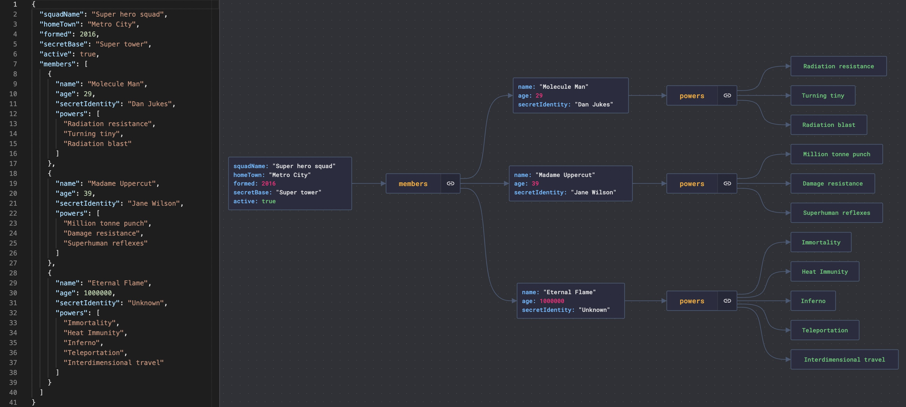

### 코드를 아키텍처 다이어그램으로 자동 변환

  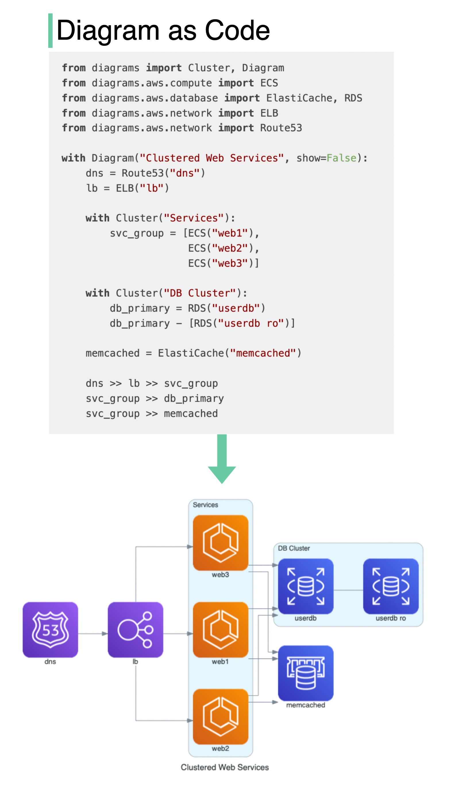

어떤 기능이 있나요?

- Python 코드로 클라우드 시스템 아키텍처를 그립니다.
- 다이어그램은 주피터 노트북에서 바로 렌더링할 수 있습니다.
- 디자인 도구가 필요하지 않습니다.
- 다음 프로바이더를 지원합니다: AWS, Azure, GCP, Kubernetes, 알리바바 클라우드, 오라클 클라우드 등.
 
[Github repo](https://github.com/mingrammer/diagrams)

## 리눅스

### 리눅스 파일 시스템 설명

  

예전에는 Linux 파일 시스템이 개인이 원하는 곳에 집을 짓는 무질서한 마을과 비슷했습니다. 하지만 1994년, 리눅스 파일 시스템에 질서를 부여하기 위해 파일시스템 계층구조 표준(FHS:Filesystem Hierarchy Standard)이 도입되었습니다.

소프트웨어는 FHS와 같은 표준을 구현함으로써 다양한 Linux 배포판에서 일관된 레이아웃을 보장할 수 있습니다. 하지만 모든 Linux 배포판이 이 표준을 엄격하게 준수하는 것은 아닙니다. 자체 고유 엘리먼트를 통합하거나 특정 요구 사항을 충족하는 경우가 많습니다.
이 표준에 능숙해지려면 먼저 살펴보는 것부터 시작할 수 있습니다. 탐색을 위해서는 "cd", 디렉토리 내용을 나열하려면 "ls"와 같은 커맨드를 활용하세요. 파일 시스템을 루트(/)에서 시작하는 트리라고 상상해 보세요. 시간이 지나면 익숙해져서 숙련된 Linux 관리자로 거듭날 수 있을 것입니다.

### 가장 많이 사용되는 18가지 리눅스 커맨드 알아보기

Linux 커맨드는 운영 체제와 상호 작용하기 위한 인스터럭션입니다. 파일, 디렉토리, 시스템 프로세스, 기타 시스템의 여러 측면을 관리하는 데 도움이 됩니다. Linux 기반 시스템을 효율적이고 효과적으로 탐색하고 유지 관리하려면 이러한 커맨드에 익숙해져야 합니다.

아래 다이어그램은 자주 사용되는 Linux 커맨드입니다.

  

- ls - 파일과 디렉토리 목록
- cd - 현재 디렉토리 변경
- mkdir - 새로운 디렉토리 생성
- rm - 파일 또는 디렉토리 제거
- cp - 파일 또는 디렉토리 복사
- mv - 파일 또는 디렉토리 이름변경 혹은 이동
- chmod - 파일 또는 디렉토리 권한 관리
- grep - 파일에서 패턴 검색
- find - 파일과 디렉토리 검색
- tar - tarball 아카이브 파일 조작
- vi - 텍스트 에디터를 사용하여 파일 편집
- cat - 파일의 콘텐츠 표시
- top - 프로세스 리소스 사용량 표시
- ps - 프로세서 정보 표시
- kill - 신호를 전송하여 프로세스 종료
- du - 파일 용량 사용량 추정
- ifconfig - 네트워크 인터페이스 설정  
- ping - 호스트 간 네트워크 커넥션 테스트

## 보안

### HTTPS는 어떻게 작동하나요?

Hypertext Transfer Protocol Secure(HTTPS)는 Hypertext Transfer Protocol(HTTP)의 확장입니다. HTTPS는 Transport Layer Security(TLS)를 사용하여 암호화된 데이터를 전송합니다. 온라인에서 데이터를 탈취당하면 탈취자가 얻는 것은 바이너리 코드뿐입니다.

  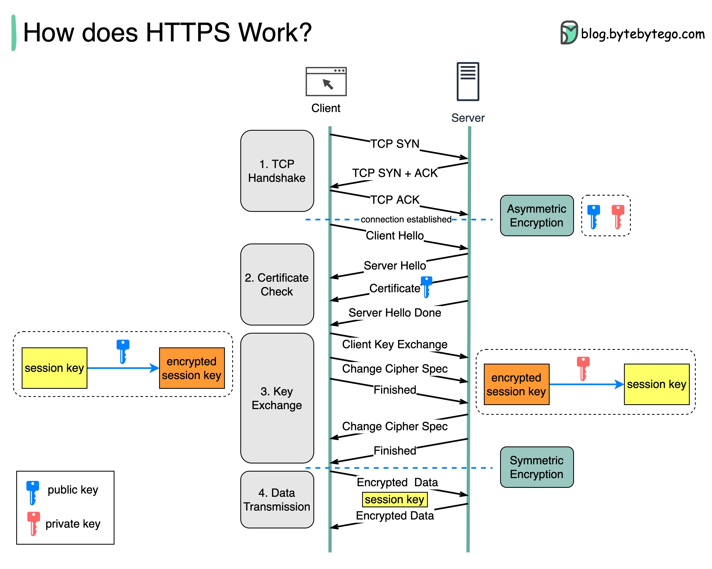

데이터는 어떻게 암호화되고 복호화되나요?

1단계 - 클라이언트(브라우저)와 서버가 TCP 커넥션을 설정합니다.

2단계 - 클라이언트가 서버에 "client hello"를 보냅니다. 이 메시지에는 필요한 암호화 알고리즘(cipher suites) 세트와 지원할 수 있는 최신 TLS 버전이 포함됩니다. 서버는 "server hello"로 응답하여 브라우저가 해당 알고리즘과 TLS 버전을 지원할 수 있는지 여부를 알 수 있습니다.

그러면 서버가 클라이언트에 SSL 인증서를 보냅니다. 인증서에는 공개 키, 호스트 이름, 만료 날짜 등이 포함됩니다. 클라이언트는 인증서의 유효성을 검사합니다.

3단계 - SSL 인증서의 유효성을 검사한 후 클라이언트는 세션 키를 생성하고 공개 키를 사용하여 암호화합니다. 서버는 암호화된 세션 키를 수신하고 개인 키로 암호를 해독합니다.

4단계 - 이제 클라이언트와 서버가 모두 동일한 세션 키(대칭 암호화)를 보유하므로 암호화된 데이터는 안전한 양방향 채널로 전송됩니다.

데이터 전송 중에 HTTPS가 대칭 암호화로 전환되는 이유는 무엇인가요? 두 가지 주요 이유가 있습니다.

1. 보안: 비대칭 암호화는 한 방향으로만 진행됩니다. 즉, 서버가 암호화된 데이터를 클라이언트로 다시 보내려고 하면 누구나 공개 키를 사용하여 데이터를 해독할 수 있습니다.

2. 서버 리소스: 비대칭 암호화는 상당한 수학적 오버헤드를 추가합니다. 긴 세션의 데이터 전송에는 적합하지 않습니다.

### 간단한 용어로 설명하는 Oauth 2.0

OAuth 2.0은 강력하고 안전한 프레임워크로, 여러 애플리케이션이 민감한 자격 증명을 공유하지 않고도 사용자를 대신하여 서로 안전하게 상호 작용할 수 있게 해줍니다.

  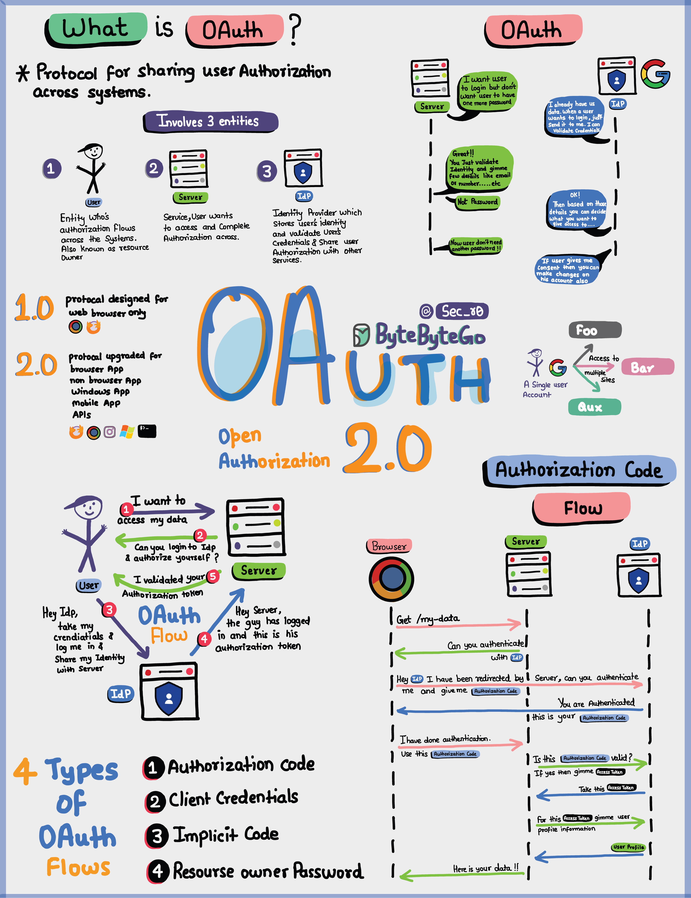

OAuth에 참여하는 개체는 사용자, 서버, ID 공급자(Identity Provider, IDP)입니다.

OAuth 토큰은 무엇을 할 수 있나요?

OAuth를 사용하면 신원 및 권한을 나타내는 OAuth 토큰을 받게 됩니다. 이 토큰은 몇 가지 중요한 작업을 수행할 수 있습니다.

Single Sign-On(SSO): OAuth 토큰을 사용하면 한 번의 로그인으로 여러 서비스나 앱에 로그인할 수 있어 더욱 쉽고 안전하게 생활할 수 있습니다.

Authorization Across Systems: 시스템 간 인증: OAuth 토큰을 사용하면 다양한 시스템에서 인증 또는 액세스 권한을 공유할 수 있으므로 모든 시스템에서 별도로 로그인할 필요가 없습니다.

Accessing User Profile: OAuth 토큰이 있는 앱은 사용자가 허용한 사용자 프로필의 특정 부분에 액세스할 수 있지만 모든 부분을 볼 수는 없습니다.

OAuth 2.0은 사용자와 사용자의 데이터를 안전하게 보호하는 동시에 다양한 애플리케이션과 서비스에서 원활하고 번거로움 없는 온라인 경험을 제공하는 데 중점을 두고 있습니다.

### 인증 메커니즘의 4가지 주요 형태

  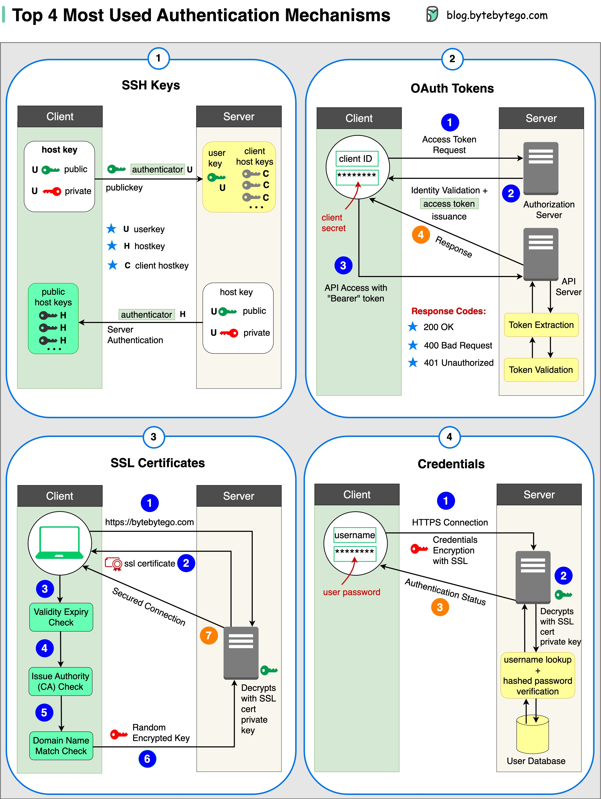

1. SSH Keys: 
   
    암호화 키는 원격 시스템 및 서버에 안전하게 액세스하는데 사용됩니다.

1. OAuth Tokens: 

    써드파티 애플리케이션의 사용자 데이터에 대한 제한된 액세스를 제공하는 토큰입니다.

1. SSL Certificates: 
  
    디지털 인증서는 서버와 클라이언트 간의 안전한 암호화된 통신을 보장합니다.

1. Credentials: 

    사용자 인증 정보는 다양한 시스템과 서비스에 대한 액세스 권한을 확인하고 부여하는 데 사용됩니다.

### Session, cookie, JWT, token, SSO, OAuth 2.0 - 그게 뭔가요?

이 약관은 모두 사용자 신원 관리와 관련이 있습니다. 웹사이트에 로그인할 때 사용자는 자신이 누구인지를 선언합니다(식별). 사용자의 신원을 확인하고(인증) 필요한 권한을 부여합니다(인가). 과거에 많은 솔루션이 제안되었고 그 목록은 계속 늘어나고 있습니다.

  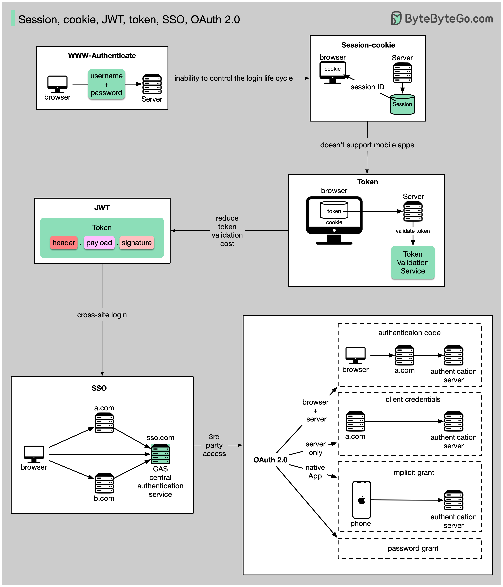

간단한 것부터 복잡한 것까지, 사용자 신원 관리에 대한 저의 이해를 정리해 보았습니다.

- WWW-인증은 가장 기본적인 방법입니다. 브라우저에서 사용자 이름과 비밀번호를 입력하라는 메시지가 표시됩니다. 로그인 수명 주기를 제어할 수 없기 때문에 오늘날에는 거의 사용되지 않습니다.

- 로그인 수명 주기를 보다 세밀하게 제어할 수 있는 방법은 세션 쿠키입니다. 서버는 세션 저장소를 유지하고 브라우저는 세션의 ID를 유지합니다. 쿠키는 일반적으로 브라우저에서만 작동하며 모바일 앱에는 적합하지 않습니다.

- 호환성 문제를 해결하기 위해 토큰을 사용할 수 있습니다. 클라이언트가 토큰을 서버로 전송하면 서버가 토큰의 유효성을 검사합니다. 단점은 토큰을 암호화하고 해독해야 하므로 시간이 오래 걸릴 수 있다는 것입니다.

- JWT는 토큰을 나타내는 표준 방식입니다. 이 정보는 디지털 서명이 되어 있기 때문에 검증되고 신뢰할 수 있습니다. JWT에는 서명이 포함되어 있으므로 서버 측에 세션 정보를 저장할 필요가 없습니다.

- SSO( Single Sign-On)을 사용하면 한 번만 로그온하여 여러 웹사이트에 로그인할 수 있습니다. CAS( Central Authentication Service)를 사용하여 사이트 간 정보를 유지 관리합니다.

- OAuth 2.0을 사용하면 한 웹사이트가 다른 웹사이트에서 내 정보에 액세스할 수 있도록 인증할 수 있습니다.

### 데이터베이스에 비밀번호를 안전하게 저장하는 방법과 비밀번호를 확인하는 방법은 무엇인가요?

  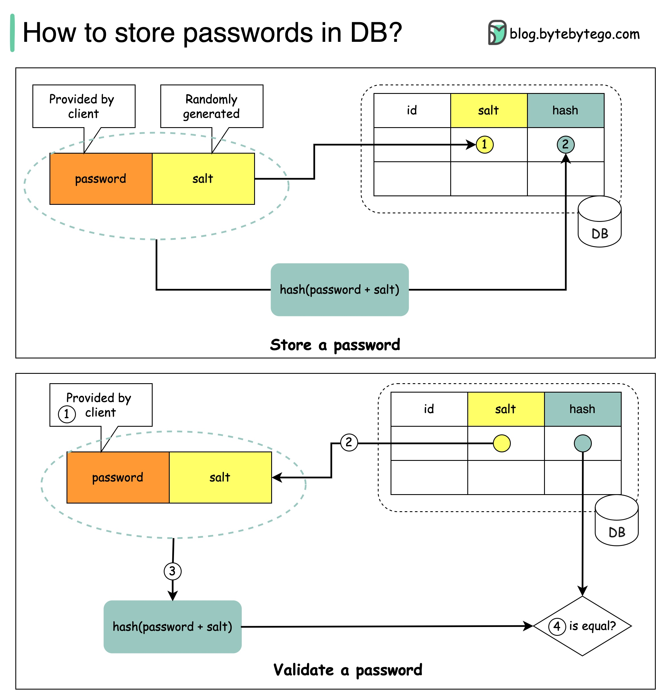

 
**하지 말아야 할 것들**

- 비밀번호를 일반 텍스트로 저장하는 것은 내부 액세스 권한이 있는 모든 사람이 볼 수 있으므로 좋은 생각이 아닙니다.

- 비밀번호 해시를 직접 저장하는 것은 레인보우 테이블과 같은 사전 계산 공격에 취약하기 때문에 충분하지 않습니다.

- 사전 계산 공격을 완화하기 위해 비밀번호를 솔트 처리합니다.

**salt란 무엇인가요?**

OWASP 가이드라인에 따르면 "솔트란 해싱 프로세스의 일부로 각 비밀번호에 추가되는 고유하고 무작위로 생성되는 문자열"입니다.
 
**비밀번호와 salt를 저장하는 방법은 무엇인가요?**

1. 해시 결과는 각 비밀번호마다 고유합니다.
1. 비밀번호는 다음 포맷을 사용하여 데이터베이스에 저장할 수 있습니다. 해시(password + salt).

**비밀번호는 어떻게 확인하나요?**

비밀번호의 유효성을 검사하려면 다음 과정을 거칠 수 있습니다.

1. 클라이언트에서 패스워드를 입력합니다.
1. 시스템은 데이터베이스에서 해당 salt를 가져옵니다.
1. 시스템이 비밀번호에 salt를 추가하고 해시로 만듭니다. 해시된 값을 H1이라고 부르겠습니다.
1. 시스템은 H1과 H2를 비교하는데, 여기서 H2는 데이터베이스에 저장된 해시입니다. 둘이 같으면 비밀번호가 유효한 것입니다.

### 10세 어린이에게 JSON Web Token(JWT) 설명하기

  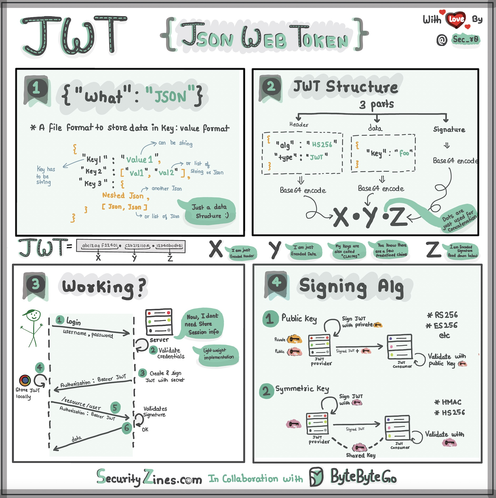

JWT라는 특별한 상자가 있다고 상상해 보세요. 이 상자 안에는 헤더, 페이로드, 서명 세 부분이 있습니다.

헤더는 상자 외부의 라벨과 같은 역할을 합니다. 헤더는 상자의 타입과 보안 방법을 알려줍니다. 일반적으로 중괄호 { }와 콜론 : 을 사용하여 정보를 정리하는 방법인 JSON이라는 포맷으로 작성됩니다.

페이로드는 전송하려는 실제 메시지 또는 정보와 같습니다. 이름, 나이 또는 공유하고자 하는 기타 데이터가 될 수 있습니다. 또한 JSON 포맷으로 작성되어 이해하기 쉽고 작업하기 쉽습니다.
서명은 JWT를 안전하게 보호하는 역할을 합니다. 서명은 발신자만 만드는 방법을 알고 있는 특별한 도장과 같습니다. 서명은 비밀번호와 같은 시크릿 코드를 사용하여 생성됩니다. 이 서명은 아무도 발신자 모르게 JWT의 내용을 변경할 수 없도록 합니다.

JWT를 서버로 보내려면 헤더, 페이로드, 서명을 상자 안에 넣고 서버로 전송합니다. 서버는 헤더와 페이로드를 쉽게 읽고 사용자가 누구인지, 무엇을 하려는지 이해할 수 있습니다.

### Google authenticator(또는 다른 유형의 2 factor authenticator)는 어떻게 작동하나요?

2단계 인증이 활성화된 경우 일반적으로 구글 인증서가 계정 로그인에 사용됩니다. 어떻게 보안을 보장하나요?
 
구글 인증기는 2단계 인증 서비스를 구현하는 소프트웨어 기반 인증기입니다. 아래 다이어그램에서 자세한 내용을 확인할 수 있습니다.

  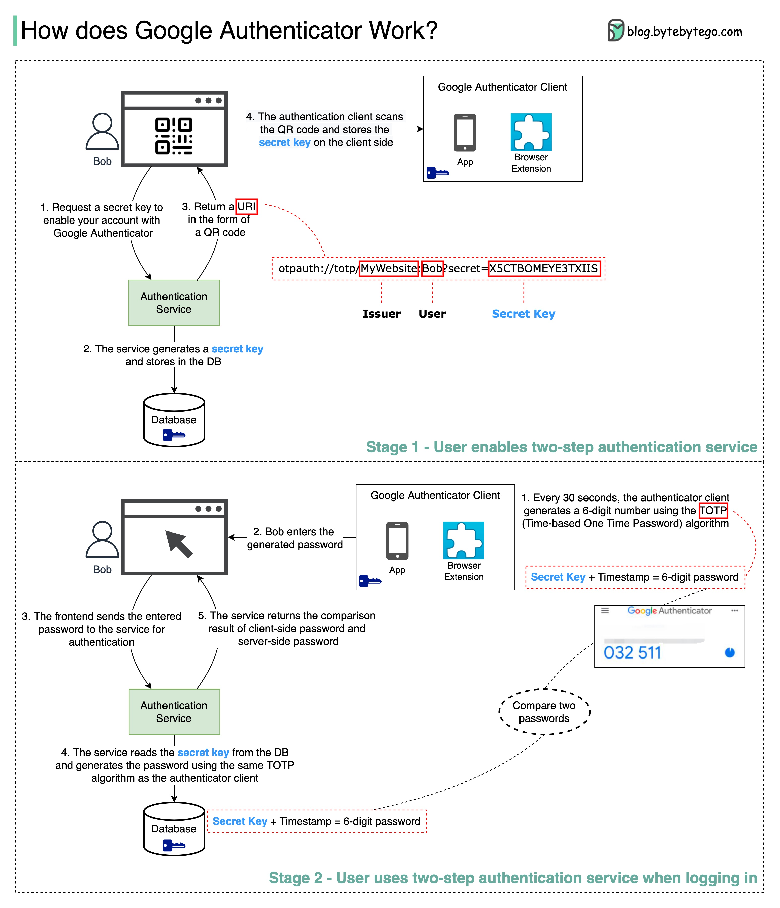

두 스테이지가 있습니다.

- 스테이지 1 - 사용자가 구글 2단계 인증을 활성화합니다.
- 스테이지 2 - 사용자는 로그인 등에 인증기를 사용합니다.

이 스테이지를 살펴보겠습니다.
 
**스테이지1**

1,2 단계: Bob이 웹 페이지를 열어 2단계 인증을 활성화합니다. 프론트엔드에서 시크릿 키를 요청합니다. 인증 서비스에서 Bob의 시크릿 키를 생성하여 데이터베이스에 저장합니다.
 
3 단계: 인증 서비스는 프론트엔드에 URI를 반환합니다. URI는 키 발급자, 사용자 이름, 시크릿 키로 구성됩니다. URI는 웹 페이지에 QR 코드 형태로 표시됩니다.
 
4 단계: 그런 다음 Bob은 구글 인증기를 사용하여 생성된 QR 코드를 스캔합니다. 시크릿 키는 인증기에 저장됩니다.

**스테이지2**

1, 2 단계: 밥은 구글 2단계 인증으로 웹사이트에 로그인하려고 합니다. 이를 위해서는 비밀번호가 필요합니다. 구글 인증기는 30초마다 TOTP(Time-based One Time Password) 알고리즘을 사용하여 6자리 비밀번호를 생성합니다. 밥은 이 비밀번호를 사용하여 웹사이트에 들어갑니다.
 
3, 4 단계: 프론트엔드는 인증을 위해 밥이 입력한 비밀번호를 백엔드로 전송합니다. 인증 서비스는 데이터베이스에서 시크릿 키를 읽고 클라이언트와 동일한 TOTP 알고리즘을 사용하여 6자리 비밀번호를 생성합니다.
 
5 단계: 인증 서비스는 클라이언트와 서버에서 생성한 두 개의 비밀번호를 비교하고 비교 결과를 프론트엔드에 반환합니다. Bob은 두 비밀번호가 일치하는 경우에만 로그인 프로세스를 진행할 수 있습니다.
 
이 인증 메커니즘은 안전한가요?

- 다른 사람이 시크릿 키를 획득할 수 있나요?

    시크릿 키가 HTTPS를 사용하여 전송되는지 확인해야 합니다. 인증기 클라이언트와 데이터베이스는 비밀 키를 저장하며, 비밀 키가 암호화되어 있는지 확인해야 합니다.

- 해커가 6자리 비밀번호를 추측할 수 있나요?
    
    아니요. 비밀번호는 6자리로 구성되므로 생성된 비밀번호의 조합 가능 수는 100만 개입니다. 게다가 비밀번호는 30초마다 변경됩니다. 해커가 30초 안에 비밀번호를 알아내려면 초당 30,000개의 조합을 입력해야 합니다.

##  실제 사례 연구

### 넷플릭스 기술 스택

이 게시물은 여러 넷플릭스 엔지니어링 블로그와 오픈소스 프로젝트의 연구를 기반으로 작성되었습니다. 부정확한 내용을 발견하면 언제든지 알려주시기 바랍니다.

  

**Mobile and web**: 넷플릭스는 네이티브 모바일 앱을 구축하기 위해 Swift와 Kotlin을 채택했습니다. 웹 애플리케이션에는 React를 사용합니다.

**Frontend/server communication**: 넷플릭스는 GraphQL을 사용합니다.

**Backend services**: 넷플릭스는 ZUUL, 유레카, 스프링 부트 프레임워크 및 기타 기술을 사용합니다.

**Databases**: 넷플릭스는 EV 캐시, 카산드라, 코크로치DB 및 기타 데이터베이스를 활용합니다.

**Messaging/streaming**: 넷플릭스는 메시징과 스트리밍을 위해 아파치 카프카와 핑크(Fink)를 사용합니다.

**Video storage**: 넷플릭스는 비디오 스토리지로 S3와 Open Connect를 사용합니다.

**Data processing**: 넷플릭스는 데이터 처리를 위해 Flink와 Spark를 활용하고, 이를 Tableau를 사용하여 시각화합니다. 구조화된 데이터 웨어하우스 정보를 처리하는 데는 Redshift를 사용합니다.

**CI/CD**: 넷플릭스는 CI/CD 프로세스를 위해 JIRA, Confluence, PagerDuty, Jenkins, Gradle, Chaos Monkey, Spinnaker, Atlas 등 다양한 도구를 사용하고 있습니다.

### 트위터 아키텍처 2022

예, 이것이 실제 트위터 아키텍처입니다. 엘론 머스크가 게시하고 가독성을 높이기 위해 다시 그린 것입니다.

  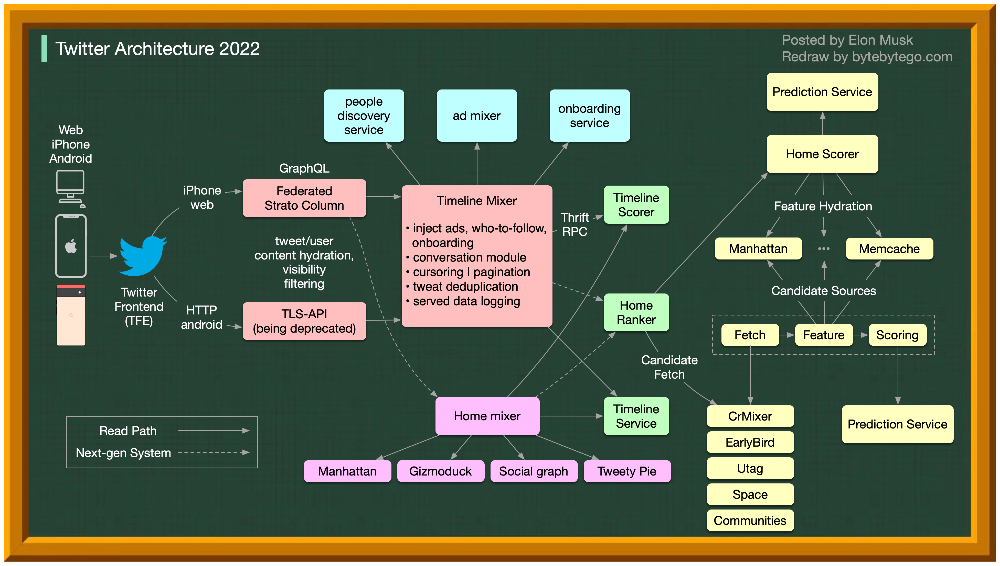

### 지난 15년간 에어비앤비 마이크로서비스 아키텍처의 진화 과정

에어비앤비의 마이크로서비스 아키텍처는 크게 3가지 스테이지를 거쳤습니다.

  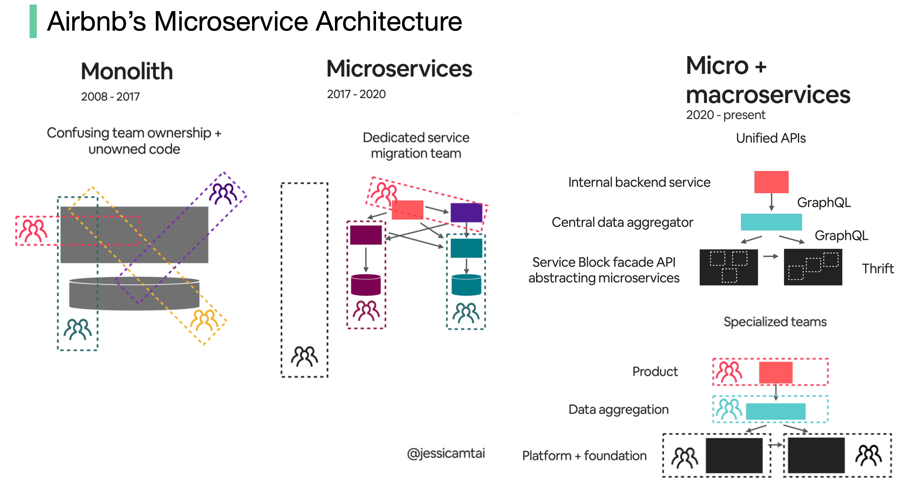

모놀리스 (2008 - 2017)

에어비앤비는 호스트와 게스트를 위한 단순한 마켓플레이스에서 시작되었습니다. 이는 모놀리스라고 하는 Ruby on Rails 애플리케이션으로 구축되었습니다.

챌린지는 무엇인가요?

- 혼란스러운 팀 오너십 + 오너십 없는 코드
- 느린 개발

마이크로서비스 (2017 - 2020)

마이크로서비스는 이러한 문제를 해결하는 것을 목표로 합니다. 마이크로서비스 아키텍처의 핵심 서비스는 다음과 같습니다:

- Data fetching service
- Business logic data service
- Write workflow service
- UI aggregation service
- 각 서비스에는 하나의 전담 팀 두기

챌린지는 무엇인가요?

수백 개의 서비스와 종속성은 사람이 관리하기 어려웠습니다.

마이크로 + 매크로서비스 (2020 - 현재)

에어비앤비는 현재 이를 위해 노력하고 있습니다. 마이크로 및 매크로서비스 하이브리드 모델은 API 통합에 중점을 둡니다.

### 모노레포 vs 마이크로레포

어떤 것이 가장 좋을까요? 회사마다 다른 옵션을 선택하는 이유는 무엇인가요?

  

모노레포는 새로운 것이 아닙니다. Linux와 Windows 모두 모노레포를 사용하여 만들어졌습니다. 확장성과 빌드 속도를 개선하기 위해 구글은 내부 전용 툴체인을 개발하여 더 빠르게 확장하고 엄격한 코딩 품질 표준을 적용하여 일관성을 유지했습니다.

아마존과 넷플릭스는 마이크로서비스 철학의 주요 홍보대사입니다. 이 접근 방식은 자연스럽게 서비스 코드를 별도의 리포지토리로 분리합니다. 확장 속도는 빠르지만 나중에 거버넌스 문제가 발생할 수 있습니다. 

모노레포 내에서 각 서비스는 하나의 폴더이며, 모든 폴더에는 빌드 구성 및 소유자 권한 제어가 있습니다. 모든 서비스 구성원은 자신의 폴더에 대한 책임이 있습니다.

반면 마이크로레포에서는 각 서비스가 해당 리포지토리를 담당하며, 일반적으로 전체 리포지토리에 대한 빌드 구성과 권한이 설정됩니다.

모노레포에서는 비즈니스에 관계없이 전체 코드베이스에서 종속성이 공유되므로 버전 업그레이드가 있을 때 모든 코드베이스가 해당 버전을 업그레이드합니다.

마이크로레포에서는 각 리포지토리 내에서 종속성을 제어합니다. 기업은 자체 일정에 따라 버전을 업그레이드할 시기를 선택할 수 있습니다.

모노레포에는 체크인에 대한 표준이 있습니다. 구글의 코드 검토 프로세스는 높은 기준을 설정하는 것으로 유명하며, 비즈니스에 관계없이 모노레포의 일관된 품질 표준을 보장합니다.

마이크로레포는 자체 표준을 설정하거나 모범 사례를 통합하여 공유 표준을 채택할 수 있습니다. 비즈니스에 맞게 더 빠르게 확장할 수 있지만 코드 품질이 약간 다를 수 있습니다. 
구글 엔지니어는 Bazel을, Meta는 Buck을 만들었습니다. 그 외에도 Nx, Lerna 등 다양한 오픈 소스 도구가 있습니다.

수년에 걸쳐 마이크로레포는 Java용 Maven과 Gradle, NodeJS용 NPM, C/C++용 CMake 등 더 많은 도구를 지원하게 되었습니다.

### 스택 오버플로 웹사이트를 어떻게 디자인할 건가요?

답변이 온프레미스 서버와 모놀리스(다음 이미지 하단)라면 면접에서 떨어질 가능성이 높지만, 실제로는 그렇게 구축되어 있습니다!

  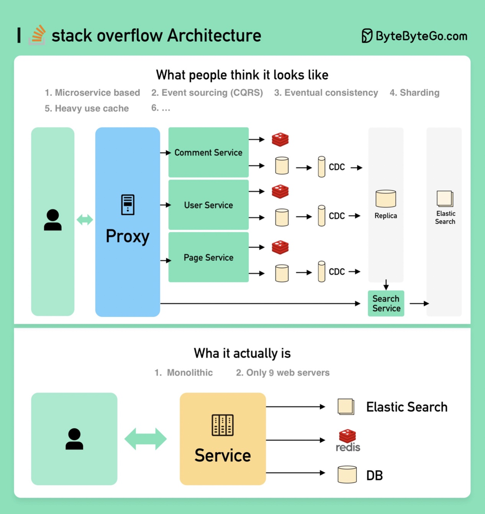

**사람들이 생각하는 디자인**

면접관은 아마도 사진의 상단 부분과 같은 것을 기대하고 있을 것입니다.

- 마이크로서비스는 시스템을 작은 컴포넌트로 분해하는 데 사용됩니다.
- 각 서비스에는 자체 데이터베이스가 있습니다. 캐시를 많이 사용하세요.
- 서비스가 샤딩됩니다.
- 서비스는 메시지 큐를 통해 비동기적으로 서로 통신합니다.
- 이 서비스는 이벤트 소싱과 CQRS를 사용하여 구현됩니다.
- 최종 정합성, CAP 정리 등과 같은 분산 시스템에 대한 지식을 뽐내 보세요.

**실제 내용**

스택 오버플로는 단 9대의 온프레미스 웹 서버로 모든 트래픽을 처리하며, 이 서버는 모놀리스로 운영됩니다! 자체 서버를 보유하고 있으며 클라우드에서 실행되지 않습니다.

이는 오늘날의 일반적인 믿음과는 상반되는 것입니다.

### 아마존 프라임 비디오 모니터링이 서버리스에서 모놀리식으로 전환된 이유는 무엇인가요? 어떻게 90%의 비용을 절감할 수 있을까요?

아래 다이어그램은 마이그레이션 전과 후의 아키텍처를 비교한 것입니다.

  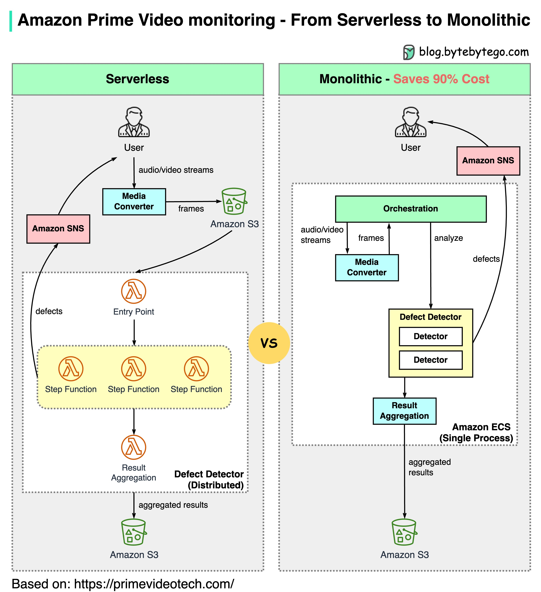

아마존 프라임 비디오 모니터링 서비스란 무엇인가요?

프라임 비디오 서비스는 수천 개의 라이브 스트림의 품질을 모니터링해야 합니다. 모니터링 도구는 실시간으로 스트림을 자동으로 분석하고 블록 손상, 동영상 정지, 동기화 문제와 같은 품질 문제를 식별합니다. 이는 고객 만족을 위한 중요한 프로세스입니다. 

미디어 컨버터, 결함 검출기, 실시간 알림의 3단계로 구성됩니다.

- 기존 아키텍처의 문제점은 무엇인가요?

  이전 아키텍처는 아마존 람다를 기반으로 하여 서비스를 빠르게 구축하는 데는 좋았습니다. 하지만 대규모로 아키텍처를 실행할 때는 비용 효율적이지 않았습니다. 다음은 가장 비용이 많이 드는 두 가지 작업입니다.

1. 오케스트레이션 워크플로 - AWS 스텝 함수는 상태 전환별로 사용자에게 요금을 부과하고, 오케스트레이션은 매초마다 여러 상태 전환을 수행합니다.

2. 분산된 컴포넌트 간의 데이터 전달 - 인터미디어트 데이터는 다음 스테이지의 다운로드를 위해 아마존 S3에 저장됩니다. 볼륨이 크면 다운로드 비용이 많이 들 수 있습니다.

- 모놀리식 아키텍처로 90% 비용 절감

  모놀리식 아키텍처는 비용 문제를 해결하기 위해 설계되었습니다. 여전히 3개의 컴포넌트가 있지만 미디어 컨버터와 결함 감지기가 동일한 프로세스에 배포되어 네트워크를 통한 데이터 전달 비용을 절감할 수 있습니다. 놀랍게도 이러한 배포 아키텍처 변경 방식은 90%의 비용 절감 효과를 가져왔습니다!

마이크로서비스가 기술 업계에서 유행처럼 번지고 있는 만큼 이 사례는 흥미롭고 독특한 사례 연구입니다. 아키텍처의 진화에 대해 더 많은 논의를 하고 장단점에 대해 더 솔직한 토론을 하고 있다는 것은 좋은 일입니다. 컴포넌트를 분산형 마이크로서비스로 분해하는 데에는 비용이 발생합니다.

- 이에 대해 아마존의 리더들은 어떤 반응을 보였을까요?
  
  아마존 CTO Werner Vogels: "**진화 가능한 소프트웨어 시스템**을 구축하는 것은 전략이지 종교가 아닙니다. 그리고 열린 마음으로 아키텍처를 재검토하는 것은 필수입니다."

Ex Amazon VP Sustainability Adrian Cockcroft: "프라임 비디오 팀은 제가 **서버리스 퍼스트**라고 부르는 길을 따랐습니다. 저는 **서버리스 온리**를 옹호하지 않습니다.".

### 디즈니 핫스타는 어떻게 토너먼트 기간 동안 50억 개의 이모티콘을 획득할 수 있었나요?

  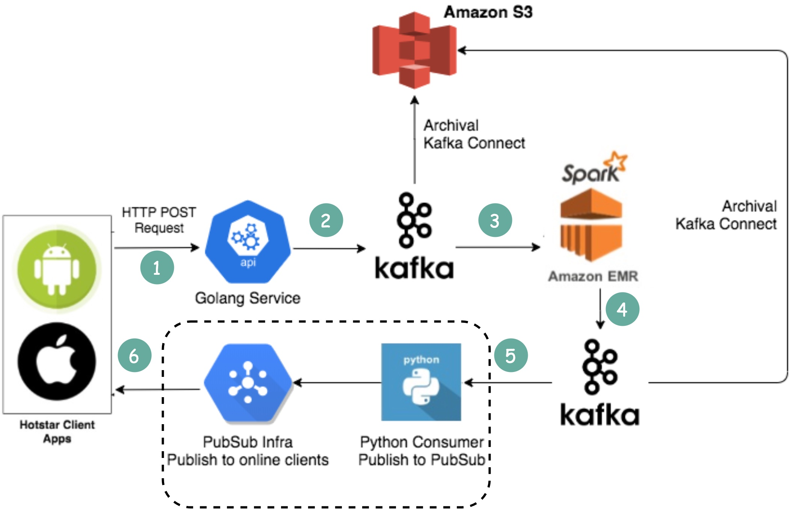

1. 클라이언트는 표준 HTTP 요청을 통해 이모티콘을 전송합니다. 고랭 서비스는 일반적인 웹 서버라고 생각하면 됩니다. 고랭을 선택한 이유는 동시성을 잘 지원하기 때문입니다. 고랭의 스레드는 가볍습니다.

2. 쓰기 볼륨이 매우 높기 때문에 카프카(메시지 큐)가 버퍼로 사용됩니다.

3. 이모티콘 데이터는 Spark라는 스트리밍 처리 서비스에 의해 어그리게이트됩니다. 이 서비스는 2초마다 데이터를 어그리게이트하며, 그 주기는 설정할 수 있습니다. 간격에 따라 장단점이 있습니다. 간격이 짧을수록 다른 클라이언트에 이모티콘이 더 빨리 전달되지만 더 많은 컴퓨팅 리소스가 필요하다는 의미도 됩니다.

4. 어그리게이트된 데이터는 또 다른 카프카에 기록됩니다.

5. PubSub 컨슈머는 카프카에서 어그리게이트된 이모티콘 데이터를 가져옵니다.

6. 이모티콘은 PubSub 인프라를 통해 다른 클라이언트에게 실시간으로 전달됩니다. PubSub 인프라는 흥미롭습니다. 핫스타는 다음과 같은 프로토콜을 고려했습니다. Socketio, NATS, MQTT, gRPC를 검토한 결과 MQTT로 결정했습니다.
 
초당 백만 개의 '좋아요'를 스트리밍하는 LinkedIn에서도 비슷한 디자인을 채택하고 있습니다.

### Discord가 수조 개의 메시지를 저장하는 방법

아래 다이어그램은 Discord에서 메시지 스토리지의 진화 과정을 보여줍니다:

  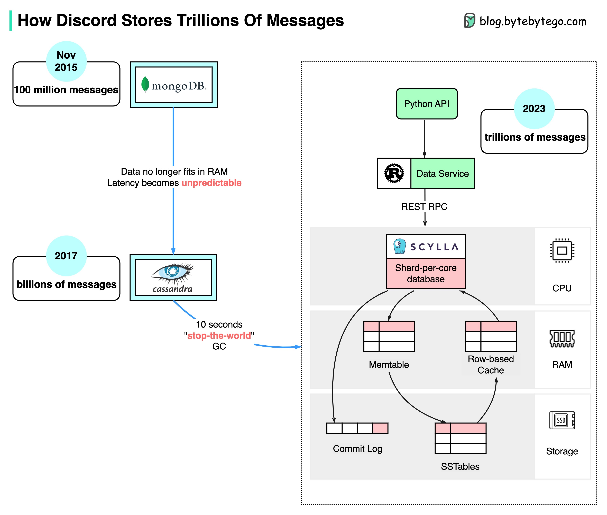

MongoDB ➡️ Cassandra ➡️ ScyllaDB 

2015년, 디스코드의 첫 번째 버전은 단일 MongoDB 레플리카 위에 구축되었습니다. 2015년 11월경, MongoDB에 1억 개의 메시지가 저장되자 RAM이 더 이상 데이터와 색인을 저장할 수 없게 되었습니다. 지연 시간을 예측할 수 없게 되었습니다. 메시지 저장소를 다른 데이터베이스로 옮겨야 했고, 카산드라가 선택되었습니다.

2017년, 디스코드에는 12개의 카산드라 노드가 있었고 수십억 개의 메시지가 저장되어 있었습니다.

2022년 초에는 177개의 노드와 수조 개의 메시지가 있었습니다. 이 시점에서는 지연 시간을 예측할 수 없었고 유지보수 운영 비용이 너무 많이 들었습니다.

여기에는 몇 가지 이유가 있습니다.

- 카산드라는 내부 데이터 구조에 LSM 트리를 사용합니다. 읽기는 쓰기보다 비용이 더 많이 듭니다. 수백 명의 사용자가 있는 서버에서 동시 읽기가 많이 발생하여 핫스팟이 발생할 수 있습니다.
- SSTable을 압축하는 등 클러스터를 유지 관리하면 성능에 영향을 미칩니다.
- 가비지 컬렉션 일시 중지로 인해 지연 시간이 크게 증가합니다.

ScyllaDB는 C++로 작성된 카산드라 호환 데이터베이스입니다. 디스코드는 모놀리식 API, Rust로 작성된 데이터 서비스, ScyllaDB 기반 스토리지를 갖추도록 아키텍처를 재설계했습니다.

ScyllaDB의 p99 읽기 지연 시간은 15ms인 반면 카산드라는 40-125ms입니다. p99 쓰기 지연 시간은 5ms인데 반해 카산드라는 5-70ms입니다.

### 동영상 라이브 스트리밍은 YouTube, TikTok 라이브, Twitch에서 어떻게 작동하나요?

라이브 스트리밍은 비디오 콘텐츠가 인터넷을 통해 실시간으로 전송되며 일반적으로 몇 초의 지연 시간만 발생한다는 점에서 일반 스트리밍과 다릅니다.

아래 다이어그램은 이러한 작업을 가능하게 하기 위해 실제로 무슨 일이 발생하는지 설명합니다.

  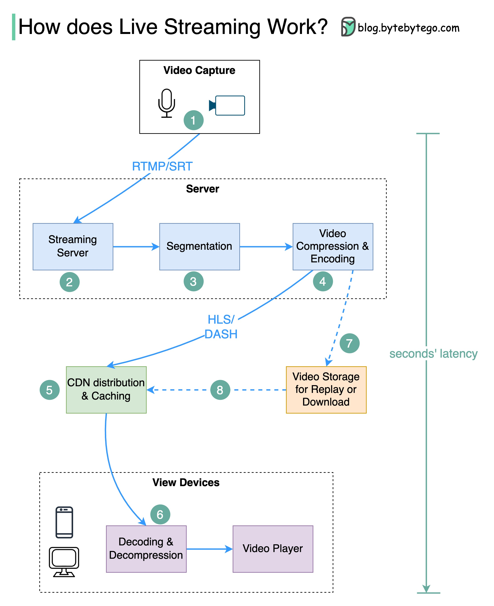

 
1단계: 로우 비디오 데이터는 마이크와 카메라로 캡처됩니다. 데이터는 서버 측으로 전송됩니다.
 
2단계: 동영상 데이터는 압축하고 인코딩됩니다. 예를 들어, 압축 알고리즘은 배경과 기타 비디오 요소를 분리합니다. 압축 후 동영상은 H.264와 같은 표준으로 인코딩됩니다. 이 단계를 거치면 동영상 데이터의 크기가 훨씬 작아집니다.
 
3단계: 인코딩된 데이터는 보통 몇 초 길이의 작은 세그먼트로 나뉘기 때문에 다운로드나 스트리밍에 걸리는 시간은 훨씬 짧습니다.
 
4단계: 세그먼트화된 데이터는 스트리밍 서버로 전송됩니다. 스트리밍 서버는 다양한 디바이스와 네트워크 조건을 지원해야 합니다. 이를 'Adaptive Bitrate Streaming'이라고 합니다. 즉, 2단계와 3단계에서 서로 다른 비트레이트로 여러 개의 파일을 생성해야 합니다.
 
5단계: 라이브 스트리밍 데이터는 CDN(Content Delivery Network)이 지원하는 엣지 서버로 푸시되며, 수백만 명의 시청자가 가까운 엣지 서버에서 동영상을 시청할 수 있습니다. CDN은 데이터 전송 지연 시간을 크게 줄여줍니다. 
 
6단계: 시청자의 디바이스는 동영상 데이터를 디코딩 및 압축 해제하고 동영상 플레이어에서 동영상을 재생합니다.
 
7, 8단계: 동영상을 다시 보기 위해 저장해야 하는 경우 인코딩된 데이터는 스토리지 서버로 전송되며, 시청자는 나중에 다시 보기를 요청할 수 있습니다.
 
라이브 스트리밍을 위한 표준 프로토콜은 다음과 같습니다.

- RTMP (Real-Time Messaging Protocol): 원래는 Macromedia에서 플래시 플레이어와 서버 간에 데이터를 전송하기 위해 개발했습니다. 지금은 인터넷을 통한 비디오 데이터 스트리밍에 사용됩니다. Skype와 같은 화상 회의 애플리케이션은 지연 시간을 줄이기 위해 RTC(Real-Time Communication) 프로토콜을 사용한다는 점에 유의하세요.
- HLS (HTTP Live Streaming): H.264 또는 H.265 인코딩이 필요합니다. Apple 장치는 HLS 포맷만 허용합니다.
- DASH (Dynamic Adaptive Streaming over HTTP): DASH는 Apple 장치를 지원하지 않습니다.
- HLS와 DASH는 모두 어댑티브 비트레이트 스트리밍을 지원합니다.

## License

This work is licensed under <a href="http://creativecommons.org/licenses/by-nc-nd/4.0/?ref=chooser-v1" target="_blank" rel="license noopener noreferrer" style="display:inline-block;">CC BY-NC-ND 4.0</a>

